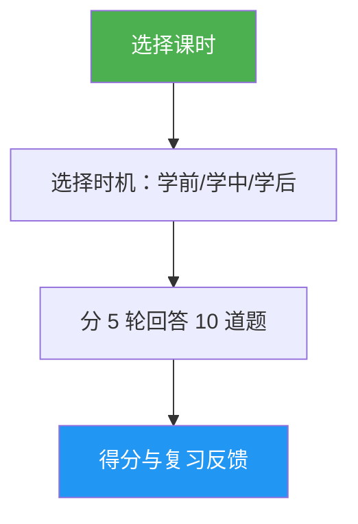

<a id="lesson-quiz"></a>
# 课时测验

> 交互式测验：通过 10 道题检验你对某一 Claude Code 课时的理解，提供逐题反馈与有针对性的复习指引。

<a id="highlights"></a>
## 亮点

- 每个课时 10 道题，兼顾概念理解与实际应用
- 覆盖全部 10 个课时（01-Slash Commands 至 10-CLI）
- 三种时机模式：学前测验、进度检查或掌握度验证
- 逐题反馈，含正确答案与解析
- 针对性复习建议，指向课时中的具体章节
- 全部课时共 100 道题的题库，见 `references/question-bank.md`

<a id="when-to-use"></a>
## 使用场景

| 可以说… | Skill 会… |
|---|---|
| "quiz me on hooks" | 运行第 06 课 Hooks 的 10 题测验 |
| "lesson quiz 03" | 考查你对第 03 课 Skills 的掌握 |
| "do I understand MCP" | 评估你对第 05 课 MCP 的理解 |
| "practice quiz" | 让你先选课时，再出题测验 |

<a id="how-it-works"></a>
## 工作原理



<a id="usage"></a>
## 用法

```
/lesson-quiz [lesson-name-or-number]
```

示例：
```
/lesson-quiz hooks
/lesson-quiz 03
/lesson-quiz advanced-features
/lesson-quiz           #（提示选择课时）
```

<a id="output"></a>
## 输出

<a id="score-report"></a>
### 成绩报告
- 总分 10 分制及等级（Mastered / Proficient / Developing / Beginning）
- 按题型拆分（概念题 vs. 实践题）

<a id="per-question-feedback"></a>
### 逐题反馈
每道答错的题会包含：
- 你的答案与正确答案
- 说明为何正确选项成立
- 建议回顾的课时章节

<a id="timing-aware-guidance"></a>
### 分时机指引
- **Pre-test**：建立基线，标出学习时需重点关注的方面
- **During**：指出已掌握内容与待回顾内容
- **After**：确认掌握程度或定位仍存在的薄弱环节

<a id="resources"></a>
## 相关资源

| 路径 | 说明 |
|---|---|
| `references/question-bank.md` | 100 道预制题目（每个课时 10 道），含答案、解析与复习指引 |
