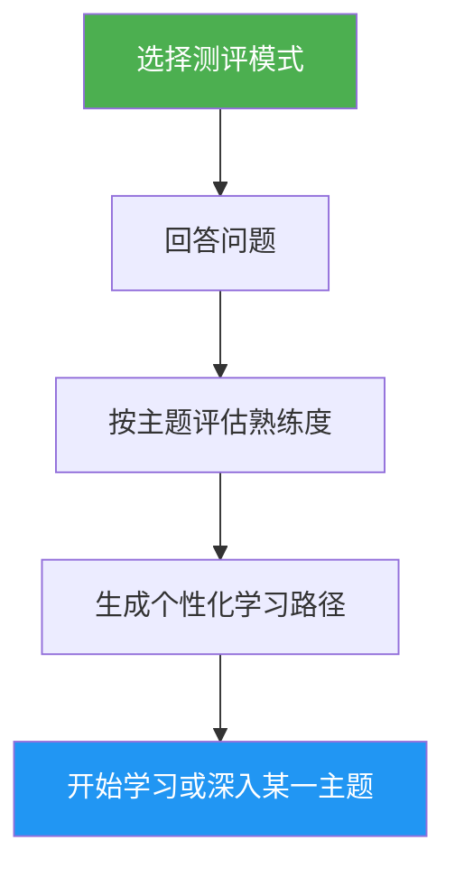

<a id="self-assessment-learning-path-advisor"></a>
# 自我评估与学习路径顾问

> 面向 Claude Code 的综合能力测评：覆盖 10 大功能领域、识别能力缺口，并生成个性化学习路径以帮助你提升。

<a id="highlights"></a>
## 亮点

- 两种测评模式：快速（8 题，约 2 分钟）与深度（5 轮，约 5 分钟）
- 覆盖 10 大功能领域：Slash Commands、Memory、Skills、Hooks、MCP、Subagents、Checkpoints、Advanced Features、Plugins、CLI
- 分主题计分与掌握度（无 / 基础 / 熟练）
- 缺口分析，并按依赖关系排序优先级
- 个性化学习路径，含具体练习与成功标准
- 后续动作：开始学习、深入某一主题、练习项目或重新测评

<a id="when-to-use"></a>
## 适用场景

| 可以这样问… | Skill 会… |
|---|---|
| "assess my level" | 运行测评并判断你的水平 |
| "where should I start" | 根据你的经验建议从哪里入手 |
| "check my skills" | 在全部 10 个领域上给出详细能力画像 |
| "what should I learn next" | 找出缺口并生成有优先级的学习路径 |

<a id="how-it-works"></a>
## 工作流程



<a id="assessment-modes"></a>
## 测评模式

<a id="quick-assessment-2-min"></a>
### 快速测评（约 2 分钟）
- 共 2 轮、8 道是否有过相关经验的题目
- 给出整体水平：初学者 / 中级 / 高级
- 列出具体缺口并附教程链接
- 适合：初次使用者、快速自检

<a id="deep-assessment-5-min"></a>
### 深度测评（约 5 分钟）
- 5 轮题目，覆盖 10 大功能领域（每轮 2 个主题）
- 分主题计分（每主题 0–2 分，总分 20）
- 掌握度表：强项、优先补强的缺口、待复习项
- 考虑依赖关系的学习路径，含阶段与时间估计
- 推荐练习项目，组合多个缺口主题
- 适合：有经验、希望系统性提升的用户，或定期能力复盘

<a id="usage"></a>
## 用法

```
/self-assessment
```

<a id="output"></a>
## 输出内容

<a id="skill-profile-table"></a>
### 能力画像表
展示各主题得分、掌握度与状态（学习 / 复习 / 已掌握）。

<a id="personalized-learning-path"></a>
### 个性化学习路径
- 按依赖顺序划分为多个阶段
- 每个主题包含：教程链接、关注要点、关键练习、成功标准
- 对已掌握的主题会调整时间估计
- 组合多个缺口领域的练习项目

<a id="follow-up-actions"></a>
### 后续动作
得到结果后，你可以选择：
- 从第一个缺口教程开始，并跟随引导练习
- 针对某一缺口领域深入
- 搭建一个覆盖你当前缺口的练习项目
- 换用另一种测评模式重新测评
