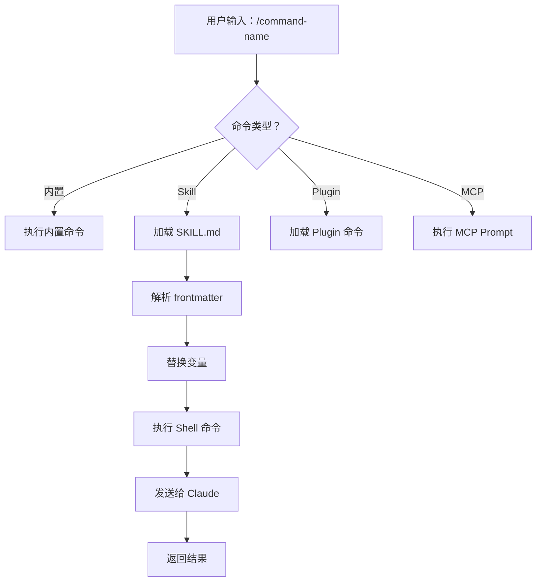
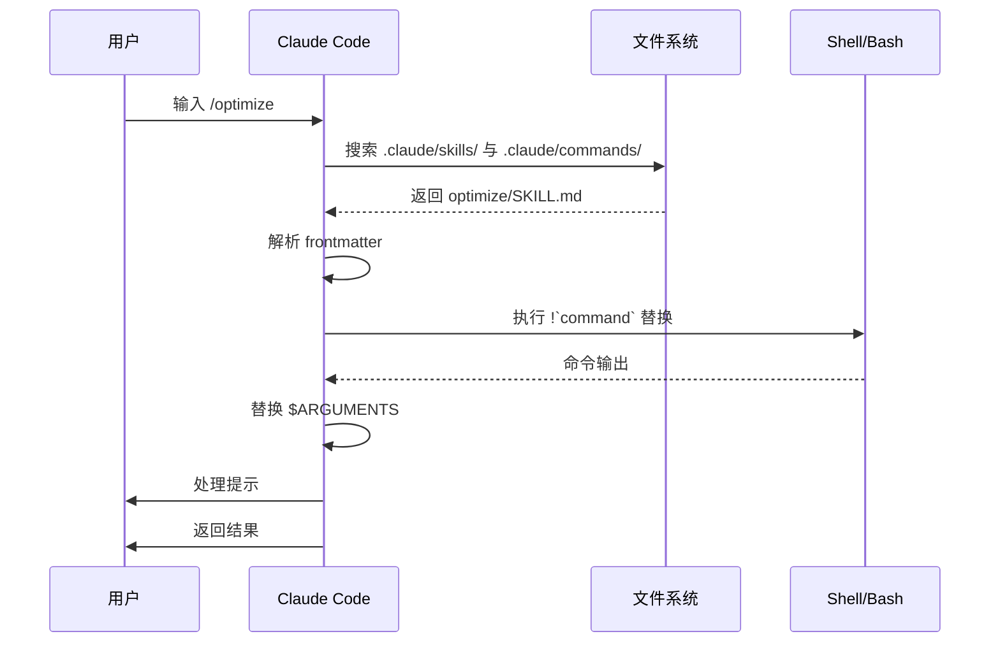

<picture>
  <source media="(prefers-color-scheme: dark)" srcset="../resources/logos/claude-howto-logo-dark.svg">
  
</picture>

<a id="slash-commands"></a>

# Slash Commands（快捷命令）

<a id="overview"></a>

## 概述

Slash commands 是在交互式会话中用来控制 Claude 行为的快捷方式，分为以下几类：

- **内置命令**：由 Claude Code 提供（`/help`、`/clear`、`/model`）
- **Skills**：以 `SKILL.md` 文件形式创建的用户自定义命令（`/optimize`、`/pr`）
- **Plugin 命令**：来自已安装插件的命令（`/frontend-design:frontend-design`）
- **MCP prompts**：来自 MCP 服务器的命令（`/mcp__github__list_prs`）

> **说明**：自定义 slash command 已并入 Skills。`.claude/commands/` 下的文件仍可使用，但推荐使用 Skills（`.claude/skills/`）。两者都会生成 `/command-name` 形式的快捷方式。完整说明见 [Skills 指南](../03-skills/)。

<a id="built-in-commands-reference"></a>

## 内置命令参考

内置命令是常用操作的快捷方式。共有 **55+ 条内置命令** 和 **5 个打包 Skills**。在 Claude Code 中输入 `/` 可查看完整列表，或输入 `/` 后接任意字母进行筛选。

| 命令 | 用途 |
|---------|------|
| `/add-dir <path>` | 添加工作目录 |
| `/agents` | 管理 agent 配置 |
| `/branch [name]` | 将对话分支到新会话（别名：`/fork`）。说明：v2.1.77 起 `/fork` 重命名为 `/branch` |
| `/btw <question>` | 侧栏提问且不写入历史 |
| `/chrome` | 配置 Chrome 浏览器集成 |
| `/clear` | 清空对话（别名：`/reset`、`/new`） |
| `/color [color\|default]` | 设置提示条颜色 |
| `/compact [instructions]` | 压缩对话，可附带聚焦说明 |
| `/config` | 打开设置（别名：`/settings`） |
| `/context` | 以彩色网格展示上下文占用 |
| `/copy [N]` | 将助手回复复制到剪贴板；`w` 表示写入文件 |
| `/cost` | 显示 token 用量统计 |
| `/desktop` | 在 Desktop 应用中继续（别名：`/app`） |
| `/diff` | 针对未提交改动的交互式 diff 查看器 |
| `/doctor` | 诊断安装健康状况 |
| `/effort [low\|medium\|high\|max\|auto]` | 设置 effort 等级。`max` 需要 Opus 4.6 |
| `/exit` | 退出 REPL（别名：`/quit`） |
| `/export [filename]` | 将当前对话导出到文件或剪贴板 |
| `/extra-usage` | 为速率限制配置额外用量 |
| `/fast [on\|off]` | 切换 fast 模式 |
| `/feedback` | 提交反馈（别名：`/bug`） |
| `/help` | 显示帮助 |
| `/hooks` | 查看 hook 配置 |
| `/ide` | 管理 IDE 集成 |
| `/init` | 初始化 `CLAUDE.md`。交互式流程请设置 `CLAUDE_CODE_NEW_INIT=true` |
| `/insights` | 生成会话分析报告 |
| `/install-github-app` | 设置 GitHub Actions 应用 |
| `/install-slack-app` | 安装 Slack 应用 |
| `/keybindings` | 打开快捷键配置 |
| `/login` | 切换 Anthropic 账号 |
| `/logout` | 退出 Anthropic 账号 |
| `/mcp` | 管理 MCP 服务器与 OAuth |
| `/memory` | 编辑 `CLAUDE.md`，开关自动 memory |
| `/mobile` | 移动端应用二维码（别名：`/ios`、`/android`） |
| `/model [model]` | 选择模型，可用左右方向键调节 effort |
| `/passes` | 分享 Claude Code 免费试用周 |
| `/permissions` | 查看/更新权限（别名：`/allowed-tools`） |
| `/plan [description]` | 进入规划模式 |
| `/plugin` | 管理插件 |
| `/pr-comments [PR]` | 拉取 GitHub PR 评论 |
| `/privacy-settings` | 隐私设置（仅 Pro/Max） |
| `/release-notes` | 查看更新日志 |
| `/reload-plugins` | 重新加载当前插件 |
| `/remote-control` | 从 claude.ai 远程控制（别名：`/rc`） |
| `/remote-env` | 配置默认远程环境 |
| `/rename [name]` | 重命名会话 |
| `/resume [session]` | 恢复对话（别名：`/continue`） |
| `/review` | **已弃用** — 请改用 `code-review` 插件 |
| `/rewind` | 回退对话和/或代码（别名：`/checkpoint`） |
| `/sandbox` | 切换沙箱模式 |
| `/schedule [description]` | 创建/管理定时任务 |
| `/security-review` | 分析分支中的安全漏洞 |
| `/skills` | 列出可用 Skills |
| `/stats` | 可视化每日用量、会话与连续使用天数 |
| `/status` | 显示版本、模型与账号 |
| `/statusline` | 配置状态行 |
| `/tasks` | 列出/管理后台任务 |
| `/terminal-setup` | 配置终端快捷键 |
| `/theme` | 更换配色主题 |
| `/vim` | 切换 Vim/Normal 模式 |
| `/voice` | 切换按住说话的语音听写 |

<a id="bundled-skills"></a>

### 打包 Skills

以下 Skills 随 Claude Code 提供，调用方式与 slash command 相同：

| Skill | 用途 |
|-------|------|
| `/batch <instruction>` | 使用 worktree 编排大规模并行修改 |
| `/claude-api` | 按项目语言加载 Claude API 参考 |
| `/debug [description]` | 启用调试日志 |
| `/loop [interval] <prompt>` | 按间隔重复运行提示 |
| `/simplify [focus]` | 审查已改动文件的代码质量 |

<a id="deprecated-commands"></a>

### 已弃用命令

| 命令 | 状态 |
|---------|------|
| `/review` | 已弃用 — 由 `code-review` 插件替代 |
| `/output-style` | 自 v2.1.73 起弃用 |
| `/fork` | 已重命名为 `/branch`（别名仍可用，v2.1.77） |

<a id="recent-changes"></a>

### 近期变更

- `/fork` 重命名为 `/branch`，`/fork` 仍作为别名保留（v2.1.77）
- `/output-style` 已弃用（v2.1.73）
- `/review` 已弃用，建议使用 `code-review` 插件
- 新增 `/effort` 命令，`max` 等级需要 Opus 4.6
- 新增 `/voice` 命令，用于按住说话的语音听写
- 新增 `/schedule` 命令，用于创建/管理定时任务
- 新增 `/color` 命令，用于自定义提示条
- `/model` 选择器现显示人类可读标签（例如 "Sonnet 4.6"），而非原始模型 ID
- `/resume` 支持 `/continue` 别名
- MCP prompts 可作为 `/mcp__<server>__<prompt>` 形式的命令使用（见 [作为命令的 MCP Prompts](#mcp-prompts-as-commands)）

<a id="custom-commands-now-skills"></a>

## 自定义命令（现为 Skills）

自定义 slash command 已**并入 Skills**。两种方式都会生成可通过 `/command-name` 调用的命令：

| 方式 | 位置 | 状态 |
|------|------|------|
| **Skills（推荐）** | `.claude/skills/<name>/SKILL.md` | 当前标准 |
| **旧版 Commands** | `.claude/commands/<name>.md` | 仍可用 |

若 Skill 与 command 同名，**以 Skill 为准**。例如同时存在 `.claude/commands/review.md` 与 `.claude/skills/review/SKILL.md` 时，使用 Skill 版本。

<a id="migration-path"></a>

### 迁移路径

你现有的 `.claude/commands/` 文件无需修改即可继续使用。若要迁移到 Skills：

**之前（旧版 Commands）：**
```
.claude/commands/optimize.md
```

**之后（Skills）：**
```
.claude/skills/optimize/SKILL.md
```

<a id="why-skills"></a>

### 为何使用 Skills？

相比旧版 command，Skills 提供额外能力：

- **目录结构**：可打包脚本、模板与参考文件
- **自动调用**：在相关时 Claude 可自动触发 Skills
- **调用控制**：可选择仅用户、仅 Claude，或两者均可调用
- **Subagent 执行**：在隔离上下文中运行 Skills，使用 `context: fork`
- **渐进式披露**：仅在需要时加载额外文件

<a id="creating-a-custom-command-as-a-skill"></a>

### 将自定义命令创建为 Skill

创建包含 `SKILL.md` 的目录：

```bash
mkdir -p .claude/skills/my-command
```

**文件：** `.claude/skills/my-command/SKILL.md`

```yaml
---
name: my-command
description: 该命令的作用及适用场景
---

# 我的命令

在该命令被调用时，请 Claude 遵循以下说明。

1. 第一步
2. 第二步
3. 第三步
```

<a id="frontmatter-reference"></a>

### Frontmatter 参考

| 字段 | 用途 | 默认值 |
|-------|------|---------|
| `name` | 命令名（成为 `/name`） | 目录名 |
| `description` | 简要说明（帮助 Claude 判断何时使用） | 首段正文 |
| `argument-hint` | 自动补全所需的参数提示 | 无 |
| `allowed-tools` | 命令可在无需授权的情况下使用的工具 | 继承 |
| `model` | 指定使用的模型 | 继承 |
| `disable-model-invocation` | 若为 `true`，仅用户可调用（Claude 不可） | `false` |
| `user-invocable` | 若为 `false`，从 `/` 菜单中隐藏 | `true` |
| `context` | 设为 `fork` 时在隔离的 subagent 中运行 | 无 |
| `agent` | 使用 `context: fork` 时的 agent 类型 | `general-purpose` |
| `hooks` | Skill 级 hooks（PreToolUse、PostToolUse、Stop） | 无 |

<a id="arguments"></a>

### 参数

命令可接收参数：

**使用 `$ARGUMENTS` 表示全部参数：**

```yaml
---
name: fix-issue
description: 按编号修复 GitHub issue
---

按我们的编码规范修复 issue #$ARGUMENTS
```

用法：`/fix-issue 123` → `$ARGUMENTS` 为 "123"

**使用 `$0`、`$1` 等表示单个参数：**

```yaml
---
name: review-pr
description: 按优先级审查 PR
---

以优先级 $1 审查 PR #$0
```

用法：`/review-pr 456 high` → `$0`="456"，`$1`="high"

<a id="dynamic-context-with-shell-commands"></a>

### 使用 Shell 命令实现动态上下文

在提示前使用 `` !`command` `` 执行 bash 命令：

```yaml
---
name: commit
description: 结合上下文创建 git commit
allowed-tools: Bash(git *)
---

## 上下文

- 当前 git 状态：!`git status`
- 当前 git diff：!`git diff HEAD`
- 当前分支：!`git branch --show-current`
- 最近提交：!`git log --oneline -5`

## 你的任务

根据以上改动，创建单个 git commit。
```

<a id="file-references"></a>

### 文件引用

使用 `@` 包含文件内容：

```markdown
在 @src/utils/helpers.js 中审查实现
将 @src/old-version.js 与 @src/new-version.js 进行对比
```

<a id="plugin-commands"></a>

## Plugin 命令

插件可提供自定义命令：

```
/plugin-name:command-name
```

无命名冲突时也可直接使用 `/command-name`。

**示例：**
```bash
/frontend-design:frontend-design
/commit-commands:commit
```

<a id="mcp-prompts-as-commands"></a>

## 作为命令的 MCP Prompts

MCP 服务器可将 prompts 暴露为 slash command：

```
/mcp__<server-name>__<prompt-name> [arguments]
```

**示例：**
```bash
/mcp__github__list_prs
/mcp__github__pr_review 456
/mcp__jira__create_issue "缺陷标题" high
```

<a id="mcp-permission-syntax"></a>

### MCP 权限语法

在 permissions 中控制 MCP 服务器访问：

- `mcp__github` - 访问整个 GitHub MCP 服务器
- `mcp__github__*` - 通配访问所有工具
- `mcp__github__get_issue` - 访问特定工具

<a id="command-architecture"></a>

## 命令架构



<a id="command-lifecycle"></a>

## 命令生命周期



<a id="available-commands-in-this-folder"></a>

## 本文件夹中的示例命令

以下示例命令可安装为 Skills 或旧版 commands。

### 1. `/optimize` — 代码优化

分析代码中的性能问题、内存泄漏与优化机会。

**用法：**
```
/optimize
[粘贴你的代码]
```

### 2. `/pr` — Pull Request 准备

引导完成 PR 准备清单，包括 lint、测试与提交信息格式。

**用法：**
```
/pr
```

**截图：**


### 3. `/generate-api-docs` — API 文档生成

从源代码生成完整的 API 文档。

**用法：**
```
/generate-api-docs
```

### 4. `/commit` — 带上下文的 Git Commit

结合仓库动态上下文创建 git commit。

**用法：**
```
/commit [可选说明]
```

### 5. `/push-all` — 暂存、提交并推送

暂存全部改动、创建 commit，并在安全检查后推送到远程。

**用法：**
```
/push-all
```

**安全检查：**
- 密钥：`.env*`、`*.key`、`*.pem`、`credentials.json`
- API Key：区分真实密钥与占位符
- 大文件：未使用 Git LFS 时 `>10MB`
- 构建产物：`node_modules/`、`dist/`、`__pycache__/`

### 6. `/doc-refactor` — 文档重构

为清晰易读重组项目文档。

**用法：**
```
/doc-refactor
```

### 7. `/setup-ci-cd` — CI/CD 流水线搭建

实现 pre-commit hooks 与 GitHub Actions 以保证质量。

**用法：**
```
/setup-ci-cd
```

### 8. `/unit-test-expand` — 测试覆盖扩展

通过针对未覆盖分支与边界情况提高测试覆盖率。

**用法：**
```
/unit-test-expand
```

<a id="installation"></a>

## 安装

<a id="as-skills-recommended"></a>

### 作为 Skills（推荐）

复制到 Skills 目录：

```bash
# 创建 skills 目录
mkdir -p .claude/skills

# 为每个 command 文件创建 skill 目录
for cmd in optimize pr commit; do
  mkdir -p .claude/skills/$cmd
  cp 01-slash-commands/$cmd.md .claude/skills/$cmd/SKILL.md
done
```

<a id="as-legacy-commands"></a>

### 作为旧版 Commands

复制到 commands 目录：

```bash
# 项目级（团队）
mkdir -p .claude/commands
cp 01-slash-commands/*.md .claude/commands/

# 个人使用
mkdir -p ~/.claude/commands
cp 01-slash-commands/*.md ~/.claude/commands/
```

<a id="creating-your-own-commands"></a>

## 创建你自己的命令

<a id="skill-template-recommended"></a>

### Skill 模板（推荐）

创建 `.claude/skills/my-command/SKILL.md`：

```yaml
---
name: my-command
description: 该命令的作用。在 [触发条件] 时使用。
argument-hint: [可选参数]
allowed-tools: Bash(npm *), Read, Grep
---

# 命令标题

## 上下文

- 当前分支：!`git branch --show-current`
- 相关文件：@package.json

## 操作说明

1. 第一步
2. 第二步（使用参数：$ARGUMENTS）
3. 第三步

## 输出格式

- 如何格式化回复
- 需要包含的内容
```

<a id="user-only-command-no-auto-invocation"></a>

### 仅用户可调用的命令（无自动调用）

适用于具有副作用、不应被 Claude 自动触发的命令：

```yaml
---
name: deploy
description: 部署到生产环境
disable-model-invocation: true
allowed-tools: Bash(npm *), Bash(git *)
---

将应用部署到生产环境：

1. 运行测试
2. 构建应用
3. 推送到部署目标
4. 验证部署
```

<a id="best-practices"></a>

## 最佳实践

| 建议 | 避免 |
|------|------|
| 使用清晰、面向操作的名称 | 为一次性任务创建命令 |
| 在 `description` 中写明触发条件 | 在命令中堆砌复杂逻辑 |
| 让命令聚焦单一任务 | 硬编码敏感信息 |
| 对有副作用的命令使用 `disable-model-invocation` | 省略 description 字段 |
| 用 `!` 前缀获取动态上下文 | 假设 Claude 已知当前状态 |
| 在 Skill 目录中组织相关文件 | 把所有内容塞进一个文件 |

<a id="troubleshooting"></a>

## 故障排除

<a id="command-not-found"></a>

### 找不到命令

**可尝试：**
- 确认文件位于 `.claude/skills/<name>/SKILL.md` 或 `.claude/commands/<name>.md`
- 确认 frontmatter 中的 `name` 与预期命令名一致
- 重启 Claude Code 会话
- 运行 `/help` 查看可用命令

<a id="command-not-executing-as-expected"></a>

### 命令行为与预期不符

**可尝试：**
- 补充更明确的说明
- 在 Skill 文件中加入示例
- 若使用 bash 命令，检查 `allowed-tools`
- 先用简单输入测试

<a id="skill-vs-command-conflict"></a>

### Skill 与旧版 command 冲突

若同名两者都存在，**以 Skill 为准**。删除其一或重命名。

<a id="related-guides"></a>

## 相关指南

- **[Skills](../03-skills/)** — Skills 完整参考（含自动调用能力）
- **[Memory](../02-memory/)** — 使用 CLAUDE.md 持久化上下文
- **[Subagents](../04-subagents/)** — 委派的 AI agent
- **[Plugins](../07-plugins/)** — 打包的命令集合
- **[Hooks](../06-hooks/)** — 事件驱动自动化

<a id="additional-resources"></a>

## 更多资源

- [官方交互模式文档](https://code.claude.com/docs/en/interactive-mode) — 内置命令参考
- [官方 Skills 文档](https://code.claude.com/docs/en/skills) — Skills 完整参考
- [CLI 参考](https://code.claude.com/docs/en/cli-reference) — 命令行选项

---

*属于 [Claude How To](../) 指南系列的一部分*
