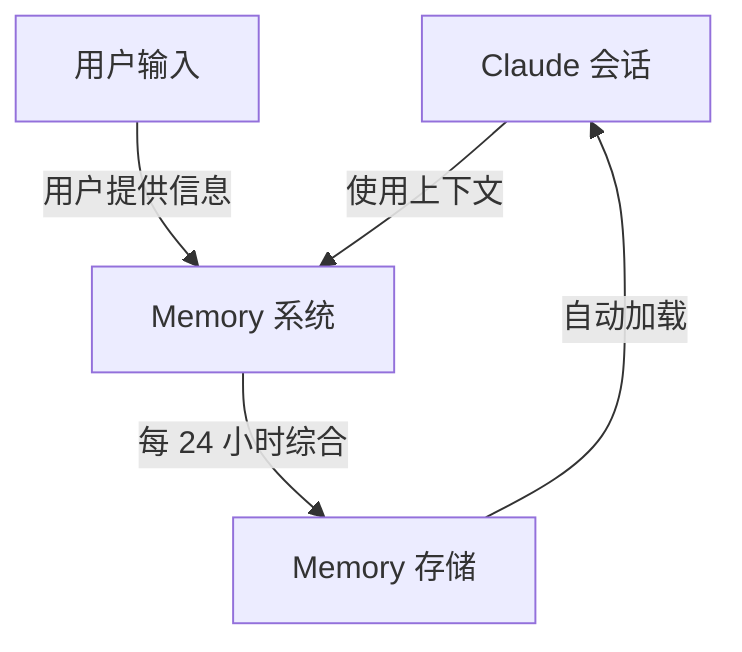
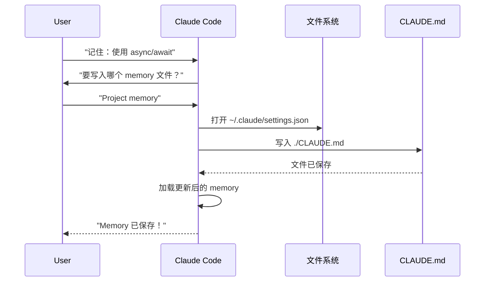
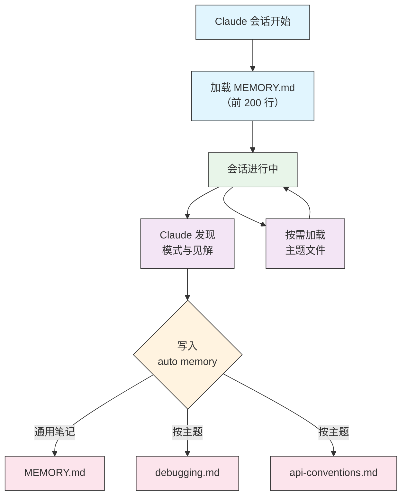

<picture>
  <source media="(prefers-color-scheme: dark)" srcset="../resources/logos/claude-howto-logo-dark.svg">
  
</picture>

<a id="memory-guide"></a>

# Memory 指南

Memory 让 Claude 能在会话与对话之间保留上下文。它有两种形式：claude.ai 中的自动综合，以及 Claude Code 中基于文件系统的 `CLAUDE.md`。

<a id="overview"></a>

## 概述

Claude Code 中的 Memory 提供可跨多次会话与对话持久存在的上下文。与临时上下文窗口不同，memory 文件让你可以：

- 在团队内共享项目规范
- 保存个人开发偏好
- 维护按目录划分的规则与配置
- 导入外部文档
- 将 memory 纳入版本控制，作为项目的一部分

Memory 系统在多个层级上运作：从全局个人偏好到具体子目录，从而精细控制 Claude 记住什么以及如何应用这些知识。

<a id="memory-commands-quick-reference"></a>

## Memory 命令速查

| 命令 | 用途 | 用法 | 适用场景 |
|---------|------|------|----------|
| `/init` | 初始化项目 memory | `/init` | 新建项目、首次设置 `CLAUDE.md` |
| `/memory` | 在编辑器中编辑 memory 文件 | `/memory` | 大量更新、重组、审阅内容 |
| `#` 前缀 | 快速单行追加 memory | `# 在此填写你的规则` | 对话中快速添加规则 |
| `# new rule into memory` | 显式追加 memory | `# new rule into memory<br/>你的详细规则` | 添加较复杂的多行规则 |
| `# remember this` | 自然语言形式的 memory | `# remember this<br/>你的说明` | 对话式更新 memory |
| `@path/to/file` | 导入外部内容 | `@README.md` 或 `@docs/api.md` | 在 `CLAUDE.md` 中引用已有文档 |

<a id="quick-start-initializing-memory"></a>

## 快速开始：初始化 Memory

<a id="the-init-command"></a>

### `/init` 命令

`/init` 是在 Claude Code 中设置项目 memory 最快的方式。它会初始化 `CLAUDE.md`，并写入基础项目文档。

**用法：**

```bash
/init
```

**作用：**

- 在项目中新建 `CLAUDE.md`（常见位置为 `./CLAUDE.md` 或 `./.claude/CLAUDE.md`）
- 建立项目约定与指南
- 为跨会话持久化上下文打下基础
- 提供用于记录项目规范的模板结构

**增强交互模式：** 设置 `CLAUDE_CODE_NEW_INIT=true` 可启用多阶段交互流程，逐步引导完成项目设置：

```bash
CLAUDE_CODE_NEW_INIT=true claude
/init
```

**何时使用 `/init`：**

- 使用 Claude Code 开启新项目
- 建立团队编码规范与约定
- 编写代码库结构相关文档
- 为协作开发设置 memory 层级

**示例工作流：**

```markdown
# 在项目目录中
/init

# Claude 会创建类似结构的 CLAUDE.md：
# 项目配置
## 项目概览
- 名称: 你的项目
- 技术栈: [你的技术栈]
- 团队规模: [开发者人数]

## 开发规范
- 代码风格偏好
- 测试要求
- Git 工作流约定
```

<a id="quick-memory-updates-with-"></a>

### 使用 `#` 快速更新 Memory

在任意对话中，只要以 `#` 开头发送消息，即可快速向 memory 追加信息：

**语法：**

```markdown
# 在此填写你的 memory 规则或说明
```

**示例：**

```markdown
# 本项目始终启用 TypeScript strict 模式

# 优先使用 async/await，少用 Promise 链

# 每次提交前运行 npm test

# 文件名使用 kebab-case
```

**工作原理：**

1. 以 `#` 开头，后接你的规则
2. Claude 会将其识别为 memory 更新请求
3. Claude 会询问要更新哪个 memory 文件（项目或个人）
4. 规则会写入对应的 `CLAUDE.md`
5. 后续会话会自动加载该上下文

**其他写法：**

```markdown
# new rule into memory
始终使用 Zod 校验用户输入

# remember this
所有发布采用语义化版本

# add to memory
数据库迁移必须可回滚
```

<a id="the-memory-command"></a>

### `/memory` 命令

`/memory` 让你在 Claude Code 会话中直接编辑 `CLAUDE.md` memory 文件；会在系统默认编辑器中打开这些文件，便于全面编辑。

**用法：**

```bash
/memory
```

**作用：**

- 在系统默认编辑器中打开 memory 文件
- 支持大量增删改与重组
- 直接访问层级中的全部 memory 文件
- 管理跨会话的持久上下文

**何时使用 `/memory`：**

- 审阅现有 memory 内容
- 大量更新项目规范
- 重组 memory 结构
- 添加详细文档或指南
- 随项目演进维护与更新 memory

**对比：`/memory` 与 `/init`**

| 方面 | `/memory` | `/init` |
|------|-----------|---------|
| **用途** | 编辑已有 memory 文件 | 初始化新的 `CLAUDE.md` |
| **何时使用** | 更新/修改项目上下文 | 开启新项目 |
| **操作** | 打开编辑器进行修改 | 生成起始模板 |
| **工作流** | 持续维护 | 一次性设置 |

**示例工作流：**

```markdown
# 打开 memory 进行编辑
/memory

# Claude 会列出选项：
# 1. Managed Policy Memory
# 2. Project Memory (./CLAUDE.md)
# 3. User Memory (~/.claude/CLAUDE.md)
# 4. Local Project Memory

# 选择第 2 项（Project Memory）
# 默认编辑器会打开 ./CLAUDE.md 的内容

# 修改、保存并关闭编辑器
# Claude 会自动重新加载更新后的 memory
```

**使用 Memory 导入：**

`CLAUDE.md` 支持 `@path/to/file` 语法以包含外部内容：

```markdown
# 项目文档
参见 @README.md 了解项目概览
参见 @package.json 查看可用 npm 命令
参见 @docs/architecture.md 了解系统设计

# 使用绝对路径从主目录导入
@~/.claude/my-project-instructions.md
```

**导入特性：**

- 支持相对路径与绝对路径（例如 `@docs/api.md` 或 `@~/.claude/my-project-instructions.md`）
- 支持递归导入，最大深度为 5
- 首次从外部路径导入会触发安全确认对话框
- 在 Markdown 行内代码或代码块内的导入指令不会被解析（因此在示例中安全地记录它们）
- 通过引用已有文档避免重复
- 被引用内容会自动纳入 Claude 的上下文

<a id="memory-architecture"></a>

## Memory 架构

Claude Code 中的 Memory 采用分层体系，不同作用域承担不同职责：



<a id="memory-hierarchy-in-claude-code"></a>

## Claude Code 中的 Memory 层级

Claude Code 使用多层分级 memory 系统。启动时会自动加载 memory 文件，较高层级的文件优先。

**完整 Memory 层级（按优先级顺序）：**

1. **Managed Policy** — 组织级说明
   - macOS：`/Library/Application Support/ClaudeCode/CLAUDE.md`
   - Linux/WSL：`/etc/claude-code/CLAUDE.md`
   - Windows：`C:\Program Files\ClaudeCode\CLAUDE.md`

2. **Managed Drop-ins** — 按字母序合并的策略文件（v2.1.83+）
   - 与 managed policy 的 `CLAUDE.md` 同级的 `managed-settings.d/` 目录
   - 文件按字母顺序合并，便于模块化策略管理

3. **Project Memory** — 团队共享上下文（可版本控制）
   - `./.claude/CLAUDE.md` 或 `./CLAUDE.md`（仓库根目录）

4. **Project Rules** — 模块化、按主题划分的项目说明
   - `./.claude/rules/*.md`

5. **User Memory** — 个人偏好（所有项目）
   - `~/.claude/CLAUDE.md`

6. **User-Level Rules** — 个人规则（所有项目）
   - `~/.claude/rules/*.md`

7. **Local Project Memory** — 个人、项目专属偏好
   - `./CLAUDE.local.md`

8. **Auto Memory** — Claude 自动记录笔记与学习
   - `~/.claude/projects/<project>/memory/`

> **说明**：截至 2026 年 3 月，[官方文档](https://code.claude.com/docs/en/memory) 未提及 `CLAUDE.local.md`。它可能仍作为遗留功能可用。新项目建议改用 `~/.claude/CLAUDE.md`（用户级）或 `.claude/rules/`（项目级、按路径作用域）等方案。

<a id="excluding-claudemd-files-with-claudemdexcludes"></a>

## 使用 `claudeMdExcludes` 排除 `CLAUDE.md` 文件

在大型 monorepo 中，部分 `CLAUDE.md` 可能与当前工作无关。`claudeMdExcludes` 设置可跳过指定 `CLAUDE.md`，使其不加载到上下文中：

```jsonc
// 位于 ~/.claude/settings.json 或 .claude/settings.json
{
  "claudeMdExcludes": [
    "packages/legacy-app/CLAUDE.md",
    "vendors/**/CLAUDE.md"
  ]
}
```

模式按相对项目根的路径匹配。适用于：

- 含多个子项目但只有部分相关的 monorepo
- 包含 vendored 或第三方 `CLAUDE.md` 的仓库
- 通过排除陈旧或无关说明，减少 Claude 上下文窗口中的噪声

<a id="settings-file-hierarchy"></a>

## 设置文件层级

Claude Code 的设置（含 `autoMemoryDirectory`、`claudeMdExcludes` 及其他配置）按五级层级解析，较高层级优先：

| 层级 | 位置 | 作用域 |
|------|------|--------|
| 1（最高） | Managed policy（系统级） | 全组织强制 |
| 2 | `managed-settings.d/`（v2.1.83+） | 模块化策略 drop-in，按字母序合并 |
| 3 | `~/.claude/settings.json` | 用户偏好 |
| 4 | `.claude/settings.json` | 项目级（提交到 git） |
| 5（最低） | `.claude/settings.local.json` | 本地覆盖（git 忽略） |

**平台专属配置（v2.1.51+）：**

还可通过以下方式配置：
- **macOS**：Property list（plist）文件
- **Windows**：Windows 注册表

这些平台原生机制与 JSON 设置文件一并读取，并遵循相同的优先级规则。

<a id="modular-rules-system"></a>

## 模块化 Rules 体系

使用 `.claude/rules/` 目录结构创建有条理、按路径作用域的规则。规则可在项目级与用户级定义：

```
your-project/
├── .claude/
│   ├── CLAUDE.md
│   └── rules/
│       ├── code-style.md
│       ├── testing.md
│       ├── security.md
│       └── api/                  # 支持子目录
│           ├── conventions.md
│           └── validation.md

~/.claude/
├── CLAUDE.md
└── rules/                        # 用户级规则（所有项目）
    ├── personal-style.md
    └── preferred-patterns.md
```

会在 `rules/` 目录（含子目录）内递归发现规则。`~/.claude/rules/` 中的用户级规则先于项目级规则加载，个人默认可被项目覆盖。

<a id="path-specific-rules-with-yaml-frontmatter"></a>

### 使用 YAML Frontmatter 的按路径规则

定义仅对特定文件路径生效的规则：

```markdown
---
paths: src/api/**/*.ts
---

# API 开发规则

- 所有 API 端点必须包含输入校验
- 使用 Zod 做 schema 校验
- 为所有参数与响应类型编写文档
- 所有操作均需包含错误处理
```

**Glob 示例：**

- `**/*.ts` — 所有 TypeScript 文件
- `src/**/*` — `src/` 下所有文件
- `src/**/*.{ts,tsx}` — 多种扩展名
- `{src,lib}/**/*.ts, tests/**/*.test.ts` — 多组模式

<a id="subdirectories-and-symlinks"></a>

### 子目录与符号链接

`.claude/rules/` 中的规则支持两种组织方式：

- **子目录**：规则递归发现，可按主题放入文件夹（例如 `rules/api/`、`rules/testing/`、`rules/security/`）
- **符号链接**：支持通过 symlink 在多个项目间共享规则。例如可将集中存放的规则文件链接到各项目的 `.claude/rules/` 目录

<a id="memory-locations-table"></a>

## Memory 位置一览

| 位置 | 作用域 | 优先级 | 共享范围 | 访问 | 最适用 |
|------|--------|--------|----------|------|--------|
| `/Library/Application Support/ClaudeCode/CLAUDE.md` (macOS) | Managed Policy | 1（最高） | 组织 | 系统 | 全公司策略 |
| `/etc/claude-code/CLAUDE.md` (Linux/WSL) | Managed Policy | 1（最高） | 组织 | 系统 | 组织标准 |
| `C:\Program Files\ClaudeCode\CLAUDE.md` (Windows) | Managed Policy | 1（最高） | 组织 | 系统 | 企业指南 |
| `managed-settings.d/*.md`（与 policy 同级） | Managed Drop-ins | 1.5 | 组织 | 系统 | 模块化策略文件（v2.1.83+） |
| `./CLAUDE.md` 或 `./.claude/CLAUDE.md` | Project Memory | 2 | 团队 | Git | 团队规范、共享架构 |
| `./.claude/rules/*.md` | Project Rules | 3 | 团队 | Git | 按路径、模块化规则 |
| `~/.claude/CLAUDE.md` | User Memory | 4 | 个人 | 文件系统 | 个人偏好（所有项目） |
| `~/.claude/rules/*.md` | User Rules | 5 | 个人 | 文件系统 | 个人规则（所有项目） |
| `./CLAUDE.local.md` | Project Local | 6 | 个人 | Git（忽略） | 个人、项目专属偏好 |
| `~/.claude/projects/<project>/memory/` | Auto Memory | 7（最低） | 个人 | 文件系统 | Claude 自动笔记与学习 |

<a id="memory-update-lifecycle"></a>

## Memory 更新生命周期

Memory 更新在 Claude Code 会话中的大致流程如下：



<a id="auto-memory"></a>

## Auto Memory

Auto memory 是 Claude 在处理项目时自动记录学习、模式与见解的持久目录。与需你手动编写维护的 `CLAUDE.md` 不同，auto memory 由 Claude 在会话中写入。

<a id="how-auto-memory-works"></a>

### Auto Memory 如何工作

- **位置**：`~/.claude/projects/<project>/memory/`
- **入口**：`MEMORY.md` 作为 auto memory 目录的主文件
- **主题文件**：可选，用于特定主题（例如 `debugging.md`、`api-conventions.md`）
- **加载行为**：会话开始时，将 `MEMORY.md` 的前 200 行加载到系统提示中；主题文件按需加载，不在启动时加载
- **读写**：会话中 Claude 会根据发现的模式与项目知识读写 memory 文件

<a id="auto-memory-architecture"></a>

### Auto Memory 架构



<a id="auto-memory-directory-structure"></a>

### Auto Memory 目录结构

```
~/.claude/projects/<project>/memory/
├── MEMORY.md              # 入口（启动时加载前 200 行）
├── debugging.md           # 主题文件（按需加载）
├── api-conventions.md     # 主题文件（按需加载）
└── testing-patterns.md    # 主题文件（按需加载）
```

<a id="version-requirement"></a>

### 版本要求

Auto memory 需要 **Claude Code v2.1.59 或更高版本**。若版本较旧，请先升级：

```bash
npm install -g @anthropic-ai/claude-code@latest
```

<a id="custom-auto-memory-directory"></a>

### 自定义 Auto Memory 目录

默认情况下，auto memory 存放在 `~/.claude/projects/<project>/memory/`。可通过 `autoMemoryDirectory` 设置更改位置（自 **v2.1.74** 起可用）：

```jsonc
// 位于 ~/.claude/settings.json 或 .claude/settings.local.json（仅限用户/本地设置）
{
  "autoMemoryDirectory": "/path/to/custom/memory/directory"
}
```

> **说明**：`autoMemoryDirectory` 只能设置在用户级（`~/.claude/settings.json`）或本地设置（`.claude/settings.local.json`）中，不能设在项目或 managed policy 设置里。

适用于以下场景：

- 将 auto memory 放在共享或同步位置
- 与默认 Claude 配置目录分离
- 在默认层级之外使用项目专属路径

<a id="worktree-and-repository-sharing"></a>

### Worktree 与仓库共享

同一 git 仓库内的所有 worktree 与子目录共享同一个 auto memory 目录。因此在同一仓库的不同 worktree 之间切换，或在不同子目录中工作，都会读写同一套 memory 文件。

<a id="subagent-memory"></a>

### Subagent Memory

Subagent（通过 Task 等工具或并行执行产生）可以有独立的 memory 上下文。在 subagent 定义中使用 `memory` frontmatter 字段指定要加载的作用域：

```yaml
memory: user      # 仅加载用户级 memory
memory: project   # 仅加载项目级 memory
memory: local     # 仅加载本地 memory
```

这样 subagent 可使用聚焦的上下文，而不必继承完整 memory 层级。

<a id="controlling-auto-memory"></a>

### 控制 Auto Memory

可通过环境变量 `CLAUDE_CODE_DISABLE_AUTO_MEMORY` 控制 auto memory：

| 取值 | 行为 |
|------|------|
| `0` | 强制开启 auto memory |
| `1` | 强制关闭 auto memory |
| *（未设置）* | 默认行为（auto memory 启用） |

```bash
# 本会话关闭 auto memory
CLAUDE_CODE_DISABLE_AUTO_MEMORY=1 claude

# 显式强制开启 auto memory
CLAUDE_CODE_DISABLE_AUTO_MEMORY=0 claude
```

<a id="additional-directories-with---add-dir"></a>

## 使用 `--add-dir` 附加目录

`--add-dir` 标志让 Claude Code 除当前工作目录外，还能从额外目录加载 `CLAUDE.md`。适用于 monorepo 或多项目场景，当其他目录的上下文也有关时。

启用该功能需设置环境变量：

```bash
CLAUDE_CODE_ADDITIONAL_DIRECTORIES_CLAUDE_MD=1
```

然后使用标志启动 Claude Code：

```bash
claude --add-dir /path/to/other/project
```

Claude 会从指定附加目录加载 `CLAUDE.md`，并与当前工作目录的 memory 文件一并加载。

<a id="practical-examples"></a>

## 实用示例

<a id="example-1-project-memory-structure"></a>

### 示例 1：项目 Memory 结构

**文件：** `./CLAUDE.md`

```markdown
# 项目配置

## 项目概览
- **名称**: 电商平台
- **技术栈**: Node.js、PostgreSQL、React 18、Docker
- **团队规模**: 5 名开发者
- **截止时间**: 2025 年 Q4

## 架构
@docs/architecture.md
@docs/api-standards.md
@docs/database-schema.md

## 开发规范

### 代码风格
- 使用 Prettier 格式化
- ESLint 使用 airbnb 配置
- 最大行宽：100 字符
- 使用 2 空格缩进

### 命名约定
- **文件**: kebab-case（`user-controller.js`）
- **类**: PascalCase（`UserService`）
- **函数/变量**: camelCase（`getUserById`）
- **常量**: UPPER_SNAKE_CASE（`API_BASE_URL`）
- **数据库表**: snake_case（`user_accounts`）

### Git 工作流
- 分支名：`feature/description` 或 `fix/description`
- 提交信息：遵循 conventional commits
- 合并前需要 PR
- 必须通过全部 CI/CD 检查
- 至少 1 人审批

### 测试要求
- 代码覆盖率不低于 80%
- 所有关键路径必须有测试
- 单元测试使用 Jest
- E2E 测试使用 Cypress
- 测试文件名：`*.test.ts` 或 `*.spec.ts`

### API 规范
- 仅使用 RESTful 端点
- JSON 请求/响应
- 正确使用 HTTP 状态码
- API 版本化：`/api/v1/`
- 为所有端点编写文档与示例

### 数据库
- 使用 migration 变更 schema
- 禁止硬编码凭证
- 使用连接池
- 开发环境启用查询日志
- 需要定期备份

### 部署
- 基于 Docker 部署
- Kubernetes 编排
- 蓝绿部署策略
- 失败时自动回滚
- 部署前执行数据库 migration

## 常用命令

| 命令 | 用途 |
|---------|------|
| `npm run dev` | 启动开发服务器 |
| `npm test` | 运行测试套件 |
| `npm run lint` | 检查代码风格 |
| `npm run build` | 生产构建 |
| `npm run migrate` | 执行数据库 migration |

## 团队联系人
- 技术负责人: Sarah Chen (@sarah.chen)
- 产品经理: Mike Johnson (@mike.j)
- DevOps: Alex Kim (@alex.k)

## 已知问题与变通方案
- 高峰时段 PostgreSQL 连接池上限为 20
- 变通方案：实现查询排队
- Safari 14 与 async generator 的兼容问题
- 变通方案：使用 Babel 转译器

## 相关项目
- 数据分析看板: `/projects/analytics`
- 移动应用: `/projects/mobile`
- 管理后台: `/projects/admin`
```

<a id="example-2-directory-specific-memory"></a>

### 示例 2：按目录的 Memory

**文件：** `./src/api/CLAUDE.md`

```markdown
# API 模块规范

本文件覆盖 `/src/api/` 下所有内容对根目录 CLAUDE.md 的约定。

## API 专属规范

### 请求校验
- 使用 Zod 做 schema 校验
- 始终校验输入
- 校验失败返回 400
- 包含字段级错误详情

### 认证
- 所有端点需要 JWT
- Token 放在 Authorization 头
- Token 24 小时过期
- 实现 refresh token 机制

### 响应格式

所有响应须符合以下结构：

```json
{
  "success": true,
  "data": { /* 实际数据 */ },
  "timestamp": "2025-11-06T10:30:00Z",
  "version": "1.0"
}
```

错误响应：
```json
{
  "success": false,
  "error": {
    "code": "VALIDATION_ERROR",
    "message": "面向用户的错误说明",
    "details": { /* 字段错误 */ }
  },
  "timestamp": "2025-11-06T10:30:00Z"
}
```

### 分页
- 使用基于游标的分页（不用 offset）
- 包含 `hasMore` 布尔值
- 单页最大 100 条
- 默认每页 20 条

### 限流
- 已认证用户每小时 1000 次请求
- 公开端点每小时 100 次请求
- 超限时返回 429
- 包含 retry-after 头

### 缓存
- 会话缓存使用 Redis
- 默认缓存时长 5 分钟
- 写操作后失效
- 缓存键按资源类型打标签
```

<a id="example-3-personal-memory"></a>

### 示例 3：个人 Memory

**文件：** `~/.claude/CLAUDE.md`

```markdown
# 我的开发偏好

## 关于我
- **经验水平**：8 年全栈开发
- **常用语言**：TypeScript、Python
- **沟通风格**：直接，并附示例
- **学习方式**：图示配合代码

## 代码偏好

### 错误处理
偏好显式错误处理：try-catch 与有意义的错误信息。
避免泛泛错误。调试时务必记录日志。

### 注释
注释写「为什么」，不写「是什么」。代码应自解释。
注释用于说明业务逻辑或非常规决策。

### 测试
偏好 TDD（测试驱动开发）。
先写测试，再写实现。
关注行为，而非实现细节。

### 架构
偏好模块化、松耦合设计。
使用依赖注入便于测试。
职责分离（Controllers、Services、Repositories）。

## 调试偏好
- `console.log` 使用前缀：`[DEBUG]`
- 附带上下文：函数名、相关变量
- 可用时使用堆栈
- 日志始终带时间戳

## 沟通方式
- 用图示解释复杂概念
- 先给具体例子，再讲理论
- 提供修改前后代码片段
- 结尾总结要点

## 项目组织
个人项目目录习惯：

   project/
   ├── src/
   │   ├── api/
   │   ├── services/
   │   ├── models/
   │   └── utils/
   ├── tests/
   ├── docs/
   └── docker/

## 工具链
- **IDE**：VS Code，vim 键位
- **终端**：Zsh + Oh-My-Zsh
- **格式化**：Prettier（行宽 100）
- **Lint**：ESLint airbnb 配置
- **测试框架**：Jest + React Testing Library
```

_我的测试_

请 Claude 保存一条新规则


由于当时没有任何 `Claude.md` 文件，Claude 没有保存该规则。随后请 Claude 确认保存位置。


<a id="example-4-memory-update-during-session"></a>

### 示例 4：会话中更新 Memory

在活跃的 Claude Code 会话中可以向 memory 追加新规则，有两种方式：

<a id="method-1-direct-request"></a>

#### 方法 1：直接请求

```markdown
User: 请记住：新组件我偏好用 React hooks，不用 class 组件。

Claude: 正在写入你的 memory。要放在哪个 memory 文件？
        1. Project memory (./CLAUDE.md)
        2. Personal memory (~/.claude/CLAUDE.md)

User: Project memory

Claude: ✅ Memory 已保存！

已追加到 ./CLAUDE.md：
---

### 组件开发
- 使用函数组件与 React Hooks
- 优先 hooks，而非 class 组件
- 可复用逻辑抽成自定义 hooks
- 事件处理使用 useCallback
- 昂贵计算使用 useMemo
```

<a id="method-2-using--new-rule-into-memory-pattern"></a>

#### 方法 2：使用 “# new rule into memory” 模式

也可使用显式模式 “# new rule into memory” 触发 memory 更新：

```markdown
User: # new rule into memory
      处理前始终用 Zod schema 校验用户输入。

Claude: 正在保存该规则到 memory。应使用哪个 memory 文件？
        1. Project memory (./CLAUDE.md)
        2. Personal memory (~/.claude/CLAUDE.md)

User: Project memory

Claude: ✅ Memory 已保存！

已追加到 ./CLAUDE.md：
---

### 输入校验
- 处理前始终用 Zod schema 校验用户输入
- 在每个 API handler 文件顶部定义 schema
- 校验失败返回 400 及错误信息
```

<a id="tips-for-adding-memory"></a>

#### 追加 Memory 的提示

- 规则要具体、可执行
- 将相关规则归到同一小节标题下
- 更新已有小节，避免重复堆砌
- 选择合适的作用域（项目 vs 个人）

<a id="memory-features-comparison"></a>

## Memory 功能对比

| 功能 | Claude Web/Desktop | Claude Code（`CLAUDE.md`） |
|------|-------------------|------------------------|
| 自动综合 | ✅ 每 24 小时 | ❌ 手动 |
| 跨项目 | ✅ 共享 | ❌ 按项目 |
| 团队访问 | ✅ 共享项目 | ✅ Git 跟踪 |
| 可搜索 | ✅ 内置 | ✅ 通过 `/memory` |
| 可编辑 | ✅ 对话中 | ✅ 直接编辑文件 |
| 导入/导出 | ✅ 支持 | ✅ 复制/粘贴 |
| 持久化 | ✅ 24h+ | ✅ 长期 |

<a id="memory-in-claude-webdesktop"></a>

### Claude Web/Desktop 中的 Memory

<a id="memory-synthesis-timeline"></a>

#### Memory 综合时间线


**Memory 摘要示例：**

```markdown
## Claude 对用户的 Memory

### 职业背景
- 高级全栈开发者，8 年经验
- 侧重 TypeScript/Node.js 后端与 React 前端
- 积极参与开源
- 对 AI 与机器学习感兴趣

### 项目上下文
- 正在搭建电商平台
- 技术栈：Node.js、PostgreSQL、React 18、Docker
- 与 5 人团队协作
- 使用 CI/CD 与蓝绿部署

### 沟通偏好
- 偏好直接、简洁的解释
- 喜欢图示与示例
- 重视代码片段
- 在注释中说明业务逻辑

### 当前目标
- 提升 API 性能
- 测试覆盖率提升至 90%
- 落地缓存策略
- 完善架构文档
```

<a id="best-practices"></a>

## 最佳实践

<a id="dos---what-to-include"></a>

### 建议做 — 应包含什么

- **具体且详细**：用清晰、具体的说明，避免空泛指导
  - ✅ 好：“所有 JavaScript 文件使用 2 空格缩进”
  - ❌ 避免：“遵循最佳实践”

- **保持条理**：用清晰的 Markdown 小节与标题组织 memory 文件

- **使用合适层级**：
  - **Managed policy**：全公司策略、安全标准、合规要求
  - **Project memory**：团队规范、架构、编码约定（提交到 git）
  - **User memory**：个人偏好、沟通风格、工具选择
  - **Directory memory**：模块专属规则与覆盖

- **善用导入**：用 `@path/to/file` 引用已有文档
  - 最多支持 5 层递归嵌套
  - 避免在多个 memory 文件中重复相同内容
  - 示例：`参见 @README.md 了解项目概览`

- **记录常用命令**：把反复使用的命令写进去以节省时间

- **对项目 memory 做版本控制**：将项目级 `CLAUDE.md` 提交到 git，便于团队使用

- **定期审阅**：随项目演进与需求变化更新 memory

- **给出具体示例**：包含代码片段与具体场景

<a id="donts---what-to-avoid"></a>

### 不建议做 — 应避免什么

- **不要存放密钥**：不要包含 API 密钥、密码、令牌或凭证

- **不要包含敏感数据**：不要包含 PII、隐私信息或专有秘密

- **不要重复内容**：用导入（`@path`）引用已有文档

- **不要含糊**：避免“遵循最佳实践”“写好代码”这类空话

- **不要过长**：单个 memory 文件保持聚焦，建议不超过 500 行

- **不要过度分层**：策略性使用层级；不要创建过多子目录覆盖

- **不要忘记更新**：陈旧的 memory 会导致困惑与过时做法

- **不要超过嵌套上限**：memory 导入最多支持 5 层嵌套

<a id="memory-management-tips"></a>

### Memory 管理技巧

**选择正确的 memory 层级：**

| 使用场景 | Memory 层级 | 理由 |
|----------|-------------|------|
| 公司安全策略 | Managed Policy | 组织内所有项目适用 |
| 团队代码风格指南 | Project | 通过 git 与团队共享 |
| 你偏好的编辑器快捷键 | User | 个人偏好，不共享 |
| API 模块规范 | Directory | 仅该模块适用 |

**快速更新工作流：**

1. 单条规则：在对话中使用 `#` 前缀
2. 多处修改：使用 `/memory` 打开编辑器
3. 初次搭建：使用 `/init` 创建模板

**导入最佳实践：**

```markdown
# 推荐：引用已有文档
@README.md
@docs/architecture.md
@package.json

# 避免：复制别处已有的全文
# 不要把 README 整段贴进 CLAUDE.md，用导入即可
```

<a id="installation-instructions"></a>

## 安装说明

<a id="setup-project-memory"></a>

### 设置项目 Memory

<a id="method-1-using-init-command-recommended"></a>

#### 方法 1：使用 `/init` 命令（推荐）

设置项目 memory 最快的方式：

1. **进入项目目录：**
   ```bash
   cd /path/to/your/project
   ```

2. **在 Claude Code 中运行 init：**
   ```bash
   /init
   ```

3. **Claude 会创建并填充 `CLAUDE.md`**，附带模板结构

4. **按项目需要自定义**生成文件

5. **提交到 git：**
   ```bash
   git add CLAUDE.md
   git commit -m "文档(项目): 使用 /init 初始化项目 memory"
   ```

<a id="method-2-manual-creation"></a>

#### 方法 2：手动创建

若偏好手动设置：

1. **在项目根目录创建 `CLAUDE.md`：**
   ```bash
   cd /path/to/your/project
   touch CLAUDE.md
   ```

2. **添加项目规范：**
   ```bash
   cat > CLAUDE.md << 'EOF'
   # 项目配置

   ## 项目概览
   - **名称**: 你的项目名称
   - **技术栈**: 列出技术栈
   - **团队规模**: 开发者人数

   ## 开发规范
   - 你的编码规范
   - 命名约定
   - 测试要求
   EOF
   ```

3. **提交到 git：**
   ```bash
   git add CLAUDE.md
   git commit -m "文档(项目): 添加项目 memory 配置"
   ```

<a id="method-3-quick-updates-with-"></a>

#### 方法 3：使用 `#` 快速更新

`CLAUDE.md` 已存在后，可在对话中快速追加规则：

```markdown
# 所有发布采用语义化版本

# 提交前始终运行测试

# 优先组合而非继承
```

Claude 会提示你选择要更新哪个 memory 文件。

<a id="setup-personal-memory"></a>

### 设置个人 Memory

1. **创建 `~/.claude` 目录：**
   ```bash
   mkdir -p ~/.claude
   ```

2. **创建个人 `CLAUDE.md`：**
   ```bash
   touch ~/.claude/CLAUDE.md
   ```

3. **写入你的偏好：**
   ```bash
   cat > ~/.claude/CLAUDE.md << 'EOF'
   # 我的开发偏好

   ## 关于我
   - 经验水平: [你的水平]
   - 常用语言: [常用语言]
   - 沟通风格: [沟通风格]

   ## 代码偏好
   - [你的偏好]
   EOF
   ```

<a id="setup-directory-specific-memory"></a>

### 设置按目录的 Memory

1. **为特定目录创建 memory：**
   ```bash
   mkdir -p /path/to/directory/.claude
   touch /path/to/directory/CLAUDE.md
   ```

2. **添加目录专属规则：**
   ```bash
   cat > /path/to/directory/CLAUDE.md << 'EOF'
   # [目录名] 规范

   本文件覆盖该目录下对根目录 CLAUDE.md 的约定。

   ## [具体规范]
   EOF
   ```

3. **提交到版本控制：**
   ```bash
   git add /path/to/directory/CLAUDE.md
   git commit -m "文档(项目): 添加 [目录名] 的 memory 配置"
   ```

<a id="verify-setup"></a>

### 验证设置

1. **检查 memory 位置：**
   ```bash
   # 项目根目录 memory
   ls -la ./CLAUDE.md

   # 个人 memory
   ls -la ~/.claude/CLAUDE.md
   ```

2. **启动会话时 Claude Code 会自动加载**这些文件

3. **在项目中开启新会话**，用 Claude Code 进行验证

<a id="official-documentation"></a>

## 官方文档

最新说明请参阅 Claude Code 官方文档：

- **[Memory 文档](https://code.claude.com/docs/en/memory)** — memory 体系统述
- **[Slash Commands 参考](https://code.claude.com/docs/en/interactive-mode)** — 含 `/init`、`/memory` 在内的内置命令
- **[CLI 参考](https://code.claude.com/docs/en/cli-reference)** — 命令行界面文档

<a id="key-technical-details-from-official-docs"></a>

### 官方文档中的关键技术点

**Memory 加载：**

- 启动 Claude Code 时会自动加载所有 memory 文件
- Claude 从当前工作目录向上遍历以发现 `CLAUDE.md` 文件
- 访问对应子目录时会发现并加载子树中的文件

**导入语法：**

- 使用 `@path/to/file` 包含外部内容（例如 `@~/.claude/my-project-instructions.md`）
- 支持相对路径与绝对路径
- 支持递归导入，最大深度为 5
- 首次从外部导入会触发确认对话框
- 在 Markdown 行内代码或代码块内不会解析
- 被引用内容会自动纳入 Claude 的上下文

**Memory 层级优先级：**

1. Managed Policy（最高）
2. Managed Drop-ins（`managed-settings.d/`，v2.1.83+）
3. Project Memory
4. Project Rules（`.claude/rules/`）
5. User Memory
6. User-Level Rules（`~/.claude/rules/`）
7. Local Project Memory
8. Auto Memory（最低）

<a id="related-concepts-links"></a>

## 相关概念链接

<a id="integration-points"></a>

### 集成入口
- [MCP 协议](../05-mcp/) — 与 memory 并用的实时数据访问
- [Slash Commands](../01-slash-commands/) — 会话内快捷方式
- [Skills](../03-skills/) — 带 memory 上下文的自动化工作流

<a id="related-claude-features"></a>

### 相关 Claude 功能
- [Claude Web Memory](https://claude.ai) — 自动综合
- [官方 Memory 文档](https://code.claude.com/docs/en/memory) — Anthropic 文档
