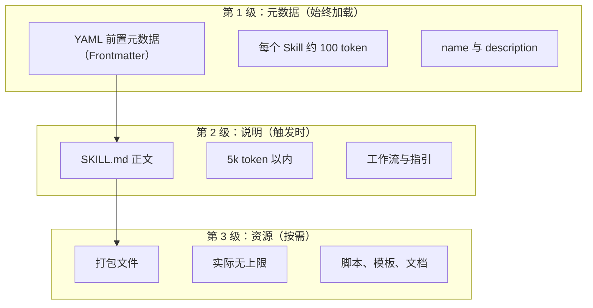
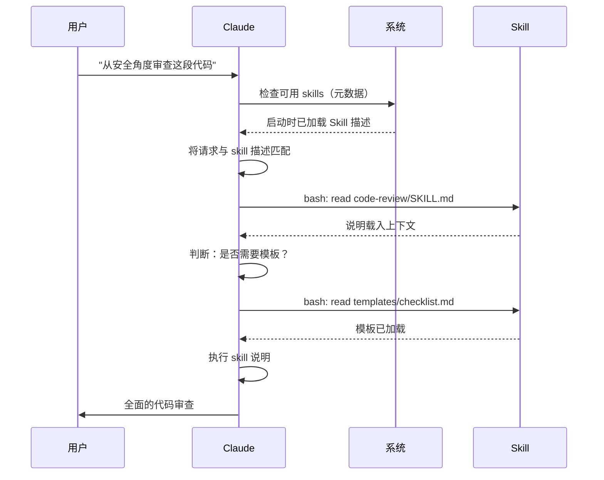

<picture>
  <source media="(prefers-color-scheme: dark)" srcset="../resources/logos/claude-howto-logo-dark.svg">
  
</picture>

<a id="agent-skills-guide"></a>
# Agent Skills 指南

Agent Skills（智能体 Skills）是可复用、基于文件系统的能力，用于扩展 Claude 的功能。它们将特定领域的专业知识、工作流与最佳实践打包成可被发现的组件，Claude 会在相关时自动使用。

<a id="overview"></a>
## 概述

**Agent Skills** 是模块化能力，能把通用智能体变成领域专家。与 prompt（对话级、一次性任务的说明）不同，Skills 按需加载，避免在多次对话中重复提供相同指引。

<a id="key-benefits"></a>
### 主要优势

- **让 Claude 更专精**：按领域任务定制能力
- **减少重复**：一次编写，多轮对话中自动复用
- **组合能力**：多个 Skills 组合成复杂工作流
- **扩展工作流**：在多个项目与团队间复用 Skills
- **保持质量**：把最佳实践直接嵌入工作流

Skills 遵循 [Agent Skills](https://agentskills.io) 开放标准，可在多种 AI 工具间通用。Claude Code 在标准之上增加了调用控制、Subagent 执行与动态上下文注入等功能。

> **说明**：自定义 slash commands 已合并进 Skills。`.claude/commands/` 下的文件仍可用，并支持相同的前置元数据字段。新开发建议使用 Skills。若同一路径下两者并存（例如 `.claude/commands/review.md` 与 `.claude/skills/review/SKILL.md`），以 Skill 为准。

<a id="how-skills-work-progressive-disclosure"></a>
## Skills 如何工作：渐进式披露

Skills 采用**渐进式披露**架构——按需分阶段加载信息，而不是一开始就占满上下文。这样既能高效管理上下文，又具备近乎无限的扩展空间。

<a id="three-levels-of-loading"></a>
### 三级加载



| 级别 | 何时加载 | Token 成本 | 内容 |
|-------|------------|------------|---------|
| **第 1 级：元数据** | 始终（启动时） | 每个 Skill 约 100 token | YAML 前置元数据（frontmatter）中的 `name` 与 `description` |
| **第 2 级：说明** | Skill 被触发时 | 5k token 以内 | 含说明与指引的 SKILL.md 正文 |
| **第 3 级及以上：资源** | 按需 | 实际无上限 | 通过 bash 执行打包文件，不把内容全文载入上下文 |

这意味着你可以安装大量 Skills 而不明显占用上下文——在被真正触发之前，Claude 只知道每个 Skill 存在以及何时使用。

<a id="skill-loading-process"></a>
## Skill 加载流程



<a id="skill-types--locations"></a>
## Skill 类型与位置

| 类型 | 位置 | 作用范围 | 是否共享 | 最适合 |
|------|----------|-------|--------|----------|
| **企业级（Enterprise）** | 托管设置 | 组织内所有用户 | 是 | 全组织规范 |
| **个人（Personal）** | `~/.claude/skills/<skill-name>/SKILL.md` | 个人 | 否 | 个人工作流 |
| **项目（Project）** | `.claude/skills/<skill-name>/SKILL.md` | 团队 | 是（通过 git） | 团队规范 |
| **插件（Plugin）** | `<plugin>/skills/<skill-name>/SKILL.md` | 启用处 | 视插件而定 | 与插件打包 |

当不同层级出现同名 skill 时，优先级更高的位置胜出：**enterprise > personal > project**。插件（Plugin）中的 skills 使用 `plugin-name:skill-name` 命名空间，因此不会冲突。

<a id="automatic-discovery"></a>
### 自动发现

**嵌套目录**：当你编辑子目录中的文件时，Claude Code 会自动从嵌套的 `.claude/skills/` 目录发现 skills。例如你在编辑 `packages/frontend/` 下的文件时，Claude Code 也会在 `packages/frontend/.claude/skills/` 查找 skills。这适用于各包拥有独立 skill 的单体仓库（monorepo）。

**`--add-dir` 目录**：通过 `--add-dir` 加入的目录中的 Skills 会自动加载，并支持实时检测变更。这些目录中 skill 文件的修改会立即生效，无需重启 Claude Code。

**描述预算**：Skill 描述（第 1 级元数据）上限为**上下文窗口的 2%**（回退上限：**16,000 字符**）。若安装的 skills 很多，部分可能被排除。运行 `/context` 查看是否有警告。可通过环境变量 `SLASH_COMMAND_TOOL_CHAR_BUDGET` 覆盖该预算。

<a id="creating-custom-skills"></a>
## 创建自定义 Skills

<a id="basic-directory-structure"></a>
### 基本目录结构

```
my-skill/
├── SKILL.md           # 主说明（必填）
├── template.md        # 供 Claude 填写的模板
├── examples/
│   └── sample.md      # 示例输出，展示期望格式
└── scripts/
    └── validate.sh    # Claude 可执行的脚本
```

<a id="skillmd-format"></a>
### SKILL.md 格式

```yaml
---
name: your-skill-name
description: 简要说明本 Skill 做什么、何时使用
---

# 你的 Skill 名称

## 说明
为 Claude 提供清晰的分步指引。

## 示例
展示使用本 Skill 的具体示例。
```

<a id="required-fields"></a>
### 必填字段

- **name**：仅小写字母、数字、连字符（最多 64 个字符）。不能包含 "anthropic" 或 "claude"。
- **description**：Skill 做什么**以及**何时使用（最多 1024 个字符）。Claude 依赖此项判断何时激活该 skill。

<a id="optional-frontmatter-fields"></a>
### 可选前置元数据（Frontmatter）字段

```yaml
---
name: my-skill
description: 本 skill 做什么、何时使用
argument-hint: "[filename] [format]"        # 自动补全提示
disable-model-invocation: true              # 仅用户可调用
user-invocable: false                       # 从 slash 菜单隐藏
allowed-tools: Read, Grep, Glob             # 限制可用工具
model: opus                                 # 使用的模型
effort: high                                # 努力程度覆盖（low, medium, high, max）
context: fork                               # 在独立 Subagent 中运行
agent: Explore                              # agent 类型（与 context: fork 联用）
shell: bash                                 # 命令所用 shell：bash（默认）或 powershell
hooks:                                      # Skill 级 hooks
  PreToolUse:
    - matcher: "Bash"
      hooks:
        - type: command
          command: "./scripts/validate.sh"
---
```

| 字段 | 说明 |
|-------|-------------|
| `name` | 仅小写字母、数字、连字符（最多 64 个字符）。不能包含 "anthropic" 或 "claude"。 |
| `description` | Skill 做什么**以及**何时使用（最多 1024 个字符）。对自动调用匹配至关重要。 |
| `argument-hint` | 在 `/` 自动补全菜单中显示的提示（例如 `"[filename] [format]"`）。 |
| `disable-model-invocation` | `true` = 仅用户可通过 `/name` 调用。Claude 不会自动调用。 |
| `user-invocable` | `false` = 从 `/` 菜单隐藏。仅 Claude 可自动调用。 |
| `allowed-tools` | 逗号分隔列表，列出 skill 可在无权限提示下使用的工具。 |
| `model` | Skill 激活期间的模型覆盖（例如 `opus`、`sonnet`）。 |
| `effort` | Skill 激活期间的努力程度覆盖：`low`、`medium`、`high` 或 `max`。 |
| `context` | `fork` 表示在 fork 出的 Subagent 上下文中运行，拥有独立上下文窗口。 |
| `agent` | 当 `context: fork` 时的 Subagent 类型（例如 `Explore`、`Plan`、`general-purpose`）。 |
| `shell` | `!`command`` 替换与脚本使用的 shell：`bash`（默认）或 `powershell`。 |
| `hooks` | 仅作用于本 skill 生命周期的 Hooks（格式与全局 hooks 相同）。 |

<a id="skill-content-types"></a>
## Skill 内容类型

Skills 可包含两类内容，分别适用于不同目的：

<a id="reference-content"></a>
### 参考型内容

补充 Claude 在当前工作中要遵循的知识——约定、模式、风格指南、领域知识。与对话上下文内联运行。

```yaml
---
name: api-conventions
description: 本代码库的 API 设计模式
---

编写 API 端点时：
- 采用 RESTful 命名约定
- 返回一致的错误格式
- 包含请求校验
```

<a id="task-content"></a>
### 任务型内容

针对具体操作的分步说明。常通过 `/skill-name` 直接调用。

```yaml
---
name: deploy
description: 将应用部署到生产环境
context: fork
disable-model-invocation: true
---

部署应用：
1. 运行测试套件
2. 构建应用
3. 推送到部署目标
```

<a id="controlling-skill-invocation"></a>
## 控制 Skill 调用

默认情况下，你和 Claude 都可以调用任意 skill。两个前置元数据（frontmatter）字段控制三种调用模式：

| 前置元数据（Frontmatter） | 你可调用 | Claude 可调用 |
|---|---|---|
| （默认） | 是 | 是 |
| `disable-model-invocation: true` | 是 | 否 |
| `user-invocable: false` | 否 | 是 |

**使用 `disable-model-invocation: true`** 适用于有副作用的工作流：`/commit`、`/deploy`、`/send-slack-message`。你不希望仅因「代码看起来可以了」就让 Claude 自行部署。

**使用 `user-invocable: false`** 适用于无法作为命令执行的背景知识。例如 `legacy-system-context` skill 说明旧系统如何运作——对 Claude 有用，但对用户而言不是有意义的可执行动作。

<a id="string-substitutions"></a>
## 字符串替换

Skills 支持在 skill 内容送达 Claude 之前解析的动态值：

| 变量 | 说明 |
|----------|-------------|
| `$ARGUMENTS` | 调用 skill 时传入的全部参数 |
| `$ARGUMENTS[N]` 或 `$N` | 按索引（从 0 起）访问某一参数 |
| `${CLAUDE_SESSION_ID}` | 当前会话 ID |
| `${CLAUDE_SKILL_DIR}` | 存放该 skill 的 SKILL.md 的目录 |
| `` !`command` `` | 动态上下文注入——执行 shell 命令并内联输出 |

**示例：**

```yaml
---
name: fix-issue
description: 修复 GitHub issue
---

按我们的编码规范修复 GitHub issue $ARGUMENTS。
1. 阅读 issue 描述
2. 实现修复
3. 编写测试
4. 创建提交
```

运行 `/fix-issue 123` 会将 `$ARGUMENTS` 替换为 `123`。

<a id="injecting-dynamic-context"></a>
## 注入动态上下文

`!`command`` 语法会在 skill 内容发送给 Claude **之前**执行 shell 命令：

```yaml
---
name: pr-summary
description: 汇总拉取请求中的变更
context: fork
agent: Explore
---

## 拉取请求上下文
- 拉取请求差异：!`gh pr diff`
- 拉取请求评论：!`gh pr view --comments`
- 变更文件：!`gh pr diff --name-only`

## 你的任务
汇总本拉取请求……
```

命令会立即执行；Claude 只看到最终输出。默认使用 `bash` 执行。在前置元数据（frontmatter）中设置 `shell: powershell` 可改用 PowerShell。

<a id="running-skills-in-subagents"></a>
## 在 Subagent 中运行 Skills

添加 `context: fork` 可在隔离的 Subagent 上下文中运行 skill。Skill 内容会成为专用 Subagent 的任务，并拥有独立上下文窗口，主对话保持清爽。

`agent` 字段指定使用的智能体（Agent）类型：

| 智能体（Agent）类型 | 最适合 |
|---|---|
| `Explore` | 只读调研、代码库分析 |
| `Plan` | 编写实现计划 |
| `general-purpose` | 需要全部工具的广泛任务 |
| 自定义 agent | 在配置中定义的专用 agent |

**前置元数据（Frontmatter）示例：**

```yaml
---
context: fork
agent: Explore
---
```

**完整 skill 示例：**

```yaml
---
name: deep-research
description: 深入调研某一主题
context: fork
agent: Explore
---

深入调研 $ARGUMENTS：
1. 使用 Glob 与 Grep 查找相关文件
2. 阅读并分析代码
3. 汇总发现并引用具体文件
```

<a id="practical-examples"></a>
## 实用示例

<a id="example-1-code-review-skill"></a>
### 示例 1：代码审查 Skill

**目录结构：**

```
~/.claude/skills/code-review/
├── SKILL.md
├── templates/
│   ├── review-checklist.md
│   └── finding-template.md
└── scripts/
    ├── analyze-metrics.py
    └── compare-complexity.py
```

**文件：** `~/.claude/skills/code-review/SKILL.md`

```yaml
---
name: code-review-specialist
description: 全面的代码审查，含安全、性能与质量分析。在用户要求审查代码、分析代码质量、评估拉取请求，或提到代码审查、安全分析、性能优化时使用。
---

# 代码审查 Skill

本 skill 提供全面的代码审查能力，重点关注：

1. **安全分析**
   - 认证/授权问题
   - 数据暴露风险
   - 注入类漏洞
   - 密码学薄弱点

2. **性能审查**
   - 算法效率（Big O 分析）
   - 内存优化
   - 数据库查询优化
   - 缓存机会

3. **代码质量**
   - SOLID 原则
   - 设计模式
   - 命名约定
   - 测试覆盖

4. **可维护性**
   - 代码可读性
   - 函数体量（建议 < 50 行）
   - 圈复杂度
   - 类型安全

## 审查模板

对每段被审查的代码，请提供：

### 摘要
- 总体质量评分（1–5）
- 主要发现条数
- 建议优先处理的方向

### 严重问题（若有）
- **问题**：清晰描述
- **位置**：文件与行号
- **影响**：为何重要
- **严重程度**：致命/高/中
- **修复**：代码示例

详细清单见 [templates/review-checklist.md](templates/review-checklist.md)。
```

<a id="example-2-codebase-visualizer-skill"></a>
### 示例 2：代码库可视化 Skill

用于生成交互式 HTML 可视化的 skill：

**目录结构：**

```
~/.claude/skills/codebase-visualizer/
├── SKILL.md
└── scripts/
    └── visualize.py
```

**文件：** `~/.claude/skills/codebase-visualizer/SKILL.md`

```yaml
---
name: codebase-visualizer
description: 生成交互式可折叠树状代码库可视化。在探索新仓库、理解项目结构或查找大文件时使用。
allowed-tools: Bash(python *)
---

# 代码库可视化器

生成交互式 HTML 树状视图，展示项目的文件结构。

## 用法

在项目根目录执行：`python ~/.claude/skills/codebase-visualizer/scripts/visualize.py .`

会生成 `codebase-map.html` 并在默认浏览器中打开。

## 可视化内容

- **可折叠目录**：点击文件夹展开/收起
- **文件大小**：显示在每个文件旁
- **颜色**：不同文件类型使用不同颜色
- **目录合计**：显示每个文件夹的汇总大小
```

打包的 Python 脚本承担主要计算，Claude 负责编排。

<a id="example-3-deploy-skill-user-invoked-only"></a>
### 示例 3：部署 Skill（仅用户调用）

```yaml
---
name: deploy
description: 将应用部署到生产环境
disable-model-invocation: true
allowed-tools: Bash(npm *), Bash(git *)
---

将 $ARGUMENTS 部署到生产环境：

1. 运行测试套件：`npm test`
2. 构建应用：`npm run build`
3. 推送到部署目标
4. 确认部署成功
5. 汇报部署状态
```

<a id="example-4-brand-voice-skill-background-knowledge"></a>
### 示例 4：品牌语气 Skill（背景知识）

```yaml
---
name: brand-voice
description: 确保所有沟通符合品牌语气与风格指南。在撰写营销文案、客户沟通或对外内容时使用。
user-invocable: false
---

## 语气
- **友好而专业**——亲切但不随意
- **清晰简练**——避免行话
- **自信**——体现专业度
- **有同理心**——理解用户需求

## 写作规范
- 对读者使用「你」
- 多用主动语态
- 单句控制在 20 词以内
- 先写价值主张

模板见 [templates/](templates/)。
```

<a id="example-5-claudemd-generator-skill"></a>
### 示例 5：CLAUDE.md 生成 Skill

```yaml
---
name: claude-md
description: 按最佳实践创建或更新 CLAUDE.md，便于 AI 智能体（agent）上手。在用户提到 CLAUDE.md、项目文档或 AI 上手时使用。
---

## 核心原则

**大语言模型无状态**：`CLAUDE.md` 是唯一会自动纳入每次对话的文件。

### 黄金法则

1. **少即是多**：控制在 300 行以内（理想情况下 100 行以内）
2. **普遍适用**：只写与**每一次**会话都相关的信息
3. **不要把 Claude 当静态检查工具（Linter）**：改用确定性工具
4. **不要自动生成**：手写并仔细斟酌

## 必备章节

- **项目名称**：一行简介
- **技术栈**：主要语言、框架、数据库
- **开发命令**：安装、测试、构建等命令
- **关键约定**：仅写非显而易见、影响大的约定
- **已知问题 / 坑**：容易绊倒开发者的点
```

<a id="example-6-refactoring-skill-with-scripts"></a>
### 示例 6：带脚本的重构 Skill

**目录结构：**

```
refactor/
├── SKILL.md
├── references/
│   ├── code-smells.md
│   └── refactoring-catalog.md
├── templates/
│   └── refactoring-plan.md
└── scripts/
    ├── analyze-complexity.py
    └── detect-smells.py
```

**文件：** `refactor/SKILL.md`

```yaml
---
name: code-refactor
description: 基于 Martin Fowler 方法的系统化代码重构。在用户要求重构代码、改进结构、减少技术债或消除代码异味时使用。
---

# 代码重构 Skill

分阶段推进，强调在测试保护下的安全、增量式变更。

## 工作流

阶段 1：调研与分析 → 阶段 2：测试覆盖评估 →
阶段 3：识别代码异味 → 阶段 4：制定重构计划 →
阶段 5：增量实施 → 阶段 6：审查与迭代

## 核心原则

1. **行为不变**：对外行为必须保持不变
2. **小步前进**：每次改动要小且可测
3. **测试驱动**：测试是安全网
4. **持续进行**：重构是常态，不是一次性活动

代码异味目录见 [references/code-smells.md](references/code-smells.md)。
重构手法见 [references/refactoring-catalog.md](references/refactoring-catalog.md)。
```

<a id="supporting-files"></a>
## 配套文件

除 `SKILL.md` 外，Skills 目录中还可以包含多个文件。这些配套文件（模板、示例、脚本、参考文档）能让主 skill 文件保持聚焦，同时为 Claude 提供可按需加载的额外资源。

```
my-skill/
├── SKILL.md              # 主说明（必填，建议控制在 500 行以内）
├── templates/            # 供 Claude 填写的模板
│   └── output-format.md
├── examples/             # 示例输出，展示期望格式
│   └── sample-output.md
├── references/           # 领域知识与规格
│   └── api-spec.md
└── scripts/              # Claude 可执行的脚本
    └── validate.sh
```

配套文件建议：

- 将 `SKILL.md` 控制在 **500 行**以内。详细参考、大型示例与规格说明放到单独文件。
- 在 `SKILL.md` 中用**相对路径**引用其他文件（例如 `[API 参考](references/api-spec.md)`）。
- 配套文件在第 3 级加载（按需），在 Claude 实际读取之前不会占用上下文。

<a id="managing-skills"></a>
## 管理 Skills

<a id="viewing-available-skills"></a>
### 查看可用 Skills

直接问 Claude：
```
有哪些 Skills 可用？
```

或查看文件系统：
```bash
# 列出个人 Skills
ls ~/.claude/skills/

# 列出项目 Skills
ls .claude/skills/
```

<a id="testing-a-skill"></a>
### 测试 Skill

两种测试方式：

**让 Claude 自动调用**：提出与描述相符的请求，例如：
```
能从安全角度帮我审查这段代码吗？
```

**或直接按 skill 名称调用**：
```
/code-review src/auth/login.ts
```

<a id="updating-a-skill"></a>
### 更新 Skill

直接编辑 `SKILL.md`。更改在下次启动 Claude Code 时生效。

```bash
# 个人 Skill
code ~/.claude/skills/my-skill/SKILL.md

# 项目 Skill
code .claude/skills/my-skill/SKILL.md
```

<a id="restricting-claudes-skill-access"></a>
### 限制 Claude 的 Skill 使用

三种方式控制 Claude 能调用哪些 skills：

在 `/permissions` 中**禁用全部 skills**：
```
# 加入拒绝规则：
Skill
```

**允许或拒绝特定 skills**：
```
# 仅允许指定 skills
Skill(commit)
Skill(review-pr *)

# 拒绝指定 skills
Skill(deploy *)
```

在其前置元数据（frontmatter）中加入 `disable-model-invocation: true` 可**隐藏个别 skills**（避免模型自动调用）。

<a id="best-practices"></a>
## 最佳实践

<a id="1-make-descriptions-specific"></a>
### 1. 把描述写具体

- **差（模糊）**：「帮助处理文档」
- **好（具体）**：「从 PDF 提取文字与表格、填写表单、合并文档。在处理 PDF、表单或文档提取，或用户提到 PDF、表单、文档提取时使用。」

<a id="2-keep-skills-focused"></a>
### 2. 保持 Skills 单一职责

- 一个 Skill = 一种能力
- ✅ 「PDF 表单填写」
- ❌ 「文档处理」（过宽）

<a id="3-include-trigger-terms"></a>
### 3. 包含触发词

在描述中加入与用户请求相匹配的关键词：
```yaml
description: 分析 Excel 表格、生成数据透视表、创建图表。在处理 Excel 文件、电子表格或 .xlsx 时使用。
```

<a id="4-keep-skillmd-under-500-lines"></a>
### 4. SKILL.md 控制在 500 行以内

将详细参考材料放到单独文件中，由 Claude 按需加载。

<a id="5-reference-supporting-files"></a>
### 5. 引用配套文件

```markdown
## 更多资源

- 完整 API 说明见 [reference.md](reference.md)
- 用法示例见 [examples.md](examples.md)
```

<a id="dos"></a>
### 建议做法

- 使用清晰、描述性的名称
- 提供完整、可执行的说明
- 加入具体示例
- 打包相关脚本与模板
- 用真实场景测试
- 记录依赖项

<a id="donts"></a>
### 避免做法

- 不要为一次性任务创建 skill
- 不要重复已有功能
- 不要把 skill 做得过宽
- 不要省略 description 字段
- 不要在未审计的情况下安装不可信来源的 skills

<a id="troubleshooting"></a>
## 故障排查

<a id="quick-reference"></a>
### 速查

| 问题 | 处理 |
|-------|----------|
| Claude 不使用 Skill | 把描述写得更具体，并加入触发词 |
| 找不到 Skill 文件 | 确认路径：`~/.claude/skills/name/SKILL.md` |
| YAML 报错 | 检查 `---` 标记、缩进、勿用制表符（Tab） |
| Skills 冲突 | 在描述中使用不同的触发词 |
| 脚本不运行 | 检查权限：`chmod +x scripts/*.py` |
| Claude 看不到全部 skills | Skills 过多；运行 `/context` 查看警告 |

<a id="skill-not-triggering"></a>
### Skill 未被触发

若预期应使用 skill 但 Claude 没有使用：

1. 检查描述是否包含用户自然会说到的关键词
2. 确认在问「有哪些 skills 可用？」时该 skill 会出现
3. 尝试改写请求以匹配描述
4. 使用 `/skill-name` 直接调用以测试

<a id="skill-triggers-too-often"></a>
### Skill 触发过于频繁

若不想使用某 skill 时 Claude 仍频繁调用：

1. 把描述写得更具体
2. 添加 `disable-model-invocation: true`，改为仅手动调用

<a id="claude-doesnt-see-all-skills"></a>
### Claude 看不到全部 Skills

Skill 描述在启动时加载，预算为**上下文窗口的 2%**（回退：**16,000 字符**）。运行 `/context` 查看是否有被排除 skills 的警告。可通过环境变量 `SLASH_COMMAND_TOOL_CHAR_BUDGET` 覆盖预算。

<a id="security-considerations"></a>
## 安全注意事项

**仅使用来自可信来源的 Skills。** Skills 通过说明与代码为 Claude 提供能力——恶意 Skill 可能诱导 Claude 以有害方式调用工具或执行代码。

**主要安全注意点：**

- **充分审计**：审查 Skill 目录下的所有文件
- **外部来源有风险**：会从外部 URL 拉取内容的 Skills 可能被篡改
- **工具滥用**：恶意 Skills 可能以有害方式调用工具
- **视同安装软件**：仅使用来自可信来源的 Skills

<a id="skills-vs-other-features"></a>
## Skills 与其他功能的对比

| 功能 | 调用方式 | 最适合 |
|---------|------------|----------|
| **Skills** | 自动或 `/name` | 可复用的专业知识与工作流 |
| **Slash Commands** | 用户发起 `/name` | 快捷方式（已合并进 Skills） |
| **Subagents** | 自动委派 | 隔离的任务执行 |
| **Memory (CLAUDE.md)** | 始终加载 | 持久化的项目上下文 |
| **MCP** | 实时 | 外部数据/服务访问 |
| **Hooks** | 事件驱动 | 自动化副作用 |

<a id="bundled-skills"></a>
## 内置 Skills

Claude Code 自带若干内置 skills，无需安装即可使用：

| Skill | 说明 |
|-------|-------------|
| `/simplify` | 检查变更文件的可复用性、质量与效率；会并行启动 3 个审查智能体（agent） |
| `/batch <instruction>` | 使用 git worktree 在代码库中大规模并行编排变更 |
| `/debug [description]` | 通过读取调试日志排查当前会话 |
| `/loop [interval] <prompt>` | 按间隔重复运行提示词（例如 `/loop 5m 检查部署状态`） |
| `/claude-api` | 加载 Claude API/SDK 参考；在出现 `anthropic`/`@anthropic-ai/sdk` 导入时自动激活 |

这些 skills 开箱即用，无需安装或配置。格式与自定义 skills 的 SKILL.md 相同。

<a id="sharing-skills"></a>
## 分享 Skills

<a id="project-skills-team-sharing"></a>
### 项目 Skills（团队共享）

1. 在 `.claude/skills/` 中创建 Skill
2. 提交到 git
3. 团队成员拉取更新后，Skills 立即可用

<a id="personal-skills"></a>
### 个人 Skills

```bash
# 复制到个人目录
cp -r my-skill ~/.claude/skills/

# 为脚本添加可执行权限
chmod +x ~/.claude/skills/my-skill/scripts/*.py
```

<a id="plugin-distribution"></a>
### 通过插件分发

将 skills 打包到插件的 `skills/` 目录中，便于更广泛分发。

<a id="going-further-a-skill-collection-and-a-skill-manager"></a>
## 延伸阅读：Skill 合集与 Skill 管理工具

认真构建 skills 之后，两件事会变得很重要：一套经实战检验的 skill 库，以及管理它们的工具。

**[luongnv89/skills](https://github.com/luongnv89/skills)** — 我几乎在所有日常项目中都会用到的 skill 合集。亮点包括 `logo-designer`（即时生成项目徽标）和 `ollama-optimizer`（按硬件调优本地 LLM）。若想直接使用现成 skills，是很好的起点。

**[luongnv89/asm](https://github.com/luongnv89/asm)** — Agent Skill Manager（智能体 Skill 管理器）。支持 skill 开发、重复检测与测试。`asm link` 命令可在任意项目中测试 skill 而无需复制文件——当你有不止几个 skills 时非常实用。

<a id="additional-resources"></a>
## 更多资源

- [官方 Skills 文档](https://code.claude.com/docs/en/skills)
- [Agent Skills 架构博文](https://claude.com/blog/equipping-agents-for-the-real-world-with-agent-skills)
- [Skills 仓库](https://github.com/luongnv89/skills) — 现成 Skills 合集
- [Slash Commands 指南](../01-slash-commands/) — 用户发起的快捷方式
- [Subagents 指南](../04-subagents/) — 委派的 AI 智能体（agent）
- [Memory 指南](../02-memory/) — 持久化上下文
- [MCP（Model Context Protocol）](../05-mcp/) — 实时外部数据
- [Hooks 指南](../06-hooks/) — 事件驱动自动化
