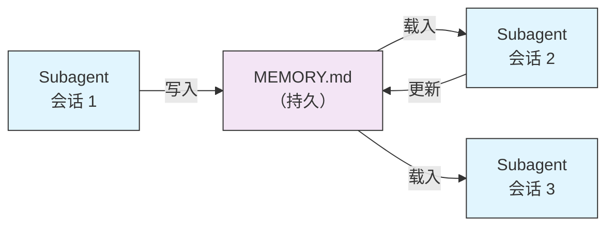
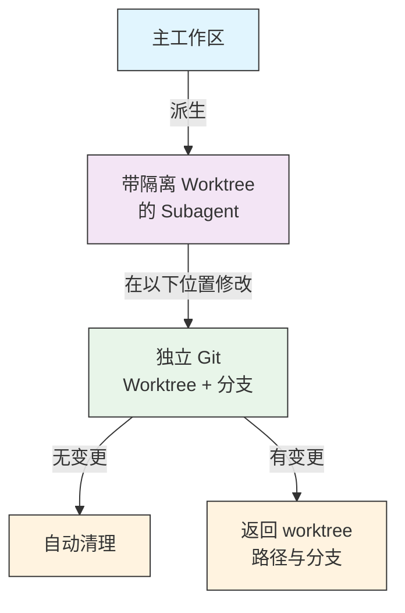
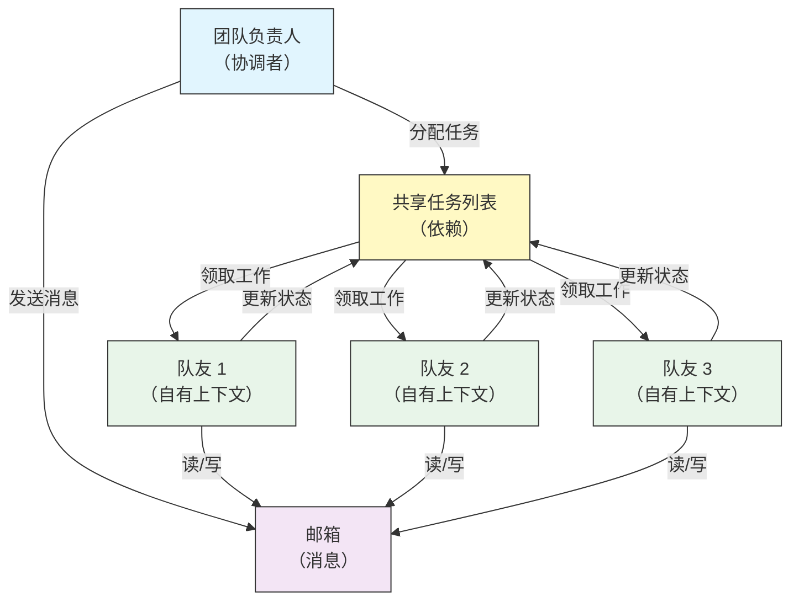
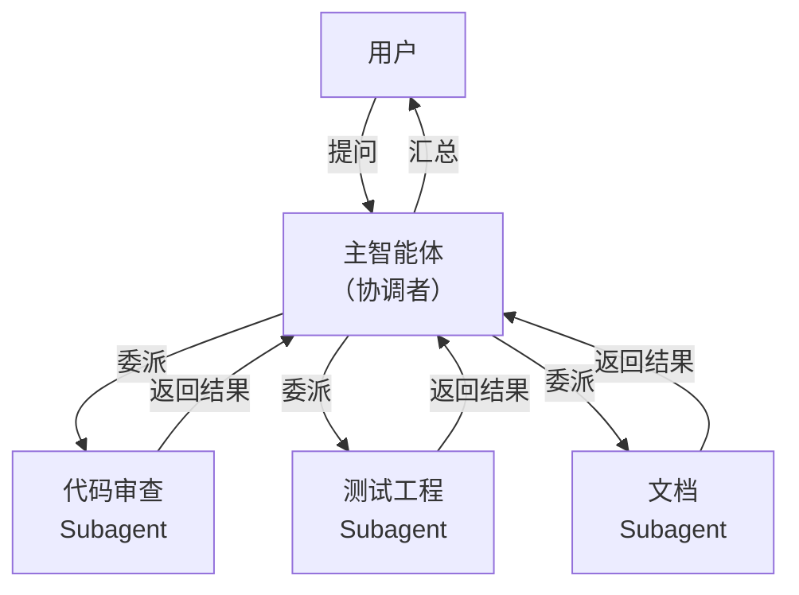
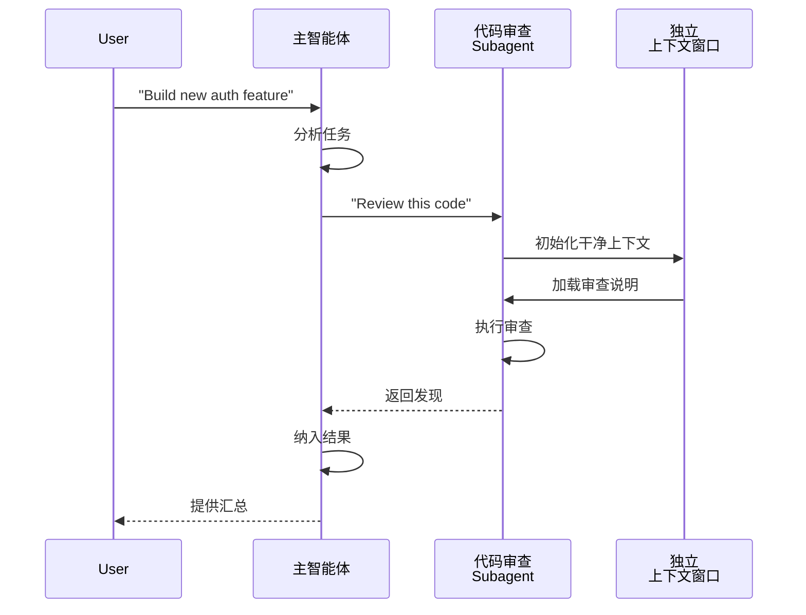
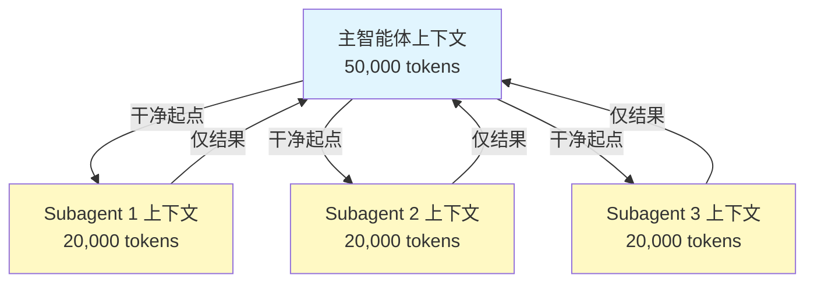
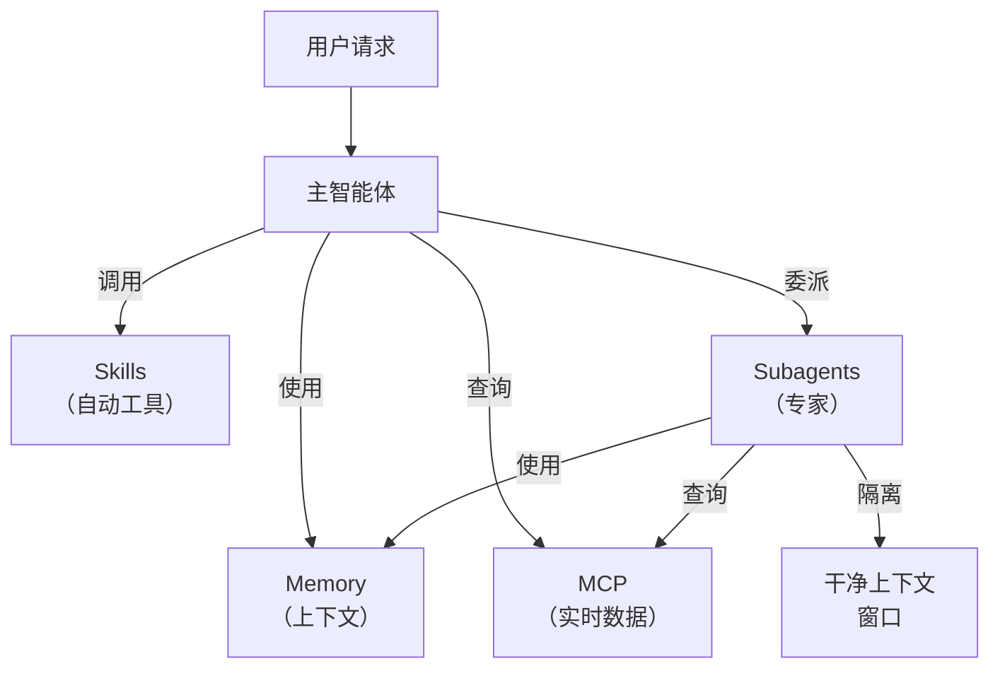

<picture>
  <source media="(prefers-color-scheme: dark)" srcset="../resources/logos/claude-howto-logo-dark.svg">
  
</picture>

# Subagents 完整参考指南

Subagents 是 Claude Code 可将任务委派给它们的专用 AI 助手。每个 Subagent 都有明确用途，使用与主对话独立的上下文窗口，并可配置特定工具与自定义系统提示。

## 目录

1. [概述](#overview)
2. [主要优势](#key-benefits)
3. [文件位置](#file-locations)
4. [配置](#configuration)
5. [内置 Subagents](#built-in-subagents)
6. [管理 Subagents](#managing-subagents)
7. [使用 Subagents](#using-subagents)
8. [可恢复的智能体](#resumable-agents)
9. [串联 Subagents](#chaining-subagents)
10. [Subagents 的持久化 Memory](#persistent-memory-for-subagents)
11. [后台 Subagents](#background-subagents)
12. [Worktree 隔离](#worktree-isolation)
13. [限制可派生的 Subagents](#restrict-spawnable-subagents)
14. [`claude agents` CLI 命令](#claude-agents-cli-command)
15. [Agent Teams（实验性）](#agent-teams-experimental)
16. [插件 Subagent 安全](#plugin-subagent-security)
17. [架构](#architecture)
18. [上下文管理](#context-management)
19. [何时使用 Subagents](#when-to-use-subagents)
20. [最佳实践](#best-practices)
21. [本文件夹中的示例 Subagents](#example-subagents-in-this-folder)
22. [安装说明](#installation-instructions)
23. [相关概念](#related-concepts)

---

<a id="overview"></a>
## 概述

Subagents 通过以下方式在 Claude Code 中实现委派式任务执行：

- 创建**隔离的 AI 助手**，各自拥有独立上下文窗口
- 提供**可定制的系统提示**，以承载专业领域能力
- 实施**工具访问控制**，限制能力范围
- 避免复杂任务造成的**上下文污染**
- 支持多个专业任务的**并行执行**

每个 Subagent 独立运行、从零开始，只接收完成任务所需的上下文，然后将结果返回主智能体进行汇总。

**快速开始**：使用 `/agents` 命令以交互方式创建、查看、编辑和管理 Subagents。

---

<a id="key-benefits"></a>
## 主要优势

| 优势 | 说明 |
|---------|-------------|
| **上下文保持** | 在独立上下文中运行，避免污染主对话 |
| **专业分工** | 针对特定领域调优，成功率更高 |
| **可复用** | 跨项目使用并与团队共享 |
| **权限灵活** | 不同 Subagent 类型可配置不同工具访问级别 |
| **可扩展** | 多个智能体可同时处理不同方面 |

---

<a id="file-locations"></a>
## 文件位置

Subagent 文件可存放在多个位置，作用范围不同：

| 优先级 | 类型 | 位置 | 作用范围 |
|----------|------|----------|-------|
| 1（最高） | **CLI 定义** | 通过 `--agents` 标志（JSON） | 仅当前会话 |
| 2 | **项目 Subagents** | `.claude/agents/` | 当前项目 |
| 3 | **用户 Subagents** | `~/.claude/agents/` | 所有项目 |
| 4（最低） | **插件智能体** | 插件的 `agents/` 目录 | 通过插件 |

名称冲突时，优先级更高的来源生效。

---

<a id="configuration"></a>
## 配置

### 文件格式

Subagent 使用 YAML frontmatter，其后为 Markdown 形式的系统提示：

```yaml
---
name: your-sub-agent-name
description: 何时应调用此 Subagent 的说明
tools: tool1, tool2, tool3  # 可选 - 省略则继承全部工具
disallowedTools: tool4  # 可选 - 明确禁止使用的工具
model: sonnet  # 可选 - sonnet、opus、haiku 或 inherit
permissionMode: default  # 可选 - 权限模式
maxTurns: 20  # 可选 - 限制 agentic 轮数
skills: skill1, skill2  # 可选 - 预加载到上下文的 skills
mcpServers: server1  # 可选 - 可用的 MCP 服务器
memory: user  # 可选 - 持久化 memory 范围（user、project、local）
background: false  # 可选 - 作为后台任务运行
effort: high  # 可选 - 推理强度（low、medium、high、max）
isolation: worktree  # 可选 - git worktree 隔离
initialPrompt: "先分析代码库"  # 可选 - 自动提交的首轮输入
hooks:  # 可选 - 组件级 hooks
  PreToolUse:
    - matcher: "Bash"
      hooks:
        - type: command
          command: "./scripts/security-check.sh"
---

在此编写 Subagent 的系统提示。可多段叙述，
并应清楚定义 Subagent 的角色、能力与解决问题的方式。
```

### 配置字段

| 字段 | 必填 | 说明 |
|-------|----------|-------------|
| `name` | 是 | 唯一标识（小写字母与连字符） |
| `description` | 是 | 用途的自然语言描述。包含 “use PROACTIVELY” 可鼓励自动调用 |
| `tools` | 否 | 以逗号分隔的工具列表。省略则继承全部工具。支持 `Agent(agent_name)` 语法以限制可派生的 Subagents |
| `disallowedTools` | 否 | Subagent 禁止使用的工具，逗号分隔 |
| `model` | 否 | 使用的模型：`sonnet`、`opus`、`haiku`、完整模型 ID 或 `inherit`。默认使用已配置的 Subagent 模型 |
| `permissionMode` | 否 | `default`、`acceptEdits`、`dontAsk`、`bypassPermissions`、`plan` |
| `maxTurns` | 否 | Subagent 最多可进行的 agentic 轮数 |
| `skills` | 否 | 预加载的 skills，逗号分隔。启动时将完整 skill 内容注入 Subagent 上下文 |
| `mcpServers` | 否 | 向 Subagent 开放的 MCP 服务器 |
| `hooks` | 否 | 组件级 hooks（PreToolUse、PostToolUse、Stop） |
| `memory` | 否 | 持久化 memory 目录范围：`user`、`project` 或 `local` |
| `background` | 否 | 设为 `true` 则始终以后台任务运行该 Subagent |
| `effort` | 否 | 推理强度：`low`、`medium`、`high` 或 `max` |
| `isolation` | 否 | 设为 `worktree` 可为 Subagent 提供独立 git worktree |
| `initialPrompt` | 否 | Subagent 作为主智能体运行时自动提交的首轮输入 |

### 工具配置选项

**选项 1：继承全部工具（省略该字段）**
```yaml
---
name: full-access-agent
description: 拥有全部可用工具的智能体
---
```

**选项 2：指定具体工具**
```yaml
---
name: limited-agent
description: 仅使用指定工具的智能体
tools: Read, Grep, Glob, Bash
---
```

**选项 3：条件化工具访问**
```yaml
---
name: conditional-agent
description: 经过滤的工具访问
tools: Read, Bash(npm:*), Bash(test:*)
---
```

### 基于 CLI 的配置

使用 `--agents` 标志以 JSON 格式为单次会话定义 Subagents：

```bash
claude --agents '{
  "code-reviewer": {
    "description": "代码审查专家。在代码变更后主动使用。",
    "prompt": "你是一名资深代码审查员。重点关注代码质量、安全与最佳实践。",
    "tools": ["Read", "Grep", "Glob", "Bash"],
    "model": "sonnet"
  }
}'
```

**`--agents` 标志的 JSON 格式：**

```json
{
  "agent-name": {
    "description": "必填：何时调用该智能体",
    "prompt": "必填：智能体的系统提示",
    "tools": ["可选", "工具", "数组"],
    "model": "可选：sonnet|opus|haiku"
  }
}
```

**智能体定义的优先级：**

智能体定义按以下优先级加载（先匹配者优先）：
1. **CLI 定义** - `--agents` 标志（仅会话，JSON）
2. **项目级** - `.claude/agents/`（当前项目）
3. **用户级** - `~/.claude/agents/`（所有项目）
4. **插件级** - 插件的 `agents/` 目录

这样 CLI 定义可在单次会话中覆盖其他所有来源。

---

<a id="built-in-subagents"></a>
## 内置 Subagents

Claude Code 内置若干始终可用的 Subagents：

| 智能体 | 模型 | 用途 |
|-------|-------|---------|
| **general-purpose** | 继承 | 复杂、多步任务 |
| **Plan** | 继承 | 规划模式下的调研 |
| **Explore** | Haiku | 只读代码库探索（quick / medium / very thorough） |
| **Bash** | 继承 | 在独立上下文中执行终端命令 |
| **statusline-setup** | Sonnet | 配置状态行 |
| **Claude Code Guide** | Haiku | 回答 Claude Code 功能相关问题 |

### 通用 Subagent

| 属性 | 值 |
|----------|-------|
| **模型** | 继承自主智能体 |
| **工具** | 全部工具 |
| **用途** | 复杂调研、多步操作、代码修改 |

**何时使用**：需要探索与修改并重、且推理较复杂的任务。

### Plan Subagent

| 属性 | 值 |
|----------|-------|
| **模型** | 继承自主智能体 |
| **工具** | Read、Glob、Grep、Bash |
| **用途** | 在规划模式下自动用于调研代码库 |

**何时使用**：Claude 需要在给出方案前先理解代码库。

### Explore Subagent

| 属性 | 值 |
|----------|-------|
| **模型** | Haiku（快速、低延迟） |
| **模式** | 严格只读 |
| **工具** | Glob、Grep、Read、Bash（仅只读命令） |
| **用途** | 快速搜索与分析代码库 |

**何时使用**：需要搜索或理解代码但不做修改。

**详尽程度**：指定探索深度：
- **"quick"** — 快速搜索、探索最少，适合查找特定模式
- **"medium"** — 中等探索，速度与深度平衡，为默认方式
- **"very thorough"** — 跨多处位置与命名习惯全面分析，可能更耗时

### Bash Subagent

| 属性 | 值 |
|----------|-------|
| **模型** | 继承自主智能体 |
| **工具** | Bash |
| **用途** | 在独立上下文窗口中执行终端命令 |

**何时使用**：运行适合隔离上下文的 shell 命令。

### Statusline Setup Subagent

| 属性 | 值 |
|----------|-------|
| **模型** | Sonnet |
| **工具** | Read、Write、Bash |
| **用途** | 配置 Claude Code 状态行显示 |

**何时使用**：设置或自定义状态行。

### Claude Code Guide Subagent

| 属性 | 值 |
|----------|-------|
| **模型** | Haiku（快速、低延迟） |
| **工具** | 只读 |
| **用途** | 回答 Claude Code 功能与用法问题 |

**何时使用**：用户询问 Claude Code 的工作方式或如何使用某项功能。

---

<a id="managing-subagents"></a>
## 管理 Subagents

### 使用 `/agents` 命令（推荐）

```bash
/agents
```

提供交互菜单，可：
- 查看全部可用 Subagents（内置、用户级与项目级）
- 通过引导流程创建新 Subagent
- 编辑已有自定义 Subagent 与工具访问
- 删除自定义 Subagent
- 在存在重名时查看哪些 Subagent 生效

### 直接管理文件

```bash
# 创建项目 Subagent
mkdir -p .claude/agents
cat > .claude/agents/test-runner.md << 'EOF'
---
name: test-runner
description: 主动用于运行测试并修复失败
---

你是一名测试自动化专家。当看到代码变更时，主动运行相应测试。
若测试失败，分析失败原因并在保留原测试意图的前提下进行修复。
EOF

# 创建用户 Subagent（在所有项目中可用）
mkdir -p ~/.claude/agents
```

---

<a id="using-subagents"></a>
## 使用 Subagents

### 自动委派

Claude 会根据以下因素主动委派任务：
- 你请求中的任务描述
- Subagent 配置中的 `description` 字段
- 当前上下文与可用工具

若希望鼓励主动使用，可在 `description` 中加入 “use PROACTIVELY” 或 “MUST BE USED”：

```yaml
---
name: code-reviewer
description: Expert code review specialist. Use PROACTIVELY after writing or modifying code.
---
```

### 显式调用

可明确要求使用某个 Subagent：

```
> 使用 test-runner Subagent 修复失败的测试
> 让 code-reviewer Subagent 查看我最近的改动
> 请 debugger Subagent 排查此错误
```

### @ 提及调用

使用 `@` 前缀可确保调用指定 Subagent（绕过自动委派启发式）：

```
> @"code-reviewer (agent)" 审查认证模块
```

### 会话级主智能体

将整个会话固定为以某个智能体作为主智能体运行：

```bash
# 通过 CLI 标志
claude --agent code-reviewer

# 通过 settings.json
{
  "agent": "code-reviewer"
}
```

### 列出可用智能体

使用 `claude agents` 命令列出所有来源的配置：

```bash
claude agents
```

---

<a id="resumable-agents"></a>
## 可恢复的智能体

Subagents 可在保留完整上下文的情况下继续之前的对话：

```bash
# 首次调用
> 使用 code-analyzer 智能体开始审查认证模块
# 返回 agentId: "abc123"

# 稍后恢复该智能体
> Resume agent abc123 并同时分析授权逻辑
```

**适用场景**：
- 跨多会话的长期调研
- 迭代优化且不丢失上下文
- 多步工作流中保持上下文

---

<a id="chaining-subagents"></a>
## 串联 Subagents

按顺序执行多个 Subagents：

```bash
> First use the code-analyzer subagent to find performance issues,
  then use the optimizer subagent to fix them
```

便于构建复杂工作流：一个 Subagent 的输出可作为下一个的输入。

---

<a id="persistent-memory-for-subagents"></a>
## Subagents 的持久化 Memory

`memory` 字段为 Subagent 提供跨对话保留的持久化目录，使其能随时间积累知识，保存笔记、发现与在会话间延续的上下文。

### Memory 范围

| 范围 | 目录 | 使用场景 |
|-------|-----------|----------|
| `user` | `~/.claude/agent-memory/<name>/` | 跨所有项目的个人笔记与偏好 |
| `project` | `.claude/agent-memory/<name>/` | 与团队共享的项目级知识 |
| `local` | `.claude/agent-memory-local/<name>/` | 不纳入版本控制的本地项目知识 |

### 工作原理

- memory 目录中 `MEMORY.md` 的前 200 行会自动载入 Subagent 的系统提示
- 会自动为 Subagent 启用 `Read`、`Write`、`Edit` 工具以管理 memory 文件
- Subagent 可按需在 memory 目录中创建其他文件

### 配置示例

```yaml
---
name: researcher
memory: user
---

You are a research assistant. Use your memory directory to store findings,
track progress across sessions, and build up knowledge over time.

Check your MEMORY.md file at the start of each session to recall previous context.
```



---

<a id="background-subagents"></a>
## 后台 Subagents

Subagents 可在后台运行，主对话可同时进行其他任务。

### 配置

在 frontmatter 中设置 `background: true`，使该 Subagent 始终作为后台任务运行：

```yaml
---
name: long-runner
background: true
description: Performs long-running analysis tasks in the background
---
```

### 键盘快捷键

| 快捷键 | 操作 |
|----------|--------|
| `Ctrl+B` | 将当前运行的 Subagent 任务转入后台 |
| `Ctrl+F` | 终止全部后台智能体（连按两次确认） |

### 禁用后台任务

设置以下环境变量可完全关闭后台任务支持：

```bash
export CLAUDE_CODE_DISABLE_BACKGROUND_TASKS=1
```

---

<a id="worktree-isolation"></a>
## Worktree 隔离

`isolation: worktree` 为 Subagent 提供独立 git worktree，使其可独立修改而不影响主工作区。

### 配置

```yaml
---
name: feature-builder
isolation: worktree
description: Implements features in an isolated git worktree
tools: Read, Write, Edit, Bash, Grep, Glob
---
```

### 工作原理



- Subagent 在独立分支上的自有 git worktree 中运行
- 若未产生变更，worktree 会自动清理
- 若有变更，worktree 路径与分支名会返回主智能体供审查或合并

---

<a id="restrict-spawnable-subagents"></a>
## 限制可派生的 Subagents

可在 `tools` 字段中使用 `Agent(agent_type)` 语法，控制某个 Subagent 允许派生哪些 Subagents，从而将可委派的 Subagents 列入允许列表。

> **说明**：在 v2.1.63 中，`Task` 工具已重命名为 `Agent`。已有的 `Task(...)` 引用仍可作为别名使用。

### 示例

```yaml
---
name: coordinator
description: Coordinates work between specialized agents
tools: Agent(worker, researcher), Read, Bash
---

You are a coordinator agent. You can delegate work to the "worker" and
"researcher" subagents only. Use Read and Bash for your own exploration.
```

本例中，`coordinator` Subagent 只能派生 `worker` 与 `researcher` Subagents，即使别处定义了其他 Subagent 也无法派生。

---

<a id="claude-agents-cli-command"></a>
## `claude agents` CLI 命令

`claude agents` 命令列出全部已配置智能体，并按来源分组（内置、用户级、项目级）：

```bash
claude agents
```

该命令会：
- 展示所有来源中的全部智能体
- 按来源位置分组
- 当高优先级智能体覆盖低优先级同名智能体时标明 **overrides**（例如项目级与用户级同名）

---

<a id="agent-teams-experimental"></a>
## Agent Teams（实验性）

Agent Teams 协调多个 Claude Code 实例协作完成复杂任务。与 Subagents（委派子任务并返回结果）不同，队友各自独立、自有上下文，并通过共享邮箱直接通信。

> **说明**：Agent Teams 为实验性功能，需要 Claude Code v2.1.32+。使用前请先启用。

### Subagents 与 Agent Teams

| 方面 | Subagents | Agent Teams |
|--------|-----------|-------------|
| **委派模型** | 父级委派子任务并等待结果 | 负责人分配工作，队友独立执行 |
| **上下文** | 每个子任务新上下文，结果再汇总 | 每名队友维护各自持久上下文 |
| **协调** | 顺序或并行，由父级管理 | 共享任务列表与自动依赖管理 |
| **通信** | 仅返回值 | 通过邮箱在智能体间传消息 |
| **会话恢复** | 支持 | 进程内队友不支持 |
| **最适合** | 明确、聚焦的子任务 | 需要并行工作的大型多文件项目 |

### 启用 Agent Teams

设置环境变量或在 `settings.json` 中加入：

```bash
export CLAUDE_CODE_EXPERIMENTAL_AGENT_TEAMS=1
```

或在 `settings.json` 中：

```json
{
  "env": {
    "CLAUDE_CODE_EXPERIMENTAL_AGENT_TEAMS": "1"
  }
}
```

### 启动团队

启用后，在提示中让 Claude 与队友协作：

```
User: Build the authentication module. Use a team — one teammate for the API endpoints,
      one for the database schema, and one for the test suite.
```

Claude 将创建团队、分配任务并自动协调。

### 显示模式

控制队友活动的展示方式：

| 模式 | 标志 | 说明 |
|------|------|-------------|
| **Auto** | `--teammate-mode auto` | 根据终端自动选择较合适的显示模式 |
| **In-process** | `--teammate-mode in-process` | 在当前终端内联显示队友输出（默认） |
| **Split-panes** | `--teammate-mode tmux` | 每个队友在独立 tmux 或 iTerm2 窗格中打开 |

```bash
claude --teammate-mode tmux
```

也可在 `settings.json` 中设置显示模式：

```json
{
  "teammateMode": "tmux"
}
```

> **说明**：分窗格模式需要 tmux 或 iTerm2。在 VS Code 终端、Windows Terminal 或 Ghostty 中不可用。

### 导航

在分窗格模式下使用 `Shift+Down` 在队友间切换。

### 团队配置

团队配置保存在 `~/.claude/teams/{team-name}/config.json`。

### 架构



**核心组件**：

- **团队负责人**：创建团队、分配任务并协调的主 Claude Code 会话
- **共享任务列表**：带自动依赖跟踪的同步任务列表
- **邮箱**：队友间通信状态与协调的消息系统
- **队友**：独立的 Claude Code 实例，各自拥有上下文窗口

### 任务分配与消息

负责人将工作拆成任务并分配给队友。共享任务列表负责：

- **自动依赖管理** — 任务会等待其依赖完成
- **状态跟踪** — 队友工作时更新任务状态
- **智能体间消息** — 队友通过邮箱协调（例如：“数据库 schema 已就绪，可以开始写查询”）

### 方案审批工作流

对复杂任务，负责人在队友开始工作前会生成执行方案。用户审阅并批准方案，确保团队方向符合预期后再改代码。

### 团队相关 Hook 事件

Agent Teams 引入两个额外的 [hook 事件](../06-hooks/)：

| 事件 | 触发时机 | 使用场景 |
|-------|-----------|----------|
| `TeammateIdle` | 队友完成当前任务且无待处理工作 | 触发通知、分配后续任务 |
| `TaskCompleted` | 共享任务列表中的任务标记为完成 | 运行校验、更新面板、串联依赖工作 |

### 最佳实践

- **团队规模**：3–5 名队友通常最利于协调
- **任务粒度**：拆成每项约 5–15 分钟的任务 — 足够小以便并行，又足够大而有意义
- **避免文件冲突**：为不同队友分配不同文件或目录，减少合并冲突
- **从简开始**：首次使用进程内模式；熟悉后再切换分窗格
- **任务描述清晰**：提供具体、可执行的任务描述，便于队友独立工作

### 限制

- **实验性**：未来版本行为可能变化
- **无会话恢复**：进程内队友在会话结束后无法恢复
- **每会话一个团队**：无法嵌套团队或在单次会话中创建多个团队
- **负责人固定**：团队负责人角色不能交给队友
- **分窗格限制**：需要 tmux/iTerm2；在 VS Code 终端、Windows Terminal、Ghostty 中不可用
- **无跨会话团队**：队友仅存在于当前会话

> **警告**：Agent Teams 为实验性功能。请先用非关键工作验证，并留意队友协调是否出现异常。

---

<a id="plugin-subagent-security"></a>
## 插件 Subagent 安全

插件提供的 Subagents 在 frontmatter 能力上受限以保证安全。以下字段在插件 Subagent 定义中**不允许**使用：

- `hooks` — 不能定义生命周期 hooks
- `mcpServers` — 不能配置 MCP 服务器
- `permissionMode` — 不能覆盖权限设置

这可防止插件通过 Subagent hooks 提升权限或执行任意命令。

---

<a id="architecture"></a>
## 架构

### 高层架构



### Subagent 生命周期



---

<a id="context-management"></a>
## 上下文管理



### 要点

- 每个 Subagent 获得**全新的上下文窗口**，不含主对话历史
- 仅将**相关上下文**传给 Subagent 以完成其任务
- 结果**压缩汇总**后回到主智能体
- 避免长项目上的**上下文 token 耗尽**

### 性能考量

- **上下文效率** — 智能体保护主上下文，支持更长会话
- **延迟** — Subagent 从干净状态启动，收集初始上下文可能增加延迟

### 关键行为

- **禁止嵌套派生** — Subagent 不能派生其他 Subagent
- **后台权限** — 后台 Subagent 对未预先批准的权限会自动拒绝
- **转入后台** — 按 `Ctrl+B` 将当前运行中的任务转入后台
- **转录** — Subagent 转录保存在 `~/.claude/projects/{project}/{sessionId}/subagents/agent-{agentId}.jsonl`
- **自动压缩** — Subagent 上下文在约 95% 容量时自动压缩（可通过环境变量 `CLAUDE_AUTOCOMPACT_PCT_OVERRIDE` 覆盖）

---

<a id="when-to-use-subagents"></a>
## 何时使用 Subagents

| 场景 | 使用 Subagent | 原因 |
|----------|--------------|-----|
| 多步骤的复杂功能 | 是 | 分离关注点，避免上下文污染 |
| 快速代码审查 | 否 | 不必要开销 |
| 并行执行任务 | 是 | 每个 Subagent 自有上下文 |
| 需要专业分工 | 是 | 自定义系统提示 |
| 长期分析 | 是 | 避免主上下文耗尽 |
| 单一简单任务 | 否 | 不必要增加延迟 |

---

<a id="best-practices"></a>
## 最佳实践

### 设计原则

**建议：**
- 从 Claude 生成的智能体起步 — 先用 Claude 生成初版 Subagent，再迭代定制
- 设计职责单一的 Subagent — 清晰单一职责，避免一个包办一切
- 编写详细提示 — 包含具体说明、示例与约束
- 限制工具访问 — 只授予 Subagent 目的所需的工具
- 版本控制 — 将项目 Subagents 纳入版本控制以便团队协作

**避免：**
- 创建职责重叠的 Subagent
- 授予 Subagent 不必要的工具访问
- 对简单单步任务使用 Subagent
- 在一个 Subagent 的提示中混杂多种关注点
- 忘记传递必要上下文

### 系统提示最佳实践

1. **明确角色**
   ```
   You are an expert code reviewer specializing in [specific areas]
   ```

2. **清楚列出优先级**
   ```
   Review priorities (in order):
   1. Security Issues
   2. Performance Problems
   3. Code Quality
   ```

3. **指定输出格式**
   ```
   For each issue provide: Severity, Category, Location, Description, Fix, Impact
   ```

4. **包含行动步骤**
   ```
   When invoked:
   1. Run git diff to see recent changes
   2. Focus on modified files
   3. Begin review immediately
   ```

### 工具访问策略

1. **先紧后松**：从仅必需工具开始
2. **按需扩展**：随需求增加工具
3. **尽量只读**：分析类智能体优先用 Read/Grep
4. **沙箱执行**：将 Bash 限制在特定模式

---

<a id="example-subagents-in-this-folder"></a>
## 本文件夹中的示例 Subagents

本文件夹包含可直接使用的示例 Subagents：

### 1. Code Reviewer（`code-reviewer.md`）

**用途**：全面的代码质量与可维护性分析

**工具**：Read、Grep、Glob、Bash

**专长**：
- 安全漏洞检测
- 性能优化点识别
- 代码可维护性评估
- 测试覆盖率分析

**适用于**：需要侧重质量与安全的自动化代码审查

---

### 2. Test Engineer（`test-engineer.md`）

**用途**：测试策略、覆盖率分析与自动化测试

**工具**：Read、Write、Bash、Grep

**专长**：
- 单元测试编写
- 集成测试设计
- 边界情况识别
- 覆盖率分析（目标 >80%）

**适用于**：需要完整测试套件或覆盖率分析

---

### 3. Documentation Writer（`documentation-writer.md`）

**用途**：技术文档、API 文档与用户指南

**工具**：Read、Write、Grep

**专长**：
- API 端点文档
- 用户指南编写
- 架构文档
- 代码注释改进

**适用于**：创建或更新项目文档

---

### 4. Secure Reviewer（`secure-reviewer.md`）

**用途**：侧重安全的代码审查，权限最小化

**工具**：Read、Grep

**专长**：
- 安全漏洞检测
- 认证/授权问题
- 数据暴露风险
- 注入类攻击识别

**适用于**：需要无修改能力的安全审计

---

### 5. Implementation Agent（`implementation-agent.md`）

**用途**：功能开发的完整实现能力

**工具**：Read、Write、Edit、Bash、Grep、Glob

**专长**：
- 功能实现
- 代码生成
- 构建与测试执行
- 代码库修改

**适用于**：需要端到端实现功能的 Subagent

---

### 6. Debugger（`debugger.md`）

**用途**：针对错误、测试失败与异常行为的调试专家

**工具**：Read、Edit、Bash、Grep、Glob

**专长**：
- 根因分析
- 错误排查
- 测试失败修复
- 最小化修复实现

**适用于**：遇到缺陷、错误或异常行为时

---

### 7. Data Scientist（`data-scientist.md`）

**用途**：SQL 查询与数据洞察方面的数据分析专家

**工具**：Bash、Read、Write

**专长**：
- SQL 查询优化
- BigQuery 操作
- 数据分析与可视化
- 统计洞察

**适用于**：数据分析、SQL 查询或 BigQuery 操作

---

<a id="installation-instructions"></a>
## 安装说明

### 方法一：使用 /agents 命令（推荐）

```bash
/agents
```

然后：
1. 选择「Create New Agent」
2. 选择 project-level 或 user-level
3. 详细描述你的 Subagent
4. 选择要授予的工具（或留空以继承全部）
5. 保存并使用

### 方法二：复制到项目

将智能体文件复制到项目的 `.claude/agents/` 目录：

```bash
# 进入你的项目
cd /path/to/your/project

# 若不存在则创建 agents 目录
mkdir -p .claude/agents

# 从本文件夹复制全部智能体文件
cp /path/to/04-subagents/*.md .claude/agents/

# 删除 README（不需要放在 .claude/agents 中）
rm .claude/agents/README.md
```

### 方法三：复制到用户目录

若希望智能体在所有项目中可用：

```bash
# 创建用户 agents 目录
mkdir -p ~/.claude/agents

# 复制智能体
cp /path/to/04-subagents/code-reviewer.md ~/.claude/agents/
cp /path/to/04-subagents/debugger.md ~/.claude/agents/
# …按需复制其他文件
```

### 验证

安装后确认智能体已被识别：

```bash
/agents
```

应能看到已安装的智能体与内置智能体并列显示。

---

## 文件结构

```
project/
├── .claude/
│   └── agents/
│       ├── code-reviewer.md
│       ├── test-engineer.md
│       ├── documentation-writer.md
│       ├── secure-reviewer.md
│       ├── implementation-agent.md
│       ├── debugger.md
│       └── data-scientist.md
└── ...
```

---

<a id="related-concepts"></a>
## 相关概念

### 相关功能

- **[Slash Commands](../01-slash-commands/)** — 用户快速调用的快捷方式
- **[Memory](../02-memory/)** — 跨会话持久上下文
- **[Skills](../03-skills/)** — 可复用的自主能力
- **[MCP Protocol](../05-mcp/)** — 实时外部数据访问
- **[Hooks](../06-hooks/)** — 事件驱动的 shell 命令自动化
- **[Plugins](../07-plugins/)** — 打包的扩展集合

### 与其他功能对比

| 功能 | 用户调用 | 自动调用 | 持久化 | 外部访问 | 隔离上下文 |
|---------|--------------|--------------|-----------|------------------|------------------|
| **Slash Commands** | 是 | 否 | 否 | 否 | 否 |
| **Subagents** | 是 | 是 | 否 | 否 | 是 |
| **Memory** | 自动 | 自动 | 是 | 否 | 否 |
| **MCP** | 自动 | 是 | 否 | 是 | 否 |
| **Skills** | 是 | 是 | 否 | 否 | 否 |

### 集成模式



---

## 更多资源

- [官方 Subagents 文档](https://code.claude.com/docs/en/sub-agents)
- [CLI 参考](https://code.claude.com/docs/en/cli-reference) — `--agents` 标志及其他 CLI 选项
- [插件指南](../07-plugins/) — 与其他功能打包智能体
- [Skills 指南](../03-skills/) — 自动调用的能力
- [Memory 指南](../02-memory/) — 持久上下文
- [Hooks 指南](../06-hooks/) — 事件驱动自动化

---

*最后更新：2026 年 3 月*

*本指南涵盖 Claude Code 下 Subagent 的完整配置、委派模式与最佳实践。*
