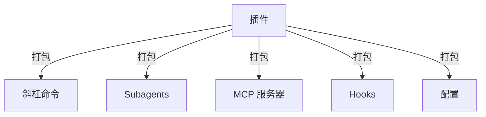
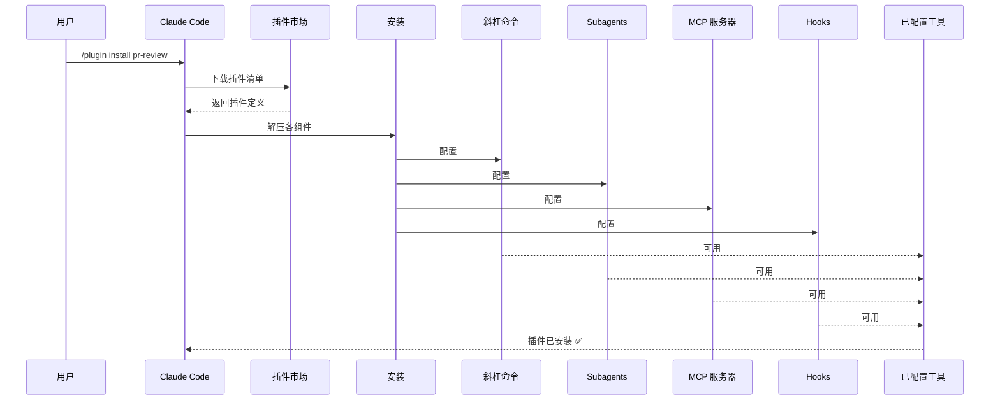
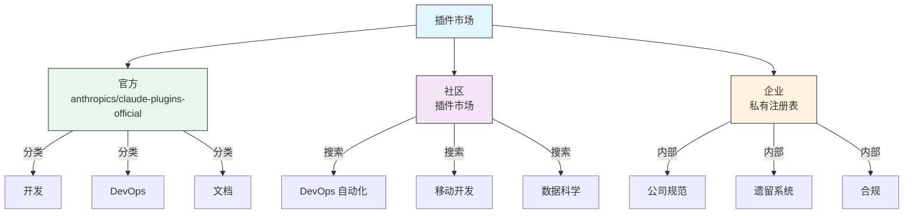
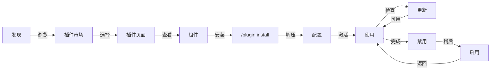
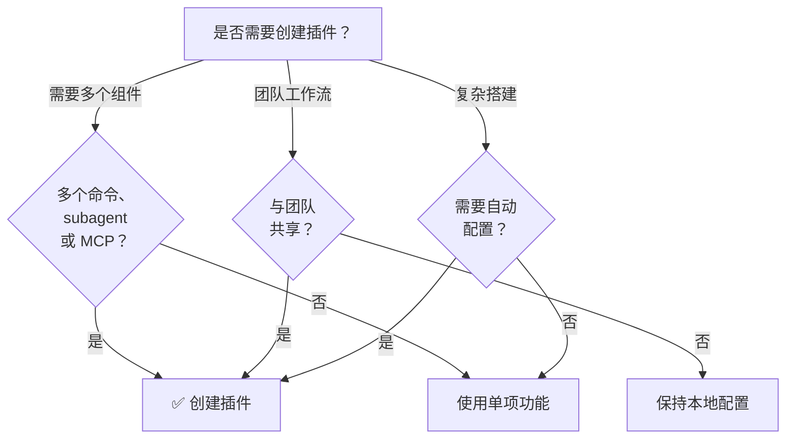

<picture>
  <source media="(prefers-color-scheme: dark)" srcset="../resources/logos/claude-howto-logo-dark.svg">
  
</picture>

<a id="claude-code-plugins"></a>
# Claude Code 插件（Plugins）

本目录包含完整的插件示例，将多种 Claude Code 功能打包成可统一安装、内聚可用的包。

<a id="overview"></a>
## 概述

Claude Code Plugins（插件）是定制化内容的打包集合（斜杠命令、Subagents、MCP 服务器与 Hooks），可通过一条命令完成安装。它们代表最高层级的扩展机制——将多种能力组合成可内聚、可分享的包。

<a id="plugin-architecture"></a>
## 插件架构



<a id="plugin-loading-process"></a>
## 插件加载流程



<a id="plugin-types-distribution"></a>
## 插件类型与分发

| 类型 | 范围 | 共享对象 | 权限方 | 示例 |
|------|------|----------|--------|------|
| 官方 | 全局 | 所有用户 | Anthropic | PR Review、安全指引 |
| 社区 | 公开 | 所有用户 | 社区 | DevOps、数据科学 |
| 组织 | 内部 | 团队成员 | 公司 | 内部规范、工具 |
| 个人 | 个人范围 | 单用户 | 开发者 | 自定义工作流 |

<a id="plugin-definition-structure"></a>
## 插件定义结构

插件清单使用 JSON 格式，位于 `.claude-plugin/plugin.json`：

```json
{
  "name": "my-first-plugin",
  "description": "问候用插件",
  "version": "1.0.0",
  "author": {
    "name": "你的名字"
  },
  "homepage": "https://example.com",
  "repository": "https://github.com/user/repo",
  "license": "MIT"
}
```

<a id="plugin-structure-example"></a>
## 插件结构示例

```
my-plugin/
├── .claude-plugin/
│   └── plugin.json       # 清单（name、description、version、author）
├── commands/             # 以 Markdown 形式存放的斜杠命令
│   ├── task-1.md
│   ├── task-2.md
│   └── workflows/
├── agents/               # 自定义 agent 定义
│   ├── specialist-1.md
│   ├── specialist-2.md
│   └── configs/
├── skills/               # 含 SKILL.md 的 Agent Skills
│   ├── skill-1.md
│   └── skill-2.md
├── hooks/                # hooks.json 中的事件处理
│   └── hooks.json
├── .mcp.json             # MCP 服务器配置
├── .lsp.json             # LSP 服务器配置
├── settings.json         # 默认设置
├── templates/
│   └── issue-template.md
├── scripts/
│   ├── helper-1.sh
│   └── helper-2.py
├── docs/
│   ├── README.md
│   └── USAGE.md
└── tests/
    └── plugin.test.js
```

<a id="lsp-server-configuration"></a>
### LSP 服务器配置

插件可包含 Language Server Protocol（LSP）支持，以提供实时代码智能。LSP 服务器会在你工作时提供诊断、代码导航与符号信息。

**配置位置**：
- 插件根目录下的 `.lsp.json` 文件
- `plugin.json` 中的内联 `lsp` 键

<a id="field-reference"></a>
#### 字段说明

| 字段 | 必填 | 说明 |
|------|------|------|
| `command` | 是 | LSP 服务器可执行文件（须在 PATH 中） |
| `extensionToLanguage` | 是 | 将文件扩展名映射到语言 ID |
| `args` | 否 | 传给服务器的命令行参数 |
| `transport` | 否 | 通信方式：`stdio`（默认）或 `socket` |
| `env` | 否 | 服务器进程的环境变量 |
| `initializationOptions` | 否 | LSP 初始化阶段发送的选项 |
| `settings` | 否 | 传给工作区的配置 |
| `workspaceFolder` | 否 | 覆盖工作区目录路径 |
| `startupTimeout` | 否 | 等待服务器启动的最长时间（毫秒） |
| `shutdownTimeout` | 否 | 优雅关闭的最长时间（毫秒） |
| `restartOnCrash` | 否 | 服务器崩溃时是否自动重启 |
| `maxRestarts` | 否 | 放弃前的最大重启次数 |

<a id="example-configurations"></a>
#### 配置示例

**Go（gopls）**：

```json
{
  "go": {
    "command": "gopls",
    "args": ["serve"],
    "extensionToLanguage": {
      ".go": "go"
    }
  }
}
```

**Python（pyright）**：

```json
{
  "python": {
    "command": "pyright-langserver",
    "args": ["--stdio"],
    "extensionToLanguage": {
      ".py": "python",
      ".pyi": "python"
    }
  }
}
```

**TypeScript**：

```json
{
  "typescript": {
    "command": "typescript-language-server",
    "args": ["--stdio"],
    "extensionToLanguage": {
      ".ts": "typescript",
      ".tsx": "typescriptreact",
      ".js": "javascript",
      ".jsx": "javascriptreact"
    }
  }
}
```

<a id="available-lsp-plugins"></a>
#### 可用的 LSP 相关插件

官方插件市场提供预配置的 LSP 插件：

| 插件 | 语言 | 服务器可执行文件 | 安装命令 |
|--------|------|------------------|----------|
| `pyright-lsp` | Python | `pyright-langserver` | `pip install pyright` |
| `typescript-lsp` | TypeScript/JavaScript | `typescript-language-server` | `npm install -g typescript-language-server typescript` |
| `rust-lsp` | Rust | `rust-analyzer` | 通过 `rustup component add rust-analyzer` 安装 |

<a id="lsp-capabilities"></a>
#### LSP 能力

配置完成后，LSP 服务器可提供：

- **即时诊断** — 编辑后错误与警告立即显示
- **代码导航** — 跳转到定义、查找引用、实现
- **悬停信息** — 悬停时显示类型签名与文档
- **符号列表** — 浏览当前文件或工作区中的符号

<a id="plugin-options"></a>
## 插件选项（v2.1.83+）

插件可在清单中通过 `userConfig` 声明可由用户配置的选项。标记为 `sensitive: true` 的值会存入系统钥匙串，而非明文设置文件：

```json
{
  "name": "my-plugin",
  "version": "1.0.0",
  "userConfig": {
    "apiKey": {
      "description": "该服务的 API 密钥",
      "sensitive": true
    },
    "region": {
      "description": "部署区域",
      "default": "us-east-1"
    }
  }
}
```

<a id="persistent-plugin-data"></a>
## 持久化插件数据（`${CLAUDE_PLUGIN_DATA}`）（v2.1.78+）

插件可通过环境变量 `${CLAUDE_PLUGIN_DATA}` 访问持久化状态目录。该目录按插件区分、在会话之间保留，适合缓存、数据库及其他持久状态：

```json
{
  "hooks": {
    "PostToolUse": [
      {
        "command": "node ${CLAUDE_PLUGIN_DATA}/track-usage.js"
      }
    ]
  }
}
```

该目录在插件安装时自动创建；其中文件会保留，直至插件被卸载。

<a id="inline-plugin-via-settings"></a>
## 通过设置内联插件（`source: 'settings'`）（v2.1.80+）

插件可在设置文件中以内联方式定义为插件市场条目，并使用 `source: 'settings'` 字段。这样可直接嵌入插件定义，而无需单独的仓库或插件市场：

```json
{
  "pluginMarketplaces": [
    {
      "name": "inline-tools",
      "source": "settings",
      "plugins": [
        {
          "name": "quick-lint",
          "source": "./local-plugins/quick-lint"
        }
      ]
    }
  ]
}
```

<a id="plugin-settings"></a>
## 插件设置

插件可附带 `settings.json` 以提供默认配置。当前支持 `agent` 键，用于设置插件的主线程 agent：

```json
{
  "agent": "agents/specialist-1.md"
}
```

当插件包含 `settings.json` 时，其默认值会在安装时应用。用户可在自己的项目或用户级配置中覆盖这些设置。

<a id="standalone-vs-plugin-approach"></a>
## 独立方案与插件方案对比

| 方案 | 命令名称 | 配置方式 | 最适用场景 |
|------|----------|----------|------------|
| **独立方案** | `/hello` | 在 CLAUDE.md 中手动设置 | 个人、项目专用 |
| **插件** | `/plugin-name:hello` | 通过 plugin.json 自动化 | 分享、分发、团队使用 |

快速个人工作流请用**独立斜杠命令**。若要打包多种能力、与团队分享或对外发布分发，请使用 **插件**。

<a id="practical-examples"></a>
## 实践示例

<a id="example-1-pr-review-plugin"></a>
### 示例 1：PR 审查插件

**文件：** `.claude-plugin/plugin.json`

```json
{
  "name": "pr-review",
  "version": "1.0.0",
  "description": "含安全、测试与文档的完整 PR 审查流程",
  "author": {
    "name": "Anthropic"
  },
  "repository": "https://github.com/anthropic/pr-review",
  "license": "MIT"
}
```

**文件：** `commands/review-pr.md`

```markdown
---
name: 审查 PR
description: 启动包含安全与测试检查的全面 PR 审查
---

# PR 审查

本命令会启动完整的拉取请求审查，包括：

1. 安全分析
2. 测试覆盖率验证
3. 文档更新
4. 代码质量检查
5. 性能影响评估
```

**文件：** `agents/security-reviewer.md`

```yaml
---
name: security-reviewer
description: 以安全为重点的代码审查
tools: read, grep, diff
---

# 安全审查 Subagent

专注于发现安全问题：
- 认证/授权问题
- 数据暴露
- 注入攻击
- 安全配置
```

**安装：**

```bash
/plugin install pr-review

# 结果：
# ✅ 已安装 3 个斜杠命令
# ✅ 已配置 3 个 subagent
# ✅ 已连接 2 个 MCP 服务器
# ✅ 已注册 4 个 Hook
# ✅ 可以开始使用！
```

<a id="example-2-devops-plugin"></a>
### 示例 2：DevOps 插件

**组件：**

```
devops-automation/
├── commands/
│   ├── deploy.md
│   ├── rollback.md
│   ├── status.md
│   └── incident.md
├── agents/
│   ├── deployment-specialist.md
│   ├── incident-commander.md
│   └── alert-analyzer.md
├── mcp/
│   ├── github-config.json
│   ├── kubernetes-config.json
│   └── prometheus-config.json
├── hooks/
│   ├── pre-deploy.js
│   ├── post-deploy.js
│   └── on-error.js
└── scripts/
    ├── deploy.sh
    ├── rollback.sh
    └── health-check.sh
```

<a id="example-3-documentation-plugin"></a>
### 示例 3：文档插件

**打包的组件：**

```
documentation/
├── commands/
│   ├── generate-api-docs.md
│   ├── generate-readme.md
│   ├── sync-docs.md
│   └── validate-docs.md
├── agents/
│   ├── api-documenter.md
│   ├── code-commentator.md
│   └── example-generator.md
├── mcp/
│   ├── github-docs-config.json
│   └── slack-announce-config.json
└── templates/
    ├── api-endpoint.md
    ├── function-docs.md
    └── adr-template.md
```

<a id="plugin-marketplace"></a>
## 插件市场（Plugin Marketplace）

Anthropic 官方维护的插件目录为 `anthropics/claude-plugins-official`。企业管理员也可以创建私有插件市场（Plugin Marketplace），用于内部分发。



<a id="marketplace-configuration"></a>
### 插件市场配置

企业与高级用户可通过设置控制插件市场行为：

| 设置项 | 说明 |
|--------|------|
| `extraKnownMarketplaces` | 在默认之外添加额外的插件市场来源 |
| `strictKnownMarketplaces` | 控制允许用户添加哪些插件市场 |
| `deniedPlugins` | 由管理员维护的阻止列表，禁止安装指定插件 |

<a id="additional-marketplace-features"></a>
### 插件市场的其他特性

- **默认 git 超时**：针对大型插件仓库，由 30 秒提高到 120 秒
- **自定义 npm registry**：插件可指定自定义 npm registry URL 以解析依赖
- **版本固定**：将插件锁定到特定版本，以获得可复现的环境

<a id="marketplace-definition-schema"></a>
### 插件市场定义模式（schema）

插件市场（Plugin Marketplace）在 `.claude-plugin/marketplace.json` 中定义：

```json
{
  "name": "my-team-plugins",
  "owner": "my-org",
  "plugins": [
    {
      "name": "code-standards",
      "source": "./plugins/code-standards",
      "description": "落实团队编码规范",
      "version": "1.2.0",
      "author": "platform-team"
    },
    {
      "name": "deploy-helper",
      "source": {
        "source": "github",
        "repo": "my-org/deploy-helper",
        "ref": "v2.0.0"
      },
      "description": "部署自动化工作流"
    }
  ]
}
```

| 字段 | 必填 | 说明 |
|------|------|------|
| `name` | 是 | 插件市场名称（kebab-case） |
| `owner` | 是 | 维护该插件市场的组织或用户 |
| `plugins` | 是 | 插件条目数组 |
| `plugins[].name` | 是 | 插件名称（kebab-case） |
| `plugins[].source` | 是 | 插件来源（路径字符串或 source 对象） |
| `plugins[].description` | 否 | 简短说明 |
| `plugins[].version` | 否 | 语义化版本字符串 |
| `plugins[].author` | 否 | 插件作者名称 |

<a id="plugin-source-types"></a>
### 插件来源类型

插件可从多种位置拉取：

| 来源 | 语法 | 示例 |
|------|------|------|
| **相对路径** | 字符串路径 | `"./plugins/my-plugin"` |
| **GitHub** | `{ "source": "github", "repo": "owner/repo" }` | `{ "source": "github", "repo": "acme/lint-plugin", "ref": "v1.0" }` |
| **Git URL** | `{ "source": "url", "url": "..." }` | `{ "source": "url", "url": "https://git.internal/plugin.git" }` |
| **Git 子目录** | `{ "source": "git-subdir", "url": "...", "path": "..." }` | `{ "source": "git-subdir", "url": "https://github.com/org/monorepo.git", "path": "packages/plugin" }` |
| **npm** | `{ "source": "npm", "package": "..." }` | `{ "source": "npm", "package": "@acme/claude-plugin", "version": "^2.0" }` |
| **pip** | `{ "source": "pip", "package": "..." }` | `{ "source": "pip", "package": "claude-data-plugin", "version": ">=1.0" }` |

GitHub 与 git 来源支持可选的 `ref`（分支/标签）与 `sha`（提交哈希）字段，用于固定版本。

<a id="distribution-methods"></a>
### 分发方式

**GitHub（推荐）**：
```bash
# 用户添加你的插件市场
/plugin marketplace add owner/repo-name
```

**其他 git 服务**（需提供完整 URL）：
```bash
/plugin marketplace add https://gitlab.com/org/marketplace-repo.git
```

**私有仓库**：可通过 git 凭据助手或环境变量中的 token 支持。用户必须对仓库拥有读权限。

**官方插件市场投稿**：可向 Anthropic 策展的插件市场提交插件，以扩大分发范围。

<a id="strict-mode"></a>
### 严格模式

控制插件市场定义如何与本地 `plugin.json` 文件协同：

| 设置 | 行为 |
|------|------|
| `strict: true`（默认） | 本地 `plugin.json` 为准；插件市场条目对其补充 |
| `strict: false` | 插件市场条目即完整的插件定义 |

使用 `strictKnownMarketplaces` 时的**组织限制**：

| 取值 | 效果 |
|------|------|
| 未设置 | 无限制 — 用户可添加任意插件市场 |
| 空数组 `[]` | 锁定 — 不允许任何插件市场 |
| 模式数组 | 允许列表 — 仅匹配的插件市场可被添加 |

```json
{
  "strictKnownMarketplaces": [
    "my-org/*",
    "github.com/trusted-vendor/*"
  ]
}
```

> **注意**：在启用 `strictKnownMarketplaces` 的严格模式下，用户只能安装来自允许列表中插件市场的插件。适合需要受控插件分发的企业环境。

<a id="plugin-installation-lifecycle"></a>
## 插件安装与生命周期



<a id="plugin-features-comparison"></a>
## 插件功能对比

| 功能 | 斜杠命令 | Skill | Subagent | 插件 |
|------|----------|-------|----------|--------|
| **安装** | 手动复制 | 手动复制 | 手动配置 | 一条命令 |
| **上手时间** | 约 5 分钟 | 约 10 分钟 | 约 15 分钟 | 约 2 分钟 |
| **打包** | 单文件 | 单文件 | 单文件 | 多组件 |
| **版本管理** | 手动 | 手动 | 手动 | 自动 |
| **团队共享** | 复制文件 | 复制文件 | 复制文件 | 安装 ID |
| **更新** | 手动 | 手动 | 手动 | 自动可见 |
| **依赖** | 无 | 无 | 无 | 可包含 |
| **插件市场** | 否 | 否 | 否 | 是 |
| **分发** | 仓库 | 仓库 | 仓库 | 插件市场 |

<a id="plugin-cli-commands"></a>
## 插件 CLI 命令

所有插件相关操作均可通过 CLI 命令完成：

```bash
claude plugin install <name>@<marketplace>   # 从插件市场安装
claude plugin uninstall <name>               # 卸载插件
claude plugin list                           # 列出已安装插件
claude plugin enable <name>                  # 启用已禁用的插件
claude plugin disable <name>                 # 禁用插件
claude plugin validate                       # 校验插件结构
```

<a id="installation-methods"></a>
## 安装方式

<a id="from-marketplace"></a>
### 从插件市场安装
```bash
/plugin install plugin-name
# 或通过 CLI：
claude plugin install plugin-name@marketplace-name
```

<a id="enable-disable"></a>
### 启用 / 禁用（自动检测作用域）
```bash
/plugin enable plugin-name
/plugin disable plugin-name
```

<a id="local-plugin"></a>
### 本地插件（开发用）
```bash
# 用于本地测试的 CLI 标志（可重复指定多个插件）
claude --plugin-dir ./path/to/plugin
claude --plugin-dir ./plugin-a --plugin-dir ./plugin-b
```

<a id="from-git-repository"></a>
### 从 Git 仓库安装
```bash
/plugin install github:username/repo
```

<a id="when-to-create-a-plugin"></a>
## 何时创建插件



<a id="plugin-use-cases"></a>
### 插件使用场景

| 使用场景 | 建议 | 原因 |
|----------|------|------|
| **团队入职 / 上手** | ✅ 使用插件 | 即时完成设置与全部配置 |
| **框架脚手架** | ✅ 使用插件 | 打包框架专用命令 |
| **企业规范** | ✅ 使用插件 | 集中分发、版本控制 |
| **快速任务自动化** | ❌ 使用斜杠命令 | 插件过于复杂 |
| **单一领域专长** | ❌ 使用 Skill | 过重，改用 Skill |
| **专项分析** | ❌ 使用 Subagent | 手动创建或使用 Skill |
| **实时数据访问** | ❌ 使用 MCP | 独立使用，不必打包 |

<a id="testing-a-plugin"></a>
## 测试插件

发布前，请使用 `--plugin-dir` CLI 标志在本地测试插件（可重复指定多个插件）：

```bash
claude --plugin-dir ./my-plugin
claude --plugin-dir ./my-plugin --plugin-dir ./another-plugin
```

这样会启动已加载插件的 Claude Code，便于你：
- 确认所有斜杠命令可用
- 测试 subagent 与 agent 是否正常工作
- 确认 MCP 服务器连接正常
- 校验 Hook 执行
- 检查 LSP 服务器配置
- 排查任何配置错误

<a id="hot-reload"></a>
## 热重载

开发过程中插件支持热重载。修改插件文件后，Claude Code 可自动检测变更。也可强制重载：

```bash
/reload-plugins
```

该命令会重新读取所有插件清单、命令、agent、Skills、Hooks 以及 MCP/LSP 配置，而无需重启会话。

<a id="managed-settings-for-plugins"></a>
## 面向插件的托管设置

管理员可通过托管设置，在组织范围内控制插件行为：

| 设置项 | 说明 |
|--------|------|
| `enabledPlugins` | 默认启用的插件允许列表 |
| `deniedPlugins` | 禁止安装的插件阻止列表 |
| `extraKnownMarketplaces` | 在默认之外添加额外的插件市场来源 |
| `strictKnownMarketplaces` | 限制用户可添加的插件市场 |
| `allowedChannelPlugins` | 按发布渠道控制允许使用的插件 |

这些设置可通过托管配置文件在组织级生效，并优先于用户级设置。

<a id="plugin-security"></a>
## 插件安全

插件中的 subagent 在受限沙箱中运行。以下 frontmatter 键在插件 subagent 定义中**不允许**使用：

- `hooks` — Subagent 不能注册事件处理逻辑
- `mcpServers` — Subagent 不能配置 MCP 服务器
- `permissionMode` — Subagent 不能覆盖权限模式

这样可确保插件无法提升权限，或在声明范围之外修改宿主环境。

<a id="publishing-a-plugin"></a>
## 发布插件

**发布步骤：**

1. 创建包含全部组件的插件结构
2. 编写 `.claude-plugin/plugin.json` 清单
3. 编写带说明文档的 `README.md`
4. 使用 `claude --plugin-dir ./my-plugin` 在本地测试
5. 提交到插件市场（Plugin Marketplace）
6. 通过审核与批准
7. 在插件市场上架
8. 用户一条命令即可安装

**投稿示例：**

````markdown
# PR 审查插件

## 说明
包含安全、测试与文档检查的完整 PR 审查流程。

## 包含内容
- 3 个斜杠命令，覆盖不同审查类型
- 3 个专业 subagent
- GitHub 与 CodeQL 的 MCP 集成
- 自动化安全扫描 Hooks

## 安装
```bash
/plugin install pr-review
```

## 功能
✅ 安全分析
✅ 测试覆盖率检查
✅ 文档校验
✅ 代码质量评估
✅ 性能影响分析

## 用法
```bash
/review-pr
/check-security
/check-tests
```

## 要求
- Claude Code 1.0+
- GitHub 访问权限
- CodeQL（可选）
````

<a id="plugin-vs-manual-configuration"></a>
## 插件与手动配置对比

**手动设置（2+ 小时）：**
- 逐个安装斜杠命令
- 分别创建 subagent
- 单独配置 MCP
- 手动设置 Hooks
- 自行撰写文档
- 与团队分享（对方未必能配好）

**使用插件（2 分钟）：**
```bash
/plugin install pr-review
# ✅ 已全部安装并配置
# ✅ 立即可用
# ✅ 团队可复现相同环境
```

<a id="best-practices"></a>
## 最佳实践

<a id="dos"></a>
### 建议 ✅
- 使用清晰、描述性强的插件名
- 提供完整的 README
- 正确使用版本号（semver）
- 将各组件放在一起测试
- 清楚说明依赖与要求
- 提供使用示例
- 包含错误处理
- 使用合适标签便于发现
- 保持向后兼容
- 保持插件聚焦、内聚
- 包含充分测试
- 文档化所有依赖

<a id="donts"></a>
### 不建议 ❌
- 不要捆绑无关功能
- 不要硬编码凭据
- 不要跳过测试
- 不要忘记文档
- 不要创建重复插件
- 不要忽视版本管理
- 不要过度复杂化组件依赖
- 不要忘记妥善处理错误

<a id="installation-instructions"></a>
## 安装说明

<a id="installing-from-marketplace"></a>
### 从插件市场安装

1. **浏览可用插件：**
   ```bash
   /plugin list
   ```

2. **查看插件详情：**
   ```bash
   /plugin info plugin-name
   ```

3. **安装插件：**
   ```bash
   /plugin install plugin-name
   ```

<a id="installing-from-local-path"></a>
### 从本地路径安装

```bash
/plugin install ./path/to/plugin-directory
```

<a id="installing-from-github"></a>
### 从 GitHub 安装

```bash
/plugin install github:username/repo
```

<a id="listing-installed-plugins"></a>
### 列出已安装的插件

```bash
/plugin list --installed
```

<a id="updating-a-plugin"></a>
### 更新插件

```bash
/plugin update plugin-name
```

<a id="disablingenabling-a-plugin"></a>
### 禁用 / 启用插件

```bash
# 临时禁用
/plugin disable plugin-name

# 重新启用
/plugin enable plugin-name
```

<a id="uninstalling-a-plugin"></a>
### 卸载插件

```bash
/plugin uninstall plugin-name
```

<a id="related-concepts"></a>
## 相关概念

以下 Claude Code 功能可与插件配合使用：

- **[斜杠命令](../01-slash-commands/)** — 打包在插件中的独立命令
- **[Memory](../02-memory/)** — 面向插件的持久化上下文
- **[Skills](../03-skills/)** — 可封装进插件的领域能力
- **[Subagents](../04-subagents/)** — 作为插件组件包含的专业 agent
- **[MCP 服务器](../05-mcp/)** — 打包在插件中的 Model Context Protocol 集成
- **[Hooks](../06-hooks/)** — 触发插件工作流的事件处理逻辑

<a id="complete-example-workflow"></a>
## 完整示例工作流

<a id="pr-review-plugin-full-workflow"></a>
### PR 审查插件全流程

```
1. 用户：/review-pr

2. 插件执行：
   ├── pre-review.js hook 校验 git 仓库
   ├── GitHub MCP 拉取 PR 数据
   ├── security-reviewer subagent 分析安全
   ├── test-checker subagent 校验覆盖率
   └── performance-analyzer subagent 检查性能

3. 汇总并展示结果：
   ✅ 安全：无严重问题
   ⚠️  测试：覆盖率 65%（建议 80%+）
   ✅ 性能：无显著影响
   📝 共 12 条建议
```

<a id="troubleshooting"></a>
## 故障排除

<a id="plugin-wont-install"></a>
### 插件无法安装
- 检查 Claude Code 版本是否兼容：`/version`
- 用 JSON 校验工具检查 `plugin.json` 语法
- 检查网络连接（远程插件）
- 检查权限：`ls -la plugin/`

<a id="components-not-loading"></a>
### 组件未加载
- 确认 `plugin.json` 中的路径与实际目录结构一致
- 检查文件权限：`chmod +x scripts/`
- 检查各组件文件语法
- 查看日志：`/plugin debug plugin-name`

<a id="mcp-connection-failed"></a>
### MCP 连接失败
- 确认环境变量设置正确
- 检查 MCP 服务器安装与健康状态
- 使用 `/mcp test` 单独测试 MCP 连接
- 检查 `mcp/` 目录下的 MCP 配置

<a id="commands-not-available-after-install"></a>
### 安装后命令不可用
- 确认插件已成功安装：`/plugin list --installed`
- 检查插件是否已启用：`/plugin status plugin-name`
- 重启 Claude Code：执行 `exit` 后重新打开
- 检查是否与已有命令命名冲突

<a id="hook-execution-issues"></a>
### Hook 执行问题
- 确认 Hook 文件权限正确
- 检查 Hook 语法与事件名
- 查看 Hook 日志中的错误详情
- 如可能，手动测试 Hook

<a id="additional-resources"></a>
## 扩展阅读

- [官方插件文档](https://code.claude.com/docs/en/plugins)
- [发现插件](https://code.claude.com/docs/en/discover-plugins)
- [插件市场文档](https://code.claude.com/docs/en/plugin-marketplaces)
- [插件参考](https://code.claude.com/docs/en/plugins-reference)
- [MCP 服务器参考](https://modelcontextprotocol.io/)
- [Subagent 配置指南](../04-subagents/README.md)
- [Hook 系统参考](../06-hooks/README.md)
