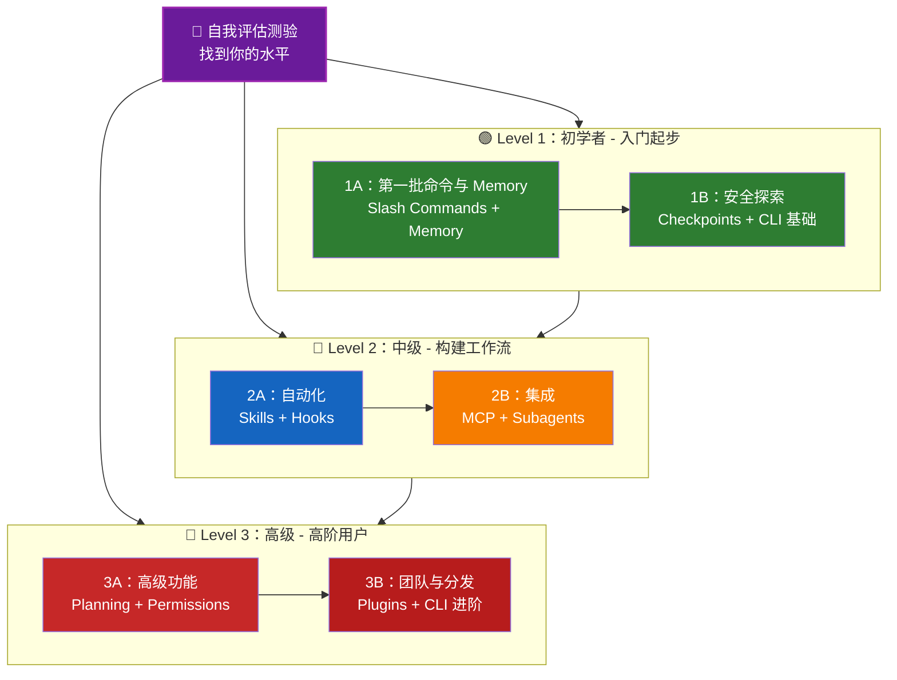

<picture>
  <source media="(prefers-color-scheme: dark)" srcset="resources/logos/claude-howto-logo-dark.svg">
  
</picture>

# 📚 Claude Code 学习路线图

**刚接触 Claude Code？** 这份指南会帮助你按自己的节奏掌握 Claude Code 的各项功能。无论你是完全的新手，还是已有经验的开发者，都建议先完成下面的自我评估，找到最适合自己的学习入口。

---

<a id="-find-your-level"></a>

## 🧭 找到你的水平

每个人的起点都不一样。先做这个简短的自我评估，找出最合适的切入点。

**请如实回答以下问题：**

- [ ] 我可以启动 Claude Code 并进行对话（`claude`）
- [ ] 我创建过或编辑过 `CLAUDE.md` 文件
- [ ] 我使用过至少 3 个内置 slash commands（例如 `/help`、`/compact`、`/model`）
- [ ] 我创建过自定义 slash command 或 skill（`SKILL.md`）
- [ ] 我配置过 MCP 服务器（例如 GitHub、数据库）
- [ ] 我在 `~/.claude/settings.json` 中配置过 hooks
- [ ] 我创建过或使用过自定义 subagents（`.claude/agents/`）
- [ ] 我使用过 print mode（`claude -p`）来做脚本或 CI/CD

**你的级别：**

| 勾选数 | 级别 | 从这里开始 | 完成时间 |
|--------|------|------------|----------|
| 0-2 | **Level 1：初学者** - 入门起步 | [里程碑 1A](#milestone-1a-first-commands--memory) | 约 3 小时 |
| 3-5 | **Level 2：中级** - 构建工作流 | [里程碑 2A](#milestone-2a-automation-skills--hooks) | 约 5 小时 |
| 6-8 | **Level 3：高级** - 高阶用户与团队负责人 | [里程碑 3A](#milestone-3a-advanced-features) | 约 5 小时 |

> **提示**：如果你不太确定，建议从更低一级开始。快速复习熟悉的内容，总比漏掉基础概念要好。

> **交互版**：可在 Claude Code 中运行 `/self-assessment`，体验一个带引导的交互式测验。它会评估你在 10 个功能领域中的熟练度，并生成个性化学习路径。

---

## 🎯 学习理念

这个仓库中的目录是按**推荐学习顺序**编号的，依据以下三个原则排列：

1. **依赖关系** - 先学习基础概念
2. **复杂度** - 先易后难
3. **使用频率** - 最常用的功能优先学习

这种安排可以确保你一边打牢基础，一边尽快获得实际的效率收益。

---

## 🗺️ 你的学习路径



**颜色说明：**
- 💜 紫色：自我评估测验
- 🟢 绿色：Level 1 初学者路径
- 🔵 蓝色 / 🟡 金色：Level 2 中级路径
- 🔴 红色：Level 3 高级路径

---

## 📊 完整路线图总表

| 步骤 | 功能 | 复杂度 | 时间 | 级别 | 前置依赖 | 为什么学这个 | 关键收益 |
|------|------|--------|------|------|----------|--------------|----------|
| **1** | [Slash Commands](01-slash-commands/) | ⭐ 初学者 | 30 分钟 | Level 1 | 无 | 快速获得效率提升（55+ 内置命令 + 5 个打包技能） | 即时自动化、团队规范 |
| **2** | [Memory](02-memory/) | ⭐⭐ 初学者+ | 45 分钟 | Level 1 | 无 | 所有功能都离不开它 | 持久上下文、偏好设置 |
| **3** | [Checkpoints](08-checkpoints/) | ⭐⭐ 中级 | 45 分钟 | Level 1 | 会话管理 | 安全探索 | 试验、恢复 |
| **4** | [CLI Basics](10-cli/) | ⭐⭐ 初学者+ | 30 分钟 | Level 1 | 无 | 掌握核心 CLI 用法 | 交互模式与 print mode |
| **5** | [Skills](03-skills/) | ⭐⭐ 中级 | 1 小时 | Level 2 | Slash Commands | 自动调用专业能力 | 可复用能力、一致性 |
| **6** | [Hooks](06-hooks/) | ⭐⭐ 中级 | 1 小时 | Level 2 | Tools、Commands | 工作流自动化（25 个事件、4 种类型） | 校验、质量门禁 |
| **7** | [MCP](05-mcp/) | ⭐⭐⭐ 中级+ | 1 小时 | Level 2 | 配置 | 访问实时数据 | 实时集成、API |
| **8** | [Subagents](04-subagents/) | ⭐⭐⭐ 中级+ | 1.5 小时 | Level 2 | Memory、Commands | 处理复杂任务（含 Bash 在内共 6 个内置 subagent） | 委派、专业化能力 |
| **9** | [Advanced Features](09-advanced-features/) | ⭐⭐⭐⭐⭐ 高级 | 2-3 小时 | Level 3 | 前面全部内容 | 高阶用户工具 | Planning、Auto Mode、Channels、Voice Dictation、permissions |
| **10** | [Plugins](07-plugins/) | ⭐⭐⭐⭐ 高级 | 2 小时 | Level 3 | 前面全部内容 | 完整解决方案 | 团队入职、分发 |
| **11** | [CLI Mastery](10-cli/) | ⭐⭐⭐ 高级 | 1 小时 | Level 3 | 推荐：全部内容 | 掌握命令行高级用法 | 脚本、CI/CD、自动化 |

**总学习时间**：约 11-13 小时（也可以直接跳到适合你当前水平的部分来节省时间）

---

## 🟢 Level 1：初学者 - 入门起步

**适合**：自评勾选数为 0-2 的用户  
**时间**：约 3 小时  
**重点**：快速见效，理解基础概念  
**结果**：能胜任日常使用，为进入 Level 2 做好准备

<a id="milestone-1a-first-commands--memory"></a>

### 里程碑 1A：第一批命令与 Memory

**主题**：Slash Commands + Memory  
**时间**：1-2 小时  
**复杂度**：⭐ 初学者  
**目标**：通过自定义命令和持久上下文，立刻获得效率提升

#### 你将获得什么
✅ 为重复任务创建自定义 slash commands  
✅ 为团队规范建立项目 Memory  
✅ 配置个人偏好  
✅ 理解 Claude 如何自动加载上下文

#### 动手练习

```bash
# 练习 1：安装你的第一个 slash command
mkdir -p .claude/commands
cp 01-slash-commands/optimize.md .claude/commands/

# 练习 2：创建项目 memory
cp 02-memory/project-CLAUDE.md ./CLAUDE.md

# 练习 3：试运行
# 在 Claude Code 中输入：/optimize
```

#### 成功标准
- [ ] 成功调用 `/optimize` 命令
- [ ] Claude 能从 `CLAUDE.md` 记住你的项目规范
- [ ] 你理解何时使用 slash commands，何时使用 memory

#### 下一步
熟悉后，继续阅读：
- [01-slash-commands/README.md](01-slash-commands/README.md)
- [02-memory/README.md](02-memory/README.md)

> **检查理解情况**：在 Claude Code 中运行 `/lesson-quiz slash-commands` 或 `/lesson-quiz memory`，测试你刚刚学到的内容。

---

### 里程碑 1B：安全探索

**主题**：Checkpoints + CLI 基础  
**时间**：1 小时  
**复杂度**：⭐⭐ 初学者+  
**目标**：学会安全地试验，并掌握核心 CLI 命令

#### 你将获得什么
✅ 使用 checkpoints 安全试验，并可随时恢复  
✅ 理解 interactive mode 和 print mode 的区别  
✅ 使用基础 CLI 参数和选项  
✅ 通过 piping 处理文件内容

#### 动手练习

```bash
# 练习 1：体验 checkpoint 工作流
# 在 Claude Code 中：
# 先做一些试验性的修改，然后按 Esc+Esc 或使用 /rewind
# 选择实验之前的 checkpoint
# 选择 "Restore code and conversation" 返回之前状态

# 练习 2：Interactive mode 与 Print mode
claude "explain this project"           # Interactive mode
claude -p "explain this function"       # Print mode（非交互）

# 练习 3：通过 piping 处理文件内容
cat error.log | claude -p "explain this error"
```

#### 成功标准
- [ ] 创建过 checkpoint 并成功回退
- [ ] 使用过 interactive mode 和 print mode
- [ ] 通过管道把文件内容交给 Claude 分析
- [ ] 理解何时使用 checkpoints 来进行安全试验

#### 下一步
- 阅读：[08-checkpoints/README.md](08-checkpoints/README.md)
- 阅读：[10-cli/README.md](10-cli/README.md)
- **准备好进入 Level 2 了！** 前往 [里程碑 2A](#milestone-2a-automation-skills--hooks)

> **检查理解情况**：运行 `/lesson-quiz checkpoints` 或 `/lesson-quiz cli`，确认你已经准备好进入 Level 2。

---

## 🔵 Level 2：中级 - 构建工作流

**适合**：自评勾选数为 3-5 的用户  
**时间**：约 5 小时  
**重点**：自动化、集成、任务委派  
**结果**：可以构建自动化工作流和外部集成，为进入 Level 3 做好准备

### 前置检查

开始 Level 2 前，请确认你已经熟悉这些 Level 1 概念：

- [ ] 会创建并使用 slash commands（[01-slash-commands/](01-slash-commands/)）
- [ ] 已通过 `CLAUDE.md` 设置项目 memory（[02-memory/](02-memory/)）
- [ ] 知道如何创建和恢复 checkpoints（[08-checkpoints/](08-checkpoints/)）
- [ ] 会在命令行中使用 `claude` 和 `claude -p`（[10-cli/](10-cli/)）

> **有短板？** 继续之前，先回看上面对应的教程。

---

<a id="milestone-2a-automation-skills--hooks"></a>

### 里程碑 2A：自动化（Skills + Hooks）

**主题**：Skills + Hooks  
**时间**：2-3 小时  
**复杂度**：⭐⭐ 中级  
**目标**：自动化常见工作流和质量检查

#### 你将获得什么
✅ 通过 YAML frontmatter 自动调用专业能力（包括 `effort` 和 `shell` 字段）  
✅ 在 25 个 hook 事件中建立事件驱动自动化  
✅ 使用全部 4 种 hook 类型（command、http、prompt、agent）  
✅ 强制执行代码质量标准  
✅ 为你的工作流创建自定义 hooks

#### 动手练习

```bash
# 练习 1：安装一个 skill
cp -r 03-skills/code-review ~/.claude/skills/

# 练习 2：设置 hooks
mkdir -p ~/.claude/hooks
cp 06-hooks/pre-tool-check.sh ~/.claude/hooks/
chmod +x ~/.claude/hooks/pre-tool-check.sh

# 练习 3：在 settings 中配置 hooks
# 添加到 ~/.claude/settings.json：
{
  "hooks": {
    "PreToolUse": [
      {
        "matcher": "Bash",
        "hooks": [
          {
            "type": "command",
            "command": "~/.claude/hooks/pre-tool-check.sh"
          }
        ]
      }
    ]
  }
}
```

#### 成功标准
- [ ] 在相关场景下，code review skill 能自动触发
- [ ] `PreToolUse` hook 会在工具执行前运行
- [ ] 你理解 skill 自动调用与 hook 事件触发之间的区别

#### 下一步
- 创建你自己的自定义 skill
- 为你的工作流配置更多 hooks
- 阅读：[03-skills/README.md](03-skills/README.md)
- 阅读：[06-hooks/README.md](06-hooks/README.md)

> **检查理解情况**：进入下一部分前，运行 `/lesson-quiz skills` 或 `/lesson-quiz hooks` 测试你的掌握程度。

---

### 里程碑 2B：集成（MCP + Subagents）

**主题**：MCP + Subagents  
**时间**：2-3 小时  
**复杂度**：⭐⭐⭐ 中级+  
**目标**：集成外部服务，并委派复杂任务

#### 你将获得什么
✅ 访问 GitHub、数据库等实时数据  
✅ 将工作委派给专业化 AI agents  
✅ 理解何时使用 MCP，何时使用 subagents  
✅ 构建集成式工作流

#### 动手练习

```bash
# 练习 1：配置 GitHub MCP
export GITHUB_TOKEN="your_github_token"
claude mcp add github -- npx -y @modelcontextprotocol/server-github

# 练习 2：测试 MCP 集成
# 在 Claude Code 中：/mcp__github__list_prs

# 练习 3：安装 subagents
mkdir -p .claude/agents
cp 04-subagents/*.md .claude/agents/
```

#### 集成练习
尝试这个完整工作流：
1. 使用 MCP 获取一个 GitHub PR
2. 让 Claude 把审查任务委派给 `code-reviewer` subagent
3. 使用 hooks 自动运行测试

#### 成功标准
- [ ] 成功通过 MCP 查询 GitHub 数据
- [ ] Claude 能将复杂任务委派给 subagents
- [ ] 你理解 MCP 与 subagents 的区别
- [ ] 在一个工作流中组合使用 MCP + subagents + hooks

#### 下一步
- 配置更多 MCP 服务器（数据库、Slack 等）
- 为你的领域创建自定义 subagents
- 阅读：[05-mcp/README.md](05-mcp/README.md)
- 阅读：[04-subagents/README.md](04-subagents/README.md)
- **准备好进入 Level 3 了！** 前往 [里程碑 3A](#milestone-3a-advanced-features)

> **检查理解情况**：运行 `/lesson-quiz mcp` 或 `/lesson-quiz subagents`，确认你已经准备好进入 Level 3。

---

## 🔴 Level 3：高级 - 高阶用户与团队负责人

**适合**：自评勾选数为 6-8 的用户  
**时间**：约 5 小时  
**重点**：团队工具、CI/CD、企业级功能、plugin 开发  
**结果**：成为高阶用户，能够搭建团队工作流和 CI/CD 集成

### 前置检查

开始 Level 3 前，请确认你已经熟悉这些 Level 2 概念：

- [ ] 会创建并使用支持自动调用的 skills（[03-skills/](03-skills/)）
- [ ] 已配置事件驱动自动化 hooks（[06-hooks/](06-hooks/)）
- [ ] 会为外部数据配置 MCP 服务器（[05-mcp/](05-mcp/)）
- [ ] 知道如何使用 subagents 进行任务委派（[04-subagents/](04-subagents/)）

> **有短板？** 继续之前，先回看上面对应的教程。

---

<a id="milestone-3a-advanced-features"></a>

### 里程碑 3A：高级功能

**主题**：Advanced Features（Planning、Permissions、Extended Thinking、Auto Mode、Channels、Voice Dictation、Remote/Desktop/Web）  
**时间**：2-3 小时  
**复杂度**：⭐⭐⭐⭐⭐ 高级  
**目标**：掌握高级工作流和高阶用户工具

#### 你将获得什么
✅ 使用 planning mode 处理复杂功能  
✅ 使用 6 种 permission mode（`default`、`acceptEdits`、`plan`、`auto`、`dontAsk`、`bypassPermissions`）做细粒度权限控制  
✅ 通过 Alt+T / Option+T 切换 extended thinking  
✅ 管理后台任务  
✅ 使用 Auto Memory 自动学习偏好  
✅ 使用带后台安全分类器的 Auto Mode  
✅ 用 Channels 构建结构化的多会话工作流  
✅ 用 Voice Dictation 进行免手打交互  
✅ 使用远程控制、桌面应用和 Web 会话  
✅ 使用 Agent Teams 实现多 agent 协作

#### 动手练习

```bash
# 练习 1：使用 planning mode
/plan Implement user authentication system

# 练习 2：试用 permission modes（共 6 种：default、acceptEdits、plan、auto、dontAsk、bypassPermissions）
claude --permission-mode plan "analyze this codebase"
claude --permission-mode acceptEdits "refactor the auth module"
claude --permission-mode auto "implement the feature"

# 练习 3：启用 extended thinking
# 在会话中按 Alt+T（macOS 上是 Option+T）切换

# 练习 4：高级 checkpoint 工作流
# 1. 创建 checkpoint "Clean state"
# 2. 使用 planning mode 设计一个功能
# 3. 通过 subagent 委派来实现
# 4. 在后台运行测试
# 5. 如果测试失败，rewind 回 checkpoint
# 6. 尝试另一种实现方式

# 练习 5：试用 auto mode（后台安全分类器）
claude --permission-mode auto "implement user settings page"

# 练习 6：启用 agent teams
export CLAUDE_AGENT_TEAMS=1
# 让 Claude 执行："Implement feature X using a team approach"

# 练习 7：定时任务
/loop 5m /check-status
# 或使用 CronCreate 创建持久化定时任务

# 练习 8：使用 Channels 组织多会话工作流
# 使用 channels 跨会话组织工作

# 练习 9：Voice Dictation
# 使用语音输入与 Claude Code 进行免手打交互
```

#### 成功标准
- [ ] 对复杂功能使用过 planning mode
- [ ] 配置过 permission modes（`plan`、`acceptEdits`、`auto`、`dontAsk`）
- [ ] 使用 Alt+T / Option+T 切换过 extended thinking
- [ ] 使用过带后台安全分类器的 auto mode
- [ ] 使用后台任务处理过长时间操作
- [ ] 体验过 Channels 组织多会话工作流
- [ ] 试用过 Voice Dictation 进行免手打输入
- [ ] 理解 Remote Control、Desktop App 和 Web sessions
- [ ] 启用并使用过 Agent Teams 进行协作任务
- [ ] 使用 `/loop` 做周期性任务或定时监控

#### 下一步
- 阅读：[09-advanced-features/README.md](09-advanced-features/README.md)

> **检查理解情况**：运行 `/lesson-quiz advanced`，测试你对高阶功能的掌握程度。

---

### 里程碑 3B：团队与分发（Plugins + CLI 进阶）

**主题**：Plugins + CLI Mastery + CI/CD  
**时间**：2-3 小时  
**复杂度**：⭐⭐⭐⭐ 高级  
**目标**：构建团队工具，创建 plugins，掌握 CI/CD 集成

#### 你将获得什么
✅ 安装并创建完整的打包 plugins  
✅ 掌握 CLI 的脚本化与自动化用法  
✅ 用 `claude -p` 建立 CI/CD 集成  
✅ 为自动化流水线生成 JSON 输出  
✅ 掌握会话管理与批处理

#### 动手练习

```bash
# 练习 1：安装一个完整 plugin
# 在 Claude Code 中：/plugin install pr-review

# 练习 2：在 CI/CD 中使用 print mode
claude -p "Run all tests and generate report"

# 练习 3：为脚本输出 JSON
claude -p --output-format json "list all functions"

# 练习 4：会话管理与恢复
claude -r "feature-auth" "continue implementation"

# 练习 5：带约束的 CI/CD 集成
claude -p --max-turns 3 --output-format json "review code"

# 练习 6：批处理
for file in *.md; do
  claude -p --output-format json "summarize this: $(cat $file)" > ${file%.md}.summary.json
done
```

#### CI/CD 集成练习
创建一个简单的 CI/CD 脚本：
1. 使用 `claude -p` 审查变更文件
2. 以 JSON 格式输出结果
3. 用 `jq` 处理特定问题
4. 集成到 GitHub Actions 工作流中

#### 成功标准
- [ ] 安装并使用过一个 plugin
- [ ] 为团队构建或修改过一个 plugin
- [ ] 在 CI/CD 中使用过 print mode（`claude -p`）
- [ ] 为脚本生成过 JSON 输出
- [ ] 成功恢复过之前的会话
- [ ] 创建过一个批处理脚本
- [ ] 将 Claude 集成到 CI/CD 工作流中

#### CLI 的真实场景用法
- **代码审查自动化**：在 CI/CD 流水线中运行代码审查
- **日志分析**：分析错误日志和系统输出
- **文档生成**：批量生成文档
- **测试洞察**：分析测试失败
- **性能分析**：审查性能指标
- **数据处理**：转换并分析数据文件

#### 下一步
- 阅读：[07-plugins/README.md](07-plugins/README.md)
- 阅读：[10-cli/README.md](10-cli/README.md)
- 创建团队级 CLI 快捷方式和 plugins
- 配置批处理脚本

> **检查理解情况**：运行 `/lesson-quiz plugins` 或 `/lesson-quiz cli`，确认你已经掌握这些内容。

---

## 🧪 测试你的掌握程度

这个仓库内置了两个交互式技能，你可以随时在 Claude Code 中使用它们来评估自己的理解程度：

| 技能 | 命令 | 用途 |
|------|------|------|
| **自我评估** | `/self-assessment` | 评估你对全部 10 个功能的整体熟练度。你可以选择 Quick（2 分钟）或 Deep（5 分钟）模式，获得个性化技能画像和学习路径。 |
| **课程测验** | `/lesson-quiz [lesson]` | 用 10 道题测试你对某一课的掌握情况。可以在学习前（预评估）、学习中（进度检查）或学习后（掌握验证）使用。 |

**示例：**
```
/self-assessment                  # 查看整体水平
/lesson-quiz hooks                # 测验第 06 课：Hooks
/lesson-quiz 03                   # 测验第 03 课：Skills
/lesson-quiz advanced-features    # 测验第 09 课
```

---

## ⚡ 快速开始路径

### 如果你只有 15 分钟
**目标**：先拿到第一次正反馈

1. 复制一个 slash command：`cp 01-slash-commands/optimize.md .claude/commands/`
2. 在 Claude Code 中试用它：`/optimize`
3. 阅读：[01-slash-commands/README.md](01-slash-commands/README.md)

**结果**：你会拥有一个可用的 slash command，并理解基础概念

---

### 如果你有 1 小时
**目标**：配置最核心的效率工具

1. **Slash Commands**（15 分钟）：复制并测试 `/optimize` 和 `/pr`
2. **项目 Memory**（15 分钟）：创建包含项目规范的 `CLAUDE.md`
3. **安装一个 skill**（15 分钟）：配置 code-review skill
4. **组合试用**（15 分钟）：观察它们如何协同工作

**结果**：通过 commands、memory 和自动技能获得基础效率提升

---

### 如果你有一个周末
**目标**：熟练掌握大部分功能

**周六上午**（3 小时）：
- 完成里程碑 1A：Slash Commands + Memory
- 完成里程碑 1B：Checkpoints + CLI 基础

**周六下午**（3 小时）：
- 完成里程碑 2A：Skills + Hooks
- 完成里程碑 2B：MCP + Subagents

**周日**（4 小时）：
- 完成里程碑 3A：高级功能
- 完成里程碑 3B：Plugins + CLI 进阶 + CI/CD
- 为你的团队构建一个自定义 plugin

**结果**：你会成为 Claude Code 的高阶用户，能够培训他人并自动化复杂工作流

---

## 💡 学习建议

### ✅ 推荐这样做

- **先做测验**，找准自己的起点
- **完成每个里程碑的动手练习**
- **从简单开始**，逐步增加复杂度
- **每学完一个功能都亲手测试**
- **记录笔记**，总结哪些方法最适合你的工作流
- **学习高级主题时回顾前面的基础概念**
- **借助 checkpoints 安全试验**
- **把经验分享给团队**

### ❌ 不建议这样做

- **跳过前置检查** 就直接进入更高等级
- **试图一次学完所有内容**，这样很容易被信息淹没
- **不理解就照抄配置**，这样出问题时你会不知道如何排查
- **忘记测试**，始终要确认功能确实能运行
- **匆忙略过里程碑**，要给自己留出理解时间
- **忽略文档**，每个 `README` 都有重要细节
- **闭门造车**，记得和队友交流讨论

---

## 🎓 学习风格

### 视觉型学习者
- 研究每个 `README` 里的 Mermaid 图表
- 观察命令执行流程
- 自己画工作流图
- 使用上面的可视化学习路径

### 动手型学习者
- 完成所有动手练习
- 尝试不同变体
- 故意把东西弄坏再修好（记得用 checkpoints！）
- 自己创建例子

### 阅读型学习者
- 认真通读每个 `README`
- 学习代码示例
- 查看对比表格
- 阅读 resources 中链接的博客文章

### 社交型学习者
- 组织结对编程
- 把概念讲给队友听
- 参与 Claude Code 社区讨论
- 分享你的自定义配置

---

## 📈 进度追踪

使用下面这些清单按级别追踪你的学习进度。你可以随时运行 `/self-assessment` 获取更新后的技能画像，也可以在每个教程后运行 `/lesson-quiz [lesson]` 验证理解程度。

### 🟢 Level 1：初学者
- [ ] 完成 [01-slash-commands](01-slash-commands/)
- [ ] 完成 [02-memory](02-memory/)
- [ ] 创建了第一个自定义 slash command
- [ ] 配置了项目 memory
- [ ] **达成里程碑 1A**
- [ ] 完成 [08-checkpoints](08-checkpoints/)
- [ ] 完成 [10-cli](10-cli/) 基础部分
- [ ] 创建过 checkpoint 并回退成功
- [ ] 使用过 interactive mode 和 print mode
- [ ] **达成里程碑 1B**

### 🔵 Level 2：中级
- [ ] 完成 [03-skills](03-skills/)
- [ ] 完成 [06-hooks](06-hooks/)
- [ ] 安装了第一个 skill
- [ ] 配置了 `PreToolUse` hook
- [ ] **达成里程碑 2A**
- [ ] 完成 [05-mcp](05-mcp/)
- [ ] 完成 [04-subagents](04-subagents/)
- [ ] 连接了 GitHub MCP
- [ ] 创建了自定义 subagent
- [ ] 在一个工作流中组合使用这些集成
- [ ] **达成里程碑 2B**

### 🔴 Level 3：高级
- [ ] 完成 [09-advanced-features](09-advanced-features/)
- [ ] 成功使用过 planning mode
- [ ] 配置过 permission modes（包含 auto 在内共 6 种）
- [ ] 使用过带安全分类器的 auto mode
- [ ] 使用过 extended thinking toggle
- [ ] 体验过 Channels 和 Voice Dictation
- [ ] **达成里程碑 3A**
- [ ] 完成 [07-plugins](07-plugins/)
- [ ] 完成 [10-cli](10-cli/) 高级用法
- [ ] 在 CI/CD 中配置 print mode（`claude -p`）
- [ ] 为自动化生成 JSON 输出
- [ ] 将 Claude 集成进 CI/CD 流水线
- [ ] 创建了团队 plugin
- [ ] **达成里程碑 3B**

---

## 🆘 常见学习难点

### 难点 1："概念一下子太多了"
**解决方案**：一次只专注一个里程碑。完成所有练习后再往下走。

### 难点 2："不知道什么时候该用哪个功能"
**解决方案**：参考主 README 中的 [使用场景矩阵](README.md#use-case-matrix)。

### 难点 3："配置不生效"
**解决方案**：查看 [故障排查](README.md#troubleshooting) 部分，并确认文件位置是否正确。

### 难点 4："这些概念看起来很像"
**解决方案**：回看 [功能对比](README.md#feature-comparison) 表格，理解它们之间的差异。

### 难点 5："很难把所有东西都记住"
**解决方案**：自己做一份速查表。并用 checkpoints 安全地做实验。

### 难点 6："我有经验，但不知道该从哪里开始"
**解决方案**：先做上面的 [自我评估测验](#-find-your-level)。直接跳到适合你的级别，再通过前置检查找出短板。

---

## 🎯 全部学完之后做什么？

完成所有里程碑后，你可以继续：

1. **编写团队文档** - 记录团队的 Claude Code 配置方案
2. **构建自定义 plugins** - 打包团队工作流
3. **探索 Remote Control** - 从外部工具以编程方式控制 Claude Code 会话
4. **尝试 Web Sessions** - 通过浏览器界面使用 Claude Code 进行远程开发
5. **使用 Desktop App** - 通过原生桌面应用访问 Claude Code 功能
6. **使用 Auto Mode** - 让 Claude 在后台安全分类器保护下自主工作
7. **利用 Auto Memory** - 让 Claude 随时间自动学习你的偏好
8. **配置 Agent Teams** - 在复杂、多维任务上协调多个 agent 协作
9. **使用 Channels** - 在结构化多会话工作流中组织任务
10. **试试 Voice Dictation** - 使用免手打语音输入与 Claude Code 交互
11. **使用定时任务** - 通过 `/loop` 和 cron 工具自动执行周期性检查
12. **贡献示例** - 分享给社区
13. **指导他人** - 帮助队友学习
14. **优化工作流** - 根据使用情况持续改进
15. **保持更新** - 关注 Claude Code 发布和新功能

---

## 📚 更多资源

### 官方文档
- [Claude Code Documentation](https://code.claude.com/docs/en/overview)
- [Anthropic Documentation](https://docs.anthropic.com)
- [MCP Protocol Specification](https://modelcontextprotocol.io)

### 博客文章
- [Discovering Claude Code Slash Commands](https://medium.com/@luongnv89/discovering-claude-code-slash-commands-cdc17f0dfb29)

### 社区
- [Anthropic Cookbook](https://github.com/anthropics/anthropic-cookbook)
- [MCP Servers Repository](https://github.com/modelcontextprotocol/servers)

---

## 💬 反馈与支持

- **发现问题？** 在仓库中创建 issue
- **有建议？** 提交 pull request
- **需要帮助？** 查看文档或向社区提问

---

**最后更新**：2026 年 3 月  
**维护者**：Claude How-To Contributors  
**许可证**：仅供学习用途，可自由使用和改编

---

[← 返回主 README](README.md)
