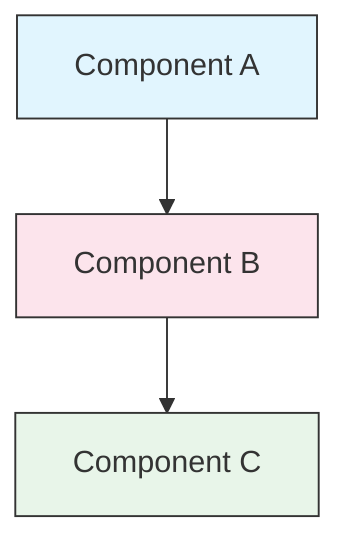

<picture>
  <source media="(prefers-color-scheme: dark)" srcset="resources/logos/claude-howto-logo-dark.svg">
  
</picture>

<a id="style-guide"></a>

# 样式指南

> 面向 Claude How To 贡献内容的约定与排版规则。遵循本指南，可使内容保持一致、专业且易于维护。

---

<a id="table-of-contents"></a>

## 目录

- [文件与文件夹命名](#file-and-folder-naming)
- [文档结构](#document-structure)
- [标题](#headings)
- [正文格式](#text-formatting)
- [列表](#lists)
- [表格](#tables)
- [代码块](#code-blocks)
- [链接与交叉引用](#links-and-cross-references)
- [图示](#diagrams)
- [Emoji 使用](#emoji-usage)
- [YAML Frontmatter](#yaml-frontmatter)
- [图片与媒体](#images-and-media)
- [语气与表述](#tone-and-voice)
- [提交信息](#commit-messages)
- [作者自检清单](#checklist-for-authors)

---

<a id="file-and-folder-naming"></a>

## 文件与文件夹命名

### 课时文件夹

课时文件夹采用**两位数字前缀**，后跟 **kebab-case** 描述名：

```
01-slash-commands/
02-memory/
03-skills/
04-subagents/
05-mcp/
```

数字表示从入门到进阶的学习路径顺序。

### 文件名

| 类型 | 约定 | 示例 |
|------|-----------|----------|
| **课时 README** | `README.md` | `01-slash-commands/README.md` |
| **功能说明文件** | Kebab-case `.md` | `code-reviewer.md`, `generate-api-docs.md` |
| **Shell 脚本** | Kebab-case `.sh` | `format-code.sh`, `validate-input.sh` |
| **配置文件** | 常规文件名 | `.mcp.json`, `settings.json` |
| **Memory 文件** | 带作用域前缀 | `project-CLAUDE.md`, `personal-CLAUDE.md` |
| **顶层文档** | UPPER_CASE `.md` | `CATALOG.md`, `QUICK_REFERENCE.md`, `CONTRIBUTING.md` |
| **图片资源** | Kebab-case | `pr-slash-command.png`, `claude-howto-logo.svg` |

### 规则

- 文件与文件夹名一律使用**小写**（顶层文档如 `README.md`、`CATALOG.md` 等除外）
- 使用**连字符**（`-`）分词，不要使用下划线或空格
- 名称在可读前提下尽量简短

---

<a id="document-structure"></a>

## 文档结构

### 仓库根目录 README

根目录 `README.md` 建议按以下顺序组织：

1. Logo（使用 `<picture>`，含深色/浅色变体）
2. H1 标题
3. 引言块引用（一行价值说明）
4. 「为何需要本指南？」及对比表格
5. 水平线（`---`）
6. 目录
7. Feature Catalog（功能目录）
8. Quick Navigation（快速导航）
9. Learning Path（学习路径）
10. 各功能章节
11. Getting Started（上手）
12. Best Practices / Troubleshooting（最佳实践 / 疑难排解）
13. Contributing / License（贡献 / 许可）

### 课时 README

每个课时的 `README.md` 建议按以下顺序组织：

1. H1 标题（例如 `# Slash Commands`）
2. 简短概述段落
3. 速查表（可选）
4. 架构图（Mermaid）
5. 详细分节（H2）
6. 实操示例（编号列出，约 4–6 个）
7. 最佳实践（宜/忌对照表）
8. Troubleshooting（疑难排解）
9. Related guides / Official documentation（相关指南 / 官方文档）
10. 文档元数据页脚

### 功能/示例文件

单个功能文件（例如 `optimize.md`、`pr.md`）建议包含：

1. YAML frontmatter（如适用）
2. H1 标题
3. 用途 / 说明
4. 使用说明
5. 代码示例
6. 自定义提示

### 分节分隔线

使用水平线（`---`）分隔文档中的主要区域：

```markdown
---

## New Major Section
```

可放在引言块引用之后，以及逻辑上相对独立的部分之间。

---

<a id="headings"></a>

## 标题

### 层级

| 级别 | 用途 | 示例 |
|-------|-----|---------|
| `#` H1 | 页面标题（每篇文档仅一个） | `# Slash Commands` |
| `##` H2 | 主要章节 | `## Best Practices` |
| `###` H3 | 小节 | `### Adding a Skill` |
| `####` H4 | 子小节（少用） | `#### Configuration Options` |

### 规则

- **每篇文档仅一个 H1** — 即页面标题
- **不要跳级** — 不要从 H2 直接到 H4
- **标题尽量简短** — 以约 2–5 个词为宜
- **使用 sentence case** — 仅首词与专有名词大写（例外：功能名保持原样）
- **仅在根目录 README** 的章节标题上加 emoji 前缀（见 [Emoji 使用](#emoji-usage)）

---

<a id="text-formatting"></a>

## 正文格式

### 强调

| 样式 | 何时使用 | 示例 |
|-------|------------|---------|
| **粗体**（`**text**`） | 关键术语、表内标签、重要概念 | `**Installation**:` |
| *斜体*（`*text*`） | 技术术语首次出现、书名/文档名 | `*frontmatter*` |
| `行内代码`（`` `text` ``） | 文件名、命令、配置值、代码引用 | `` `CLAUDE.md` `` |

### 用块引用作提示框

对重要说明使用带粗体前缀的块引用：

```markdown
> **Note**: Custom slash commands have been merged into skills since v2.0.

> **Important**: Never commit API keys or credentials.

> **Tip**: Combine memory with skills for maximum effectiveness.
```

支持的提示类型：**Note**、**Important**、**Tip**、**Warning**。

### 段落

- 段落宜短（约 2–4 句）
- 段落之间空一行
- 先写要点，再补充背景
- 说明「为什么」，不只写「是什么」

---

<a id="lists"></a>

## 列表

### 无序列表

使用短横线（`-`），嵌套时缩进 2 个空格：

```markdown
- First item
- Second item
  - Nested item
  - Another nested item
    - Deep nested (avoid going deeper than 3 levels)
- Third item
```

### 有序列表

用于步骤、操作说明、排序项：

```markdown
1. First step
2. Second step
   - Sub-point detail
   - Another sub-point
3. Third step
```

### 描述性列表

用粗体作「键」的列表：

```markdown
- **Performance bottlenecks** - identify O(n^2) operations, inefficient loops
- **Memory leaks** - find unreleased resources, circular references
- **Algorithm improvements** - suggest better algorithms or data structures
```

### 规则

- 保持缩进一致（每层 2 个空格）
- 列表前后各空一行
- 列表项结构平行（都以动词开头，或都是名词等）
- 嵌套不要超过 3 层

---

<a id="tables"></a>

## 表格

### 基本格式

```markdown
| Column 1 | Column 2 | Column 3 |
|----------|----------|----------|
| Data     | Data     | Data     |
```

### 常见表格形态

**功能对比（3–4 列）：**

```markdown
| Feature | Invocation | Persistence | Best For |
|---------|-----------|------------|----------|
| **Slash Commands** | Manual (`/cmd`) | Session only | Quick shortcuts |
| **Memory** | Auto-loaded | Cross-session | Long-term learning |
```

**宜 / 忌：**

```markdown
| Do | Don't |
|----|-------|
| Use descriptive names | Use vague names |
| Keep files focused | Overload a single file |
```

**速查：**

```markdown
| Aspect | Details |
|--------|---------|
| **Purpose** | Generate API documentation |
| **Scope** | Project-level |
| **Complexity** | Intermediate |
```

### 规则

- 当首列为行标签时，对**表头使用粗体**
- 为便于阅读，可在源码中对齐竖线（可选，但建议）
- 单元格内容宜短；细节用链接展开
- 单元格内的命令与路径使用 `` `代码格式` ``

---

<a id="code-blocks"></a>

## 代码块

### 语言标签

为语法高亮务必指定语言：

| 语言 | 标签 | 用途 |
|----------|-----|---------|
| Shell | `bash` | CLI 命令、脚本 |
| Python | `python` | Python 代码 |
| JavaScript | `javascript` | JS 代码 |
| TypeScript | `typescript` | TS 代码 |
| JSON | `json` | 配置文件 |
| YAML | `yaml` | Frontmatter、配置 |
| Markdown | `markdown` | Markdown 示例 |
| SQL | `sql` | 数据库查询 |
| 纯文本 | （不写标签） | 预期输出、目录树 |

### 约定

```bash
# Comment explaining what the command does
claude mcp add notion --transport http https://mcp.notion.com/mcp
```

- 对不够直观的命令，先加一行**注释说明**
- 示例应**可直接复制粘贴执行**
- 在合适时同时给出**简单版与进阶版**
- 有助于理解时附上**预期输出**（使用无语言标签的代码块）

### 安装类代码块

安装说明可使用如下模式：

```bash
# Copy files to your project
cp 01-slash-commands/*.md .claude/commands/
```

### 多步骤流程

```bash
# Step 1: Create the directory
mkdir -p .claude/commands

# Step 2: Copy the templates
cp 01-slash-commands/*.md .claude/commands/

# Step 3: Verify installation
ls .claude/commands/
```

---

<a id="links-and-cross-references"></a>

## 链接与交叉引用

### 站内链接（相对路径）

站内链接一律使用相对路径：

```markdown
[Slash Commands](01-slash-commands/)
[Skills Guide](03-skills/)
[Memory Architecture](02-memory/#memory-architecture)
```

从课时目录返回根目录或同级：

```markdown
[Back to main guide](../README.md)
[Related: Skills](../03-skills/)
```

### 站外链接（绝对 URL）

使用完整 URL，锚文字要有描述性：

```markdown
[Anthropic's official documentation](https://code.claude.com/docs/en/overview)
```

- 不要用「点击这里」「此链接」之类作锚文字
- 锚文字脱离上下文也应能看懂

### 章节锚点

同一文档内跳转到小节时，使用 GitHub 风格的锚点：

```markdown
[Feature Catalog](#-feature-catalog)
[Best Practices](#best-practices)
```

### 「相关指南」写法

课时文末可附相关指南：

```markdown
## Related Guides

- [Slash Commands](../01-slash-commands/) - Quick shortcuts
- [Memory](../02-memory/) - Persistent context
- [Skills](../03-skills/) - Reusable capabilities
```

---

<a id="diagrams"></a>

## 图示

### Mermaid

图示统一使用 Mermaid。常用类型：

- `graph TB` / `graph LR` — 架构、层级、流程
- `sequenceDiagram` — 交互时序
- `timeline` — 时间线

### 样式约定

用 style 块保持配色一致：



**色板：**

| 颜色 | Hex | 用途 |
|-------|-----|---------|
| Light blue | `#e1f5fe` | 主流程组件、输入 |
| Light pink | `#fce4ec` | 处理、中间层 |
| Light green | `#e8f5e9` | 输出、结果 |
| Light yellow | `#fff9c4` | 配置、可选项 |
| Light purple | `#f3e5f5` | 面向用户、UI |

### 规则

- 节点文案使用 `["Label text"]`（便于包含特殊字符）
- 标签内换行使用 `<br/>`
- 图示尽量简单（约 10–12 个节点以内）
- 图下附一两句文字说明，便于理解与无障碍
- 层级结构优先自上而下（`TB`），流程可左右（`LR`）

---

<a id="emoji-usage"></a>

## Emoji 使用

### 使用场景

Emoji **少而精**，仅用于特定场景：

| 场景 | Emoji | 示例 |
|---------|--------|---------|
| 根 README 章节标题 | 类别图标 | `## 📚 Learning Path` |
| 难度标识 | 彩色圆点 | 🟢 Beginner, 🔵 Intermediate, 🔴 Advanced |
| 宜 / 忌 | 对勾 / 叉 | ✅ Do this, ❌ Don't do this |
| 复杂度 | 星标 | ⭐⭐⭐ |

### 常用 Emoji 表

| Emoji | 含义 |
|-------|--------|
| 📚 | 学习、指南、文档 |
| ⚡ | 上手、速查 |
| 🎯 | 功能、速查 |
| 🎓 | 学习路径 |
| 📊 | 统计、对比 |
| 🚀 | 安装、快捷命令 |
| 🟢 | 初级 |
| 🔵 | 中级 |
| 🔴 | 高级 |
| ✅ | 推荐做法 |
| ❌ | 应避免 / 反模式 |
| ⭐ | 复杂度星级单位 |

### 规则

- **正文段落中不要使用 emoji**
- **仅在根 README 的标题中使用 emoji**（课时 README 中不要用）
- **不要堆砌装饰性 emoji** — 每个 emoji 都应有明确含义
- 使用方式请与上表保持一致

---

<a id="yaml-frontmatter"></a>

## YAML Frontmatter

### 功能文件（Skills、Commands、Agents）

```yaml
---
name: unique-identifier
description: What this feature does and when to use it
allowed-tools: Bash, Read, Grep
---
```

### 可选字段

```yaml
---
name: my-feature
description: Brief description
argument-hint: "[file-path] [options]"
allowed-tools: Bash, Read, Grep, Write, Edit
model: opus                        # opus, sonnet, or haiku
disable-model-invocation: true     # User-only invocation
user-invocable: false              # Hidden from user menu
context: fork                      # Run in isolated subagent
agent: Explore                     # Agent type for context: fork
---
```

### 规则

- Frontmatter 放在文件最顶部
- `name` 字段使用 **kebab-case**
- `description` 保持一句话
- 只写需要的字段

---

<a id="images-and-media"></a>

## 图片与媒体

### Logo 写法

凡在文首放 Logo 的文档，均用 `<picture>` 以支持深色/浅色模式：

```html
<picture>
  <source media="(prefers-color-scheme: dark)" srcset="resources/logos/claude-howto-logo-dark.svg">
  
</picture>
```

### 截图

- 放在对应课时目录下（例如 `01-slash-commands/pr-slash-command.png`）
- 文件名为 kebab-case
- 提供有意义的 alt 文案
- 图示优先 SVG，截图用 PNG

### 规则

- 图片必须有 alt 文案
- 控制文件体积（PNG 建议小于约 500KB）
- 引用图片使用相对路径
- 图片与文档同目录，或放在共享的 `assets/` 下

---

<a id="tone-and-voice"></a>

## 语气与表述

### 写作风格

- **专业且友好** — 技术准确，但避免堆砌术语
- **主动语态** — 写「创建文件」，不写「应当创建文件」
- **指令直接** — 写「运行此命令」，不写「你也许想运行此命令」
- **面向新手** — 假设读者不熟悉 Claude Code，但具备一般编程基础

### 内容原则

| 原则 | 示例 |
|-----------|---------|
| **展示胜于说教** | 给出可运行示例，而非抽象描述 |
| **循序渐进** | 先简单，后文再深入 |
| **解释原因** | 写「使用 memory 是因为…」，而不只写「使用 memory 用于…」 |
| **可复制粘贴** | 每个代码块粘贴后应能直接运行 |
| **贴近真实场景** | 用实际情境，避免刻意造例 |

### 用词

- 使用「Claude Code」（不要用「Claude CLI」或笼统说「这个工具」）
- 使用「skill」（不要用已弃用的「custom command」）
- 对编号章节使用「lesson」或「guide」的对应中文表述时，与全库一致即可
- 单个功能文件可称为「example」或译为「示例文件」，与全库一致即可

---

<a id="commit-messages"></a>

## 提交信息

遵循 [Conventional Commits](https://www.conventionalcommits.org/)：

```
type(scope): description
```

### 类型（type）

| Type | 用途 |
|------|---------|
| `feat` | 新功能、示例或指南 |
| `fix` | 缺陷修复、更正、坏链 |
| `docs` | 文档改进 |
| `refactor` | 结构调整，行为不变 |
| `style` | 仅格式变更 |
| `test` | 测试新增或变更 |
| `chore` | 构建、依赖、CI |

### 范围（scope）

以课时名或文件区域为 scope：

```
feat(slash-commands): Add API documentation generator
docs(memory): Improve personal preferences example
fix(README): Correct table of contents link
docs(skills): Add comprehensive code review skill
```

---

<a id="document-metadata-footer"></a>

## 文档元数据页脚

课时 `README` 文末可附元数据块：

```markdown
---
**Last Updated**: March 2026
**Claude Code Version**: 2.1+
**Compatible Models**: Claude Sonnet 4.6, Claude Opus 4.6, Claude Haiku 4.5
```

- 日期使用「月份 + 年份」（例如 March 2026）
- 功能变更时更新版本说明
- 列出所有兼容模型

---

<a id="checklist-for-authors"></a>

## 作者自检清单

提交前请确认：

- [ ] 文件/文件夹名为 kebab-case
- [ ] 文档以 H1 标题开头（每文件一个）
- [ ] 标题层级正确（无跳级）
- [ ] 所有代码块都带有语言标签
- [ ] 代码示例可直接复制粘贴使用
- [ ] 站内链接使用相对路径
- [ ] 站外链接锚文字有描述性
- [ ] 表格格式正确
- [ ] Emoji 符合标准集合（若使用）
- [ ] Mermaid 图示使用标准色板
- [ ] 无敏感信息（API 密钥、凭据等）
- [ ] YAML frontmatter 有效（若使用）
- [ ] 图片配有 alt 文案
- [ ] 段落简短、聚焦
- [ ] 「相关指南」一节链接到相关课时
- [ ] 提交信息符合 Conventional Commits 格式
