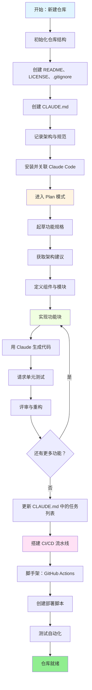
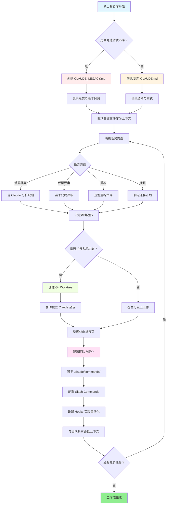

<picture>
  <source media="(prefers-color-scheme: dark)" srcset="resources/logos/claude-howto-logo-dark.svg">
  
</picture>

# 优质资源列表

## 官方文档

| 资源 | 说明 | 链接 |
|------|------|------|
| Claude Code Docs | Claude Code 官方文档 | [code.claude.com/docs/en/overview](https://code.claude.com/docs/en/overview) |
| Anthropic Docs | Anthropic 完整文档 | [docs.anthropic.com](https://docs.anthropic.com) |
| MCP Protocol | Model Context Protocol 规范 | [modelcontextprotocol.io](https://modelcontextprotocol.io) |
| MCP Servers | 官方 MCP 服务器实现 | [github.com/modelcontextprotocol/servers](https://github.com/modelcontextprotocol/servers) |
| Anthropic Cookbook | 代码示例与教程 | [github.com/anthropics/anthropic-cookbook](https://github.com/anthropics/anthropic-cookbook) |
| Claude Code Skills | 社区 skills 仓库 | [github.com/anthropics/skills](https://github.com/anthropics/skills) |
| Agent Teams | 多智能体协同与协作 | [code.claude.com/docs/en/agent-teams](https://code.claude.com/docs/en/agent-teams) |
| Scheduled Tasks | 使用 /loop 与 cron 的周期性任务 | [code.claude.com/docs/en/scheduled-tasks](https://code.claude.com/docs/en/scheduled-tasks) |
| Chrome Integration | 浏览器自动化 | [code.claude.com/docs/en/chrome](https://code.claude.com/docs/en/chrome) |
| Keybindings | 键盘快捷键自定义 | [code.claude.com/docs/en/keybindings](https://code.claude.com/docs/en/keybindings) |
| Desktop App | 原生桌面应用 | [code.claude.com/docs/en/desktop](https://code.claude.com/docs/en/desktop) |
| Remote Control | 远程会话控制 | [code.claude.com/docs/en/remote-control](https://code.claude.com/docs/en/remote-control) |
| Auto Mode | 自动权限管理 | [code.claude.com/docs/en/auto-mode](https://code.claude.com/docs/en/auto-mode) |
| Channels | 多渠道通信 | [code.claude.com/docs/en/channels](https://code.claude.com/docs/en/channels) |
| Voice Dictation | Claude Code 语音输入 | [code.claude.com/docs/en/voice-dictation](https://code.claude.com/docs/en/voice-dictation) |

## Anthropic 工程博客

| 文章 | 说明 | 链接 |
|------|------|------|
| Code Execution with MCP | 如何通过代码执行缓解 MCP 上下文膨胀——token 用量减少 98.7% | [anthropic.com/engineering/code-execution-with-mcp](https://www.anthropic.com/engineering/code-execution-with-mcp) |

---

## 30 分钟掌握 Claude Code

_Video_: https://www.youtube.com/watch?v=6eBSHbLKuN0

_**全部技巧**_
- **探索高级功能与快捷键**
  - 定期在发布说明中查看 Claude 的新代码编辑与上下文相关能力。
  - 学习键盘快捷键，在聊天、文件与编辑器视图之间快速切换。

- **高效初始化**
  - 为项目创建命名/描述清晰的专用会话，便于日后检索。
  - 置顶最常用的文件或文件夹，让 Claude 随时能访问。
  - 配置 Claude 的集成（例如 GitHub、常用 IDE），简化开发流程。

- **高效的代码库问答**
  - 向 Claude 询问架构、设计模式与具体模块等细节问题。
  - 在提问中使用文件与行号引用（例如：“`app/models/user.py` 中的逻辑在做什么？”）。
  - 对大型代码库，可提供摘要或清单，帮助 Claude 聚焦。
  - **示例提示**：_“能否解释 `src/auth/AuthService.ts` 第 45–120 行实现的认证流程？它如何与 `src/middleware/auth.ts` 中的中间件配合？”_

- **代码编辑与重构**
  - 在代码块中用行内注释或请求获得针对性修改（例如「把这个函数重构得更清晰」）。
  - 要求并排展示修改前/修改后。
  - 重大修改后让 Claude 生成测试或文档，用于质量把关。
  - **示例提示**：_“将 `api/users.js` 中的 `getUserData` 从 Promise 改为 async/await 重构。请给出修改前后对比，并为重构后的版本生成单元测试。”_

- **上下文管理**
  - 粘贴的代码/上下文只保留与当前任务相关的部分。
  - 使用结构化提示（「这是文件 A，这是函数 B，我的问题是 X」）以获得更好效果。
  - 在提示窗口中移除或折叠大文件，避免超出上下文上限。
  - **示例提示**：_“下面是 `models/User.js` 中的 User 模型，以及 `utils/validation.js` 中的 `validateUser` 函数。我的问题是：如何在保持向后兼容的前提下增加邮箱校验？”_

- **接入团队工具**
  - 将 Claude 会话连接到团队的仓库与文档。
  - 使用内置模板或为重复工程任务创建自定义模板。
  - 通过分享会话记录与提示词与队友协作。

- **提升表现**
  - 向 Claude 下达清晰、目标导向的指令（例如「用五个要点总结这个类」）。
  - 从上下文中去掉不必要的注释与样板代码。
  - 若输出偏离预期，可重置上下文或改述问题以重新对齐。
  - **示例提示**：_“用五个要点总结 `src/db/Manager.ts` 中的 `DatabaseManager` 类，重点说明主要职责与关键方法。”_

- **实用示例**
  - 调试：粘贴错误与堆栈，询问可能原因与修复方式。
  - 测试生成：为复杂逻辑请求基于属性的测试、单元测试或集成测试。
  - 代码评审：请 Claude 指出有风险变更、边界情况或代码异味。
  - **示例提示**：
    - _“我遇到错误：‘TypeError: Cannot read property 'map' of undefined’，出现在 `components/UserList.jsx` 第 42 行。下面是堆栈与相关代码。原因是什么？如何修复？”_
    - _“为 `PaymentProcessor` 类生成全面的单元测试，覆盖交易失败、超时与非法输入等边界情况。”_
    - _“请评审此 PR diff，指出潜在安全问题、性能瓶颈与代码异味。”_

- **工作流自动化**
  - 用 Claude 提示将重复任务（如格式化、清理、批量重命名）脚本化。
  - 用 Claude 根据代码 diff 起草 PR 描述、发布说明或文档。
  - **示例提示**：_“根据 git diff 写一份详细的 PR 说明，包含变更摘要、修改文件列表、测试步骤与可能影响。并为 2.3.0 版本生成发布说明。”_

**提示**：为获得最佳效果，可组合多种做法——先置顶关键文件并概括目标，再配合聚焦的提示与 Claude 的重构能力，逐步改进代码库与自动化。

**推荐：与 Claude Code 配合的工作流**

### 与 Claude Code 配合的推荐工作流

#### 新建仓库

1. **初始化仓库与 Claude 集成**
   - 为新仓库搭建必要结构：README、LICENSE、.gitignore、根目录配置等。
   - 创建 `CLAUDE.md`，描述架构、高层目标与编码规范。
   - 安装 Claude Code 并关联到仓库，以获得代码建议、测试脚手架与工作流自动化。

2. **使用 Plan 模式与规格说明**
   - 使用 plan 模式（`shift-tab` 或 `/plan`）在实现功能前先起草详细规格。
   - 请 Claude 给出架构建议与初始项目布局。
   - 保持清晰、目标导向的提示序列——请求组件大纲、主要模块与职责划分。

3. **迭代开发与评审**
   - 分小块实现核心功能，提示 Claude 生成代码、重构与文档。
   - 每个增量完成后请求单元测试与示例。
   - 在 CLAUDE.md 中维护持续更新的任务列表。

4. **自动化 CI/CD 与部署**
   - 用 Claude 搭建 GitHub Actions、npm/yarn 脚本或部署工作流。
   - 通过更新 CLAUDE.md 并请求相应命令/脚本，轻松调整流水线。

#### 已有仓库

1. **仓库与上下文设置**
   - 新增或更新 `CLAUDE.md`，记录仓库结构、编码模式与关键文件。对遗留仓库可使用 `CLAUDE_LEGACY.md`，涵盖框架、版本对照、说明、已知缺陷与升级说明。
   - 置顶或标出 Claude 应优先用作上下文的主要文件。

2. **结合上下文的代码问答**
   - 请 Claude 做代码评审、解释缺陷、重构或迁移计划，并引用具体文件/函数。
   - 给出明确边界（例如「只修改这些文件」或「不新增依赖」）。

3. **分支、Worktree 与多会话管理**
   - 用多个 git worktree 隔离功能或缺陷修复，并为每个 worktree 启动独立的 Claude 会话。
   - 按分支或功能组织终端标签页/窗口，便于并行工作流。

4. **团队工具与自动化**
   - 通过 `.claude/commands/` 同步自定义命令，保持团队一致。
   - 借助 Claude 的 slash commands 或 hooks，自动化重复任务、创建 PR 与代码格式化。
   - 与团队成员共享会话与上下文，协作排查与评审。

**提示**：
- 每个新功能或修复都从规格说明与 plan 模式提示开始。
- 对遗留与复杂仓库，将详细指引放在 CLAUDE.md / CLAUDE_LEGACY.md 中。
- 给出清晰、聚焦的指令，把复杂工作拆成多阶段计划。
- 定期清理会话、精简上下文并移除已完成的 worktree，避免杂乱。

以上步骤概括了在新旧代码库中使用 Claude Code 时顺畅工作流的核心建议。

---

## 新功能与能力（2026 年 3 月）

### 关键功能资源

| 功能 | 说明 | 延伸阅读 |
|------|------|----------|
| **Auto Memory** | Claude 会在会话间自动学习并记住你的偏好 | [Memory Guide](02-memory/) |
| **Remote Control** | 通过外部工具与脚本以编程方式控制 Claude Code 会话 | [Advanced Features](09-advanced-features/) |
| **Web Sessions** | 通过基于浏览器的界面使用 Claude Code，支持远程开发 | [CLI Reference](10-cli/) |
| **Desktop App** | Claude Code 原生桌面应用，界面增强 | [Claude Code Docs](https://code.claude.com/docs/en/desktop) |
| **Extended Thinking** | 通过 `Alt+T`/`Option+T` 或环境变量 `MAX_THINKING_TOKENS` 开启深度推理 | [Advanced Features](09-advanced-features/) |
| **Permission Modes** | 细粒度控制：default、acceptEdits、plan、auto、dontAsk、bypassPermissions | [Advanced Features](09-advanced-features/) |
| **7-Tier Memory** | Managed Policy、Project、Project Rules、User、User Rules、Local、Auto Memory | [Memory Guide](02-memory/) |
| **Hook Events** | 25 类事件：PreToolUse、PostToolUse、PostToolUseFailure、Stop、StopFailure、SubagentStart、SubagentStop、Notification、Elicitation 等 | [Hooks Guide](06-hooks/) |
| **Agent Teams** | 协调多个智能体协作完成复杂任务 | [Subagents Guide](04-subagents/) |
| **Scheduled Tasks** | 使用 `/loop` 与 cron 工具设置周期性任务 | [Advanced Features](09-advanced-features/) |
| **Chrome Integration** | 使用无头 Chromium 进行浏览器自动化 | [Advanced Features](09-advanced-features/) |
| **Keyboard Customization** | 自定义快捷键，包括组合键序列 | [Advanced Features](09-advanced-features/) |
